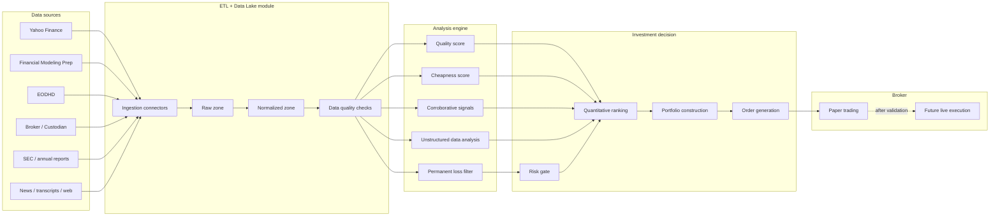

# SmartWealthAI - MVP Architecture

This document is a living specification for designing the SmartWealthAI MVP with a spec-driven development workflow. Its purpose is to capture decisions, open questions, assumptions, and acceptance criteria before writing implementation code.

## MVP vision

Build a modular quantitative value investing system that:

1. Retrieves financial data from multiple financial data providers.
2. Stores raw and normalized data in a data lake.
3. Filters out companies with high risk of permanent capital loss.
4. Identifies high-quality companies.
5. Identifies cheap companies.
6. Uses corroborative signals to strengthen or weaken investment theses.
7. Analyzes unstructured financial data.
8. Prepares, and later executes, broker orders.

The MVP should prioritize traceability, reproducibility, and a clean separation between data ingestion, rules, scoring, portfolio construction, and execution.

## Architecture principles

- Modularity: each module should evolve independently.
- Traceability: every score or decision should be explainable from its input data.
- Reproducibility: a run over a given universe and date should be repeatable.
- Financial safety: broker integration must be isolated and start in simulation or paper trading mode.
- Data first: raw data must be stored before transformation so errors can be audited.
- Interchangeable sources: Yahoo Finance, Financial Modeling Prep, EODHD, and future sources should be wrapped behind connectors.
- Specs before code: every module should have a markdown spec with scope, questions, and acceptance criteria.

## Architecture diagram

## MVP modules

| Module | Spec | Main responsibility |
| --- | --- | --- |
| ETL + Data Lake | [features/etl-data-lake.md](features/etl-data-lake.md) | Download, version, validate, and store financial data. |
| Permanent loss filter | [features/permanent-loss-filter.md](features/permanent-loss-filter.md) | Exclude or penalize companies with manipulation, fraud, or bankruptcy risk. |
| High-quality stocks | [features/high-quality-stocks.md](features/high-quality-stocks.md) | Score economic, financial, and operating quality. |
| Cheap stocks | [features/cheap-stocks.md](features/cheap-stocks.md) | Score absolute and relative undervaluation. |
| Corroborative signals | [features/corroborative-signals.md](features/corroborative-signals.md) | Include buybacks, insider buying, and other confirming signals. |
| Unstructured financial data | [features/unstructured-financial-data.md](features/unstructured-financial-data.md) | Extract useful information from filings, news, transcripts, and financial text. |
| Broker execution | [features/broker-execution.md](features/broker-execution.md) | Convert portfolio decisions into controlled broker orders. |

## Proposed functional flow

1. Define the initial stock universe.
2. Run ingestion for financial data and relevant financial text.
3. Store raw data in the data lake.
4. Normalize data into a shared model.
5. Validate completeness, freshness, and consistency.
6. Apply the permanent loss filter.
7. Calculate quality scores.
8. Calculate cheapness scores.
9. Adjust ranking with corroborative signals and unstructured data analysis.
10. Build a candidate portfolio.
11. Generate orders in simulation mode.
12. Audit outputs, logs, explanations, and data lineage.

## Cross-cutting questions to answer together

### Investment universe

- Which markets should the MVP cover: United States, Europe, global, or something else?
- Should we start with common stocks only, or include ADRs, ETFs, REITs, BDCs, and preferred shares?
- Should the MVP enforce minimum liquidity, market cap, or trading volume?
- How should we handle financials, insurers, banks, and utilities, whose statements are structurally different?
- Should the initial universe be static, imported from index constituents, or built from a screener?
- Should delisted companies be included for backtesting realism?
- How should we handle multiple share classes?

### Data

- What should be the primary data provider for the MVP?
- Which provider is authoritative when Yahoo Finance, FMP, and EODHD disagree?
- Should we store daily, quarterly, annual, trailing twelve month, or all data?
- Do we need point-in-time data from the MVP to avoid look-ahead bias?
- How will we record the actual publication date of financial statements?
- What should happen with missing data: exclude, impute, penalize, or flag for review?
- Which financial fields are mandatory for the first version?
- Should all provider responses be stored exactly as received?
- What data retention policy do we want?

### Scoring and investment logic

- Should the MVP use a Greenblatt-style ranking, a weighted multifactor ranking, or staged rules?
- Should quality, cheapness, and corroborative signal weights be configurable?
- Does the permanent loss filter automatically exclude companies, or only reduce their score?
- How will we avoid overfitting historical ratios?
- What is the target number of portfolio positions?
- Should there be limits by sector, country, currency, industry, or factor exposure?
- Should rebalancing be monthly, quarterly, or event-driven?
- Should the strategy allow short positions, or long-only only?
- Should the MVP produce a ranked watchlist, a model portfolio, or actual orders?

### Risk and explainability

- What does "permanent loss of capital" mean in this framework: bankruptcy, dilution, fraud, competitive deterioration, excessive leverage, or all of these?
- What level of explanation should each recommendation include?
- Should every run produce immutable snapshots for future audits?
- Is backtesting required before broker integration?
- Which metrics will validate the system: CAGR, max drawdown, turnover, hit rate, Sharpe ratio, alpha versus benchmark, or others?
- Which risk checks must block order generation?
- How should we review false positives and false negatives from the filters?

### Product and operations

- Should the MVP be a CLI, notebooks, a dashboard, or an automated pipeline only?
- Where should the first data lake live: local filesystem, S3-compatible storage, database, DuckDB, or another option?
- How should API keys and broker credentials be configured?
- What logs and alerts are required from the first MVP?
- Should every run produce a Markdown, HTML, or CSV report?
- Must broker execution start in paper trading mode only?
- Who is the expected user of the MVP: developer, investor, analyst, or automated agent?

## Pending decisions

| Area | Decision | Status |
| --- | --- | --- |
| Initial universe | Define markets, liquidity thresholds, and sector exclusions. | Open |
| Data lake | Choose initial storage format and location. | Open |
| Data providers | Choose primary provider and fallback providers. | Open |
| Scoring | Choose initial ranking formula and weights. | Open |
| Broker | Choose broker integration and paper trading behavior. | Open |
| Unstructured data | Choose initial scope: SEC filings, news, transcripts, or all. | Open |
| Backtesting | Decide whether backtesting is part of MVP or a follow-up milestone. | Open |

## Architecture acceptance criteria

- Every module has its own spec in `docs/features/`.
- Every spec includes objective, scope, inputs, outputs, flow, Mermaid diagram, open questions, and acceptance criteria.
- The architecture can run the pipeline without a live broker.
- The architecture separates raw data, normalized data, scoring, portfolio construction, and orders.
- Investment decisions can be explained from versioned data and rules.
- New data providers can be added without changing downstream scoring modules.
