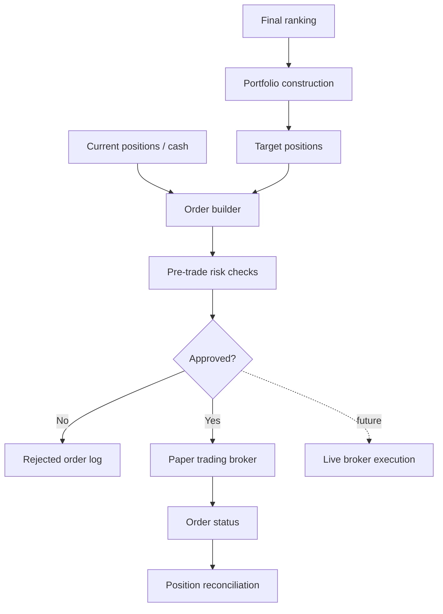

# Feature: Broker Execution

## Objective

Create a broker execution module that converts portfolio decisions into controlled orders. For the MVP, this module should prioritize safety, auditability, and paper trading over live execution.

## MVP scope

- Define the boundary between portfolio construction and broker execution.
- Generate proposed orders from target positions.
- Validate orders against risk and operational rules.
- Support paper trading or simulated execution first.
- Store order proposals, approvals, submissions, and execution status.

## Out of initial scope

- Live trading with real money.
- Smart order routing.
- High-frequency execution.
- Options, futures, margin, or derivatives.
- Tax optimization.

## Candidate responsibilities

- Translate target portfolio weights into orders.
- Validate cash, position limits, and concentration limits.
- Enforce paper trading mode by default.
- Record every generated order.
- Track order lifecycle status.
- Reconcile expected positions with broker-reported positions.
- Prevent duplicate orders for the same run.

## Mermaid diagram

## Expected flow

1. Receive target positions from portfolio construction.
2. Retrieve current positions and available cash.
3. Calculate required trades.
4. Run pre-trade checks.
5. Generate order proposals.
6. Submit orders to paper trading or simulation.
7. Store order lifecycle events.
8. Reconcile simulated or broker-reported positions.

## Questions to answer together

- Which broker should be supported first?
- Should the MVP integrate with a real broker paper account or use an internal simulator?
- Should order execution require manual approval?
- What order types are allowed in the MVP: market, limit, or only simulated target fills?
- Should the strategy trade whole shares only or fractional shares?
- What minimum cash buffer is required?
- What maximum position size should be allowed?
- Should there be maximum turnover per rebalance?
- Should orders be blocked if data is stale?
- Should orders be blocked if the permanent loss filter has unresolved warnings?
- How should failed or partially filled orders be handled?
- Should orders be generated from target weights, target dollar amounts, or target share counts?
- How should currency conversion be handled for non-USD securities?
- Should broker credentials ever be available in local development?
- What audit trail is required before live trading is considered?
- What reconciliation frequency is needed?

## Outputs

- Target positions received from portfolio construction.
- Proposed orders.
- Pre-trade check results.
- Paper trading submissions.
- Order status events.
- Reconciliation report.

## Acceptance criteria

- Paper trading or simulation is the default and only MVP execution mode.
- Every order has an audit trail from ranking to target position to order proposal.
- Risk checks can reject orders before submission.
- Duplicate order submission is explicitly prevented.
- Live execution remains a future extension behind additional safeguards.

## Risks

- Broker APIs vary significantly in behavior and reliability.
- Accidental live trading must be prevented by design.
- Stale data can produce incorrect target positions.
- Partial fills and reconciliation errors can compound over time.
