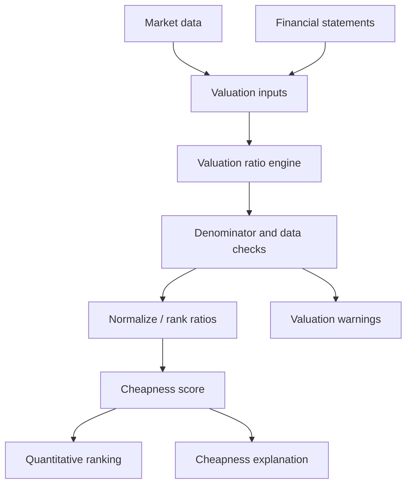

# Feature: Cheap Stocks

## Objective

Create a module that identifies companies trading at attractive prices relative to their earnings power, assets, cash flows, and enterprise value. This module should help find value opportunities without ignoring quality and permanent loss risk.

## MVP scope

- Score cheapness using structured market and financial data.
- Support multiple valuation ratios.
- Normalize valuations across the universe or within sectors.
- Avoid ranking companies as cheap when the denominator is unreliable or negative.
- Produce an explanation of why a company is considered cheap or expensive.

## Out of initial scope

- Full discounted cash flow modeling.
- Analyst estimate based valuation, unless provided cleanly by a data source.
- Private market valuation comps.
- Intrinsic value ranges requiring manual assumptions.

## Candidate valuation dimensions

- Earnings yield.
- Free cash flow yield.
- Enterprise value to EBIT.
- Enterprise value to EBITDA.
- Price to book.
- Price to tangible book.
- Price to sales.
- Dividend yield.
- Shareholder yield.
- Net-net or liquidation value screens for special situations.

## Mermaid diagram

## Expected flow

1. Receive current market data and normalized financial data.
2. Calculate valuation ratios.
3. Validate denominators, units, currency, and stale prices.
4. Normalize each valuation metric.
5. Combine valuation metrics into a cheapness score.
6. Emit warnings for distorted or unusable ratios.
7. Pass score and explanation to the ranking module.

## Questions to answer together

- Which valuation metric should be the MVP anchor: earnings yield, free cash flow yield, EV/EBIT, or EV/EBITDA?
- Should valuation be sector-relative, market-wide, or both?
- Should low price-to-book matter for all companies or only asset-heavy sectors?
- How should negative earnings, negative EBIT, or negative free cash flow be handled?
- Should cyclical companies use normalized multi-year earnings?
- Should cash-rich companies receive special treatment through enterprise value?
- How should leases, minority interests, and pension liabilities affect enterprise value?
- Should we use trailing twelve month, latest fiscal year, average cycle earnings, or forward estimates?
- Should dividend yield be treated as cheapness or as a corroborative signal?
- Should cheapness be a rank, percentile, z-score, or absolute threshold?
- Should outliers be capped?
- How do we prevent value traps from scoring too highly?
- Should a company pass the permanent loss filter before cheapness is calculated?
- Should cheapness require a minimum quality threshold?
- Should valuation history be considered, such as current multiple versus five-year average?

## Outputs

- Overall cheapness score.
- Ratio-level scores.
- Invalid or unreliable ratio warnings.
- Explanation text for reports.

## Acceptance criteria

- The module supports more than one valuation metric.
- Invalid valuation ratios are flagged instead of silently ranked.
- Cheapness output can be combined with quality and risk outputs.
- The score is explainable at the ratio level.
- The spec explicitly documents how value traps will be controlled.

## Risks

- Statistically cheap companies may be cheap for good reasons.
- One-time earnings can make stocks appear artificially cheap.
- Sector comparisons may be misleading across business models.
- Market data timing mismatches can distort valuation.
