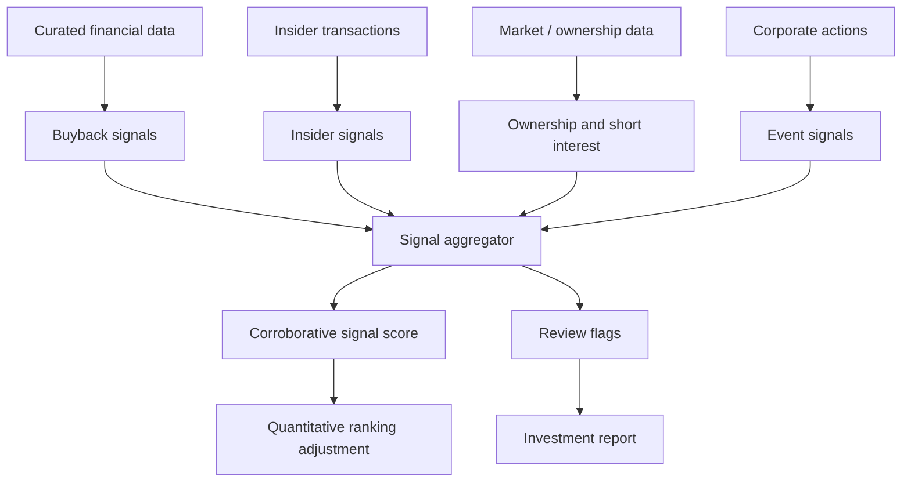

# Feature: Corroborative Signals

## Objective

Create a module that captures additional signals that can corroborate or challenge the main quality and cheapness ranking. These signals should not replace the core valuation framework, but they can strengthen, weaken, or flag an investment candidate for review.

## MVP scope

- Track buybacks and share count reduction.
- Track insider buying and insider selling if available.
- Track dividend behavior and shareholder yield.
- Track selected corporate actions.
- Produce a signal score or qualitative flags.
- Explain how each signal affects the final ranking.

## Out of initial scope

- Fully automated event-driven trading.
- Social media sentiment.
- Alternative data that requires complex licensing.
- High-frequency market microstructure signals.

## Candidate signals

### Shareholder return

- Net buyback yield.
- Share count reduction over time.
- Dividend yield.
- Dividend growth.
- Total shareholder yield.

### Insider activity

- Insider buying by executives or directors.
- Cluster buying.
- Insider selling after large price appreciation.
- Insider ownership level.

### Market and ownership context

- Short interest.
- Institutional ownership changes.
- Activist involvement.
- Credit spread changes if available.

### Corporate events

- Spin-offs.
- Tender offers.
- Debt refinancing.
- Management changes.
- Major asset sales.

## Mermaid diagram

## Expected flow

1. Receive structured data about buybacks, dividends, insider transactions, ownership, and corporate events.
2. Calculate signal-specific metrics.
3. Determine whether each signal is positive, negative, neutral, or unavailable.
4. Combine signals into an adjustment score or set of flags.
5. Pass the result to ranking and reporting.

## Questions to answer together

- Which corroborative signal should be included first: buybacks, insider buying, dividends, short interest, or activist ownership?
- Should corroborative signals change ranking weights or only appear as report flags?
- How large must a buyback be to matter?
- Should buybacks be considered positive only when the stock is cheap?
- How should we distinguish buybacks from share count reduction after stock-based compensation?
- Which insider roles matter most: CEO, CFO, directors, founders, or all insiders?
- Should insider selling be negative, or only meaningful in specific contexts?
- How do we handle planned insider sales?
- Should dividends be treated as quality, cheapness, or corroborative evidence?
- Should short interest be a risk warning, a contrarian signal, or ignored?
- Do we need event freshness windows, such as signals from the last 90 or 180 days?
- How should unavailable signal data affect the final score?
- Should signals be sector-specific?
- Should corroborative signals ever override a permanent loss exclusion?
- Which provider should supply insider transaction data?

## Outputs

- Corroborative signal score.
- Signal-level positive, negative, neutral, or unavailable status.
- Review flags.
- Explanation text for downstream reports.

## Acceptance criteria

- The module distinguishes core ranking factors from corroborative signals.
- Missing signal data does not automatically penalize a company unless explicitly decided.
- Buybacks and insider activity are represented separately.
- Signals can be audited back to source data and event dates.
- The module can be extended with new signals without changing core scoring specs.

## Risks

- Some signals are noisy and context-dependent.
- Insider data availability varies by market.
- Buybacks can destroy value if done at excessive prices.
- Overweighting signals can weaken the value discipline.
