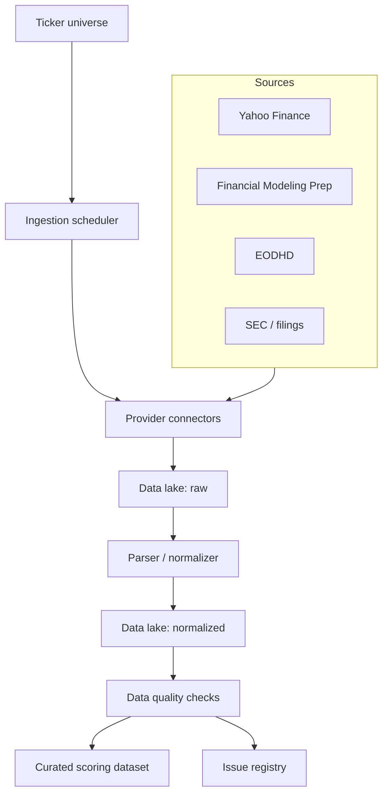

# Feature: ETL and Data Lake

## Objective

Create the module responsible for downloading, validating, normalizing, and storing financial information from multiple providers. This module is the foundation for the rest of the system: if the data is unreliable, no downstream score will be reliable.

## MVP scope

- Ingest company financial data from one or more sources.
- Store an unmodified raw copy of provider responses.
- Transform raw data into a normalized schema.
- Record metadata for source, download date, ticker, fiscal period, and schema version.
- Run basic completeness, freshness, and consistency checks.
- Expose curated datasets for the scoring modules.

## Out of initial scope

- Advanced API cost optimization.
- Real-time streaming.
- Enterprise-grade data warehouse architecture.
- Full point-in-time guarantees if providers do not support them.

## Candidate data

- Historical and current prices.
- Market cap, enterprise value, shares outstanding, and float.
- Income statement.
- Balance sheet.
- Cash flow statement.
- Provider-calculated financial ratios.
- Dividends, splits, and corporate actions.
- Sector and industry classification.
- Earnings calendar.
- Documents or links to filings.
- Provider metadata and rate-limit information.

## Mermaid diagram

## Expected flow

1. Receive a ticker universe and run date.
2. Determine which datasets are required for each ticker.
3. Query each source through independent connectors.
4. Store provider responses without modification.
5. Normalize fields, currencies, fiscal periods, and company identifiers.
6. Run data quality checks.
7. Mark each dataset as usable, incomplete, stale, or failed.
8. Publish curated datasets for analytical modules.

## Questions to answer together

- What should the initial ticker universe be?
- Should we start with one provider for simplicity or multiple providers from the beginning?
- Which provider should be trusted most for financial statements?
- Which provider should be trusted most for prices and corporate actions?
- How should discrepancies between providers be resolved?
- Should raw responses be stored as JSON, CSV, parquet, or another format?
- Should the MVP data lake be local, S3-compatible, database-backed, or DuckDB-based?
- Should data be partitioned by source, ticker, download date, fiscal year, and fiscal period?
- How should currency and units be represented: USD, local currency, thousands, millions?
- Do we need currency conversion from the MVP?
- Which minimum validation failures should block a stock from ranking?
- Which missing fields are tolerable, and which invalidate the analysis?
- Should API responses be cached to reduce provider quota usage?
- How should rate limits and provider errors be logged?
- Should normalized schemas be versioned?
- Should we use raw, bronze, silver, and gold layers or a simpler naming convention?
- Should the data lake support incremental refreshes or always rebuild from scratch?
- How do we detect restated financial statements?

## Acceptance criteria

- Raw and normalized datasets are clearly defined.
- Every data point can be traced to a source and download timestamp.
- The module can fail for one ticker without stopping the entire run.
- Scoring modules do not depend directly on external APIs.
- Data validation produces auditable issues.
- Provider-specific field names do not leak into downstream scoring specs.

## Risks

- Inconsistent data across providers.
- Lack of point-in-time data and potential look-ahead bias.
- API rate limits or unexpected provider costs.
- Financial fields with different meanings across providers.
- Sectors with non-comparable accounting conventions.
