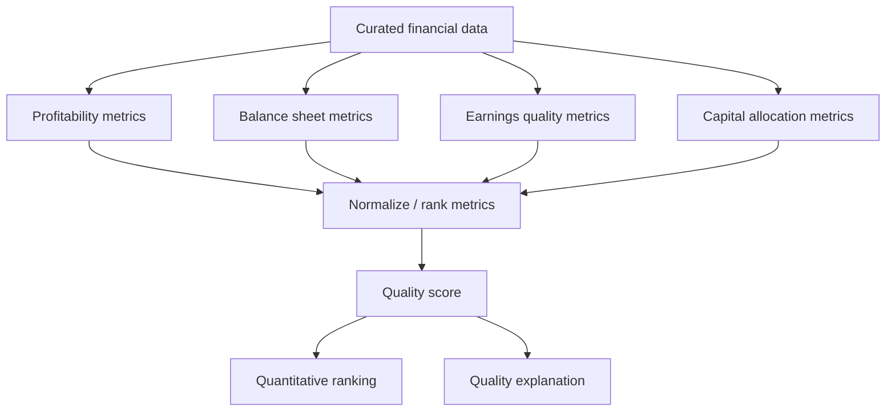

# Feature: High-Quality Stocks

## Objective

Create a module that identifies companies with strong economic quality, durable profitability, healthy balance sheets, and evidence of disciplined capital allocation.

## MVP scope

- Score company quality using structured financial data.
- Separate profitability, balance sheet strength, growth quality, and capital allocation.
- Produce a quality score that can be combined with cheapness and corroborative signals.
- Explain why a company is considered high quality or low quality.

## Out of initial scope

- Full competitive moat analysis from qualitative research.
- Machine learning quality prediction.
- Analyst estimates and forward-looking consensus models, unless a provider already exposes them cleanly.

## Candidate quality dimensions

### Profitability

- Return on invested capital.
- Return on equity.
- Return on assets.
- Gross margin stability.
- Operating margin stability.
- Free cash flow margin.

### Balance sheet strength

- Net debt to EBITDA.
- Interest coverage.
- Debt to equity.
- Current ratio.
- Cash runway for unprofitable companies.

### Earnings quality

- Free cash flow conversion.
- Accruals ratio.
- Stability of revenue and earnings.
- Difference between adjusted and GAAP earnings.

### Capital allocation

- Reinvestment returns.
- Buyback quality.
- Dividend sustainability.
- M&A discipline if data is available.

## Mermaid diagram

## Expected flow

1. Receive validated financial statement data.
2. Calculate quality metrics for each company.
3. Normalize metrics across the investment universe or within sectors.
4. Combine metrics into sub-scores.
5. Combine sub-scores into an overall quality score.
6. Emit explanations and warnings.

## Questions to answer together

- What does "quality" mean for SmartWealthAI: profitability, durability, balance sheet safety, reinvestment ability, or all of these?
- Should quality be measured sector-relative or market-wide?
- Which metric should be the anchor: ROIC, ROE, ROA, gross profitability, or free cash flow return on capital?
- How many years of history are required to consider quality durable?
- Should companies with negative earnings but positive free cash flow be eligible?
- Should high-growth unprofitable companies be excluded from quality scoring?
- Should financial companies use a separate quality framework?
- Should quality scores use raw values, ranks, z-scores, percentiles, or buckets?
- How should extreme outliers be winsorized or capped?
- Should deteriorating quality be penalized more than low but stable quality?
- How should share dilution affect quality?
- Should buybacks be part of quality or only corroborative signals?
- Should management quality be inferred from capital allocation metrics?
- What minimum data is required to calculate a reliable quality score?
- Should the module produce a single score or multiple sub-scores?

## Outputs

- Overall quality score.
- Profitability sub-score.
- Balance sheet sub-score.
- Earnings quality sub-score.
- Capital allocation sub-score.
- Metric-level explanation and data warnings.

## Acceptance criteria

- Quality is defined through explicit, auditable metrics.
- The module can rank companies even if some non-critical metrics are missing.
- Sector-specific caveats are documented.
- The output can be combined with valuation and corroborative signal modules.
- Every score includes enough detail to explain the result.

## Risks

- Accounting differences can distort quality comparisons.
- High-quality companies may appear expensive and require valuation context.
- Backward-looking quality can miss rapid deterioration.
- Sector-neutral ranking may hide structurally poor economics in some industries.
