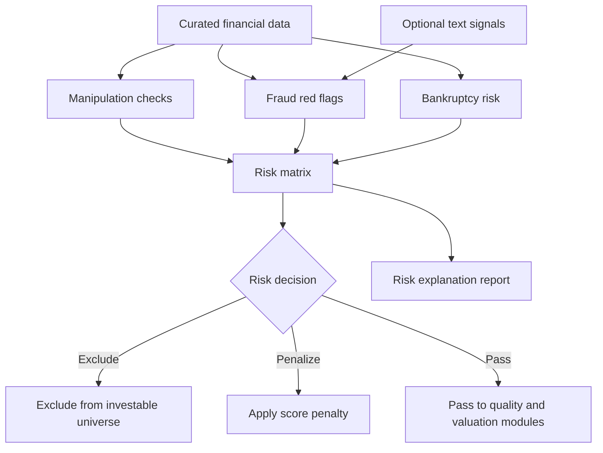

# Feature: Permanent Loss Filter

## Objective

Create a risk filter that identifies companies with a high probability of permanent capital loss before they enter the ranking and portfolio construction stages. The filter should focus on three families of risk: financial statement manipulation, fraud indicators, and bankruptcy risk.

## MVP scope

- Detect accounting manipulation red flags.
- Detect fraud-related red flags using structured data.
- Detect bankruptcy or financial distress risk.
- Produce a transparent risk classification per company.
- Decide whether each risk category excludes the company or only penalizes its score.
- Store the reasons behind every exclusion or penalty.

## Out of initial scope

- Machine learning fraud models.
- Real-time forensic accounting alerts.
- Legal judgment about whether fraud has occurred.
- Fully automated short-selling decisions.

## Risk categories

### Financial statement manipulation

Candidate signals:

- Accruals quality deterioration.
- Revenue growth materially above cash flow growth.
- Receivables growing faster than revenue.
- Inventory growth inconsistent with sales.
- Unusual margin expansion.
- Frequent restatements.
- Large one-off adjustments.
- Auditor changes.
- Persistent gap between net income and free cash flow.

### Fraud indicators

Candidate signals:

- Abnormal related-party transactions.
- Repeated regulatory investigations or enforcement actions.
- Insider selling around suspicious periods.
- Governance red flags.
- Complex corporate structure.
- Frequent changes in management or auditors.
- Suspicious promotional language in filings or press releases.

### Bankruptcy and distress

Candidate signals:

- Altman Z-score or sector-adjusted equivalent.
- Interest coverage deterioration.
- Net debt to EBITDA.
- Current ratio and quick ratio.
- Free cash flow burn.
- Maturity wall risk.
- Credit rating downgrades if available.
- Equity dilution under stress.

## Mermaid diagram

## Expected flow

1. Receive curated financial data for each company.
2. Calculate manipulation, fraud, and bankruptcy indicators.
3. Compare indicators against explicit thresholds.
4. Combine signals into a risk matrix.
5. Apply exclusion, penalty, or pass decision.
6. Emit a human-readable explanation.
7. Store risk output for audit and later model improvement.

## Questions to answer together

- Should permanent loss be a hard exclusion filter or a scoring penalty?
- Which risks are always disqualifying?
- Should thresholds be absolute, sector-relative, or percentile-based?
- Should banks, insurers, REITs, utilities, and commodity companies have separate distress models?
- Which manipulation model should be included first: Beneish M-score, accruals models, or custom rules?
- Which bankruptcy model should be included first: Altman Z-score, Ohlson O-score, Piotroski F-score as a health proxy, or custom rules?
- How should missing fields affect the risk result?
- How conservative should the MVP be when data quality is poor?
- Do we want an "unknown risk" state distinct from pass and fail?
- How should restatements be detected and weighted?
- Should governance data be included from the beginning?
- Should insider selling be considered here or only in corroborative signals?
- Should fraud-related textual signals block investment before human review?
- How will false positives be reviewed?
- What minimum explanation should be stored for each exclusion?

## Outputs

- Permanent loss risk status: `pass`, `penalize`, `exclude`, or `unknown`.
- Risk category scores.
- Triggered red flags.
- Data quality warnings.
- Explanation text for downstream reports.

## Acceptance criteria

- The filter handles manipulation, fraud, and bankruptcy as distinct submodules.
- Every exclusion or penalty includes explicit reasons.
- Missing data produces a visible warning rather than a silent pass.
- The output can be consumed by ranking and reporting modules.
- The spec leaves room for future machine learning fraud detection without requiring it in the MVP.

## Risks

- Overly strict filters may exclude successful turnarounds.
- Weak data may produce false confidence.
- Sector-specific accounting can make generic thresholds misleading.
- Fraud cannot be proven from ratios alone.
