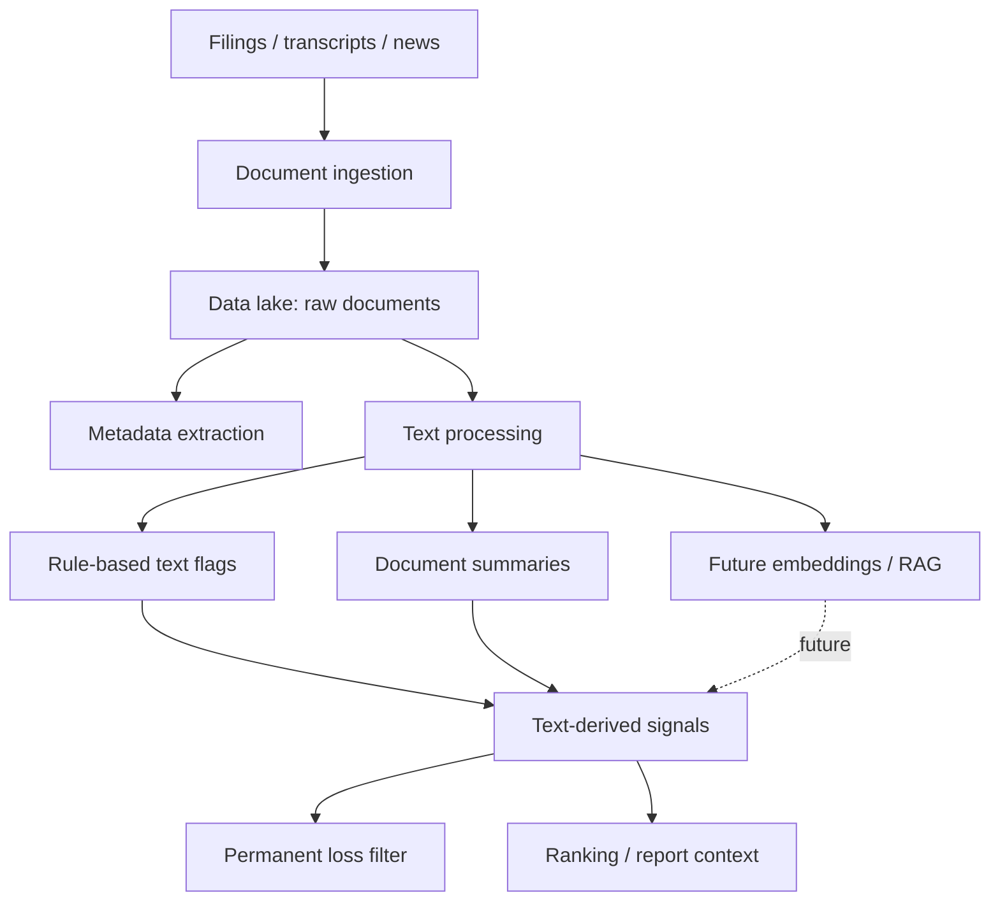

# Feature: Unstructured Financial Data

## Objective

Create a module that extracts useful investment signals from unstructured financial text such as annual reports, quarterly filings, earnings call transcripts, press releases, news, and regulatory documents.

## MVP scope

- Define which unstructured sources matter for the first version.
- Store source documents or references in the data lake.
- Extract metadata such as company, date, document type, and source.
- Produce simple text-derived flags or summaries.
- Prepare the module for future retrieval-augmented generation and machine learning workflows.

## Out of initial scope

- Fully autonomous investment recommendations from text.
- Complex fraud machine learning models.
- Real-time news trading.
- Production-grade vector search unless selected as an MVP requirement.

## Candidate sources

- SEC 10-K and 10-Q filings.
- Annual reports.
- Earnings call transcripts.
- Press releases.
- Investor presentations.
- News articles.
- Regulatory enforcement documents.
- Auditor opinions.

## Candidate analyses

- Management discussion changes.
- Risk factor changes.
- Going concern language.
- Auditor qualification language.
- Litigation mentions.
- Related-party transaction mentions.
- Sentiment shifts.
- Keyword and phrase flags for fraud or distress.
- Summaries of business model, risks, and capital allocation.

## Mermaid diagram

## Expected flow

1. Receive a company identifier, document type, and date range.
2. Retrieve documents or document links.
3. Store raw documents or immutable references.
4. Extract metadata and text.
5. Apply simple rule-based text checks.
6. Generate summaries or flags.
7. Pass text-derived signals to risk filters, ranking, and reporting.

## Questions to answer together

- Which documents should be included first: 10-Ks, 10-Qs, annual reports, transcripts, news, or press releases?
- Should the MVP download full documents or store links and metadata only?
- Which markets matter first, and do their filings have accessible public sources?
- Do we need OCR for PDFs, or should we start with HTML/text filings?
- Should documents be stored in the same data lake as structured data?
- Should text analysis start with rules, LLM summaries, embeddings, or a hybrid?
- What are the first high-value text flags for permanent loss risk?
- Should changes between annual reports be compared year over year?
- Should management tone or sentiment affect scoring in the MVP?
- How should we avoid hallucinated conclusions from LLM-generated summaries?
- Should every text-derived signal include citations to source passages?
- How will API costs and rate limits be controlled for LLM usage?
- Should document processing be asynchronous?
- Should the MVP support multilingual filings?
- Which text outputs should appear in the final investment report?

## Outputs

- Document metadata.
- Raw document references.
- Extracted text or parsed sections.
- Rule-based text flags.
- Optional summaries with citations.
- Text-derived signals for risk and ranking modules.

## Acceptance criteria

- The module has a clear first set of document sources.
- Raw documents or immutable references are preserved.
- Text-derived outputs include source document references.
- The module can provide context to the permanent loss filter and final report.
- Future machine learning and RAG capabilities can be added without changing the core architecture.

## Risks

- Text data can be large, noisy, and expensive to process.
- LLM summaries can hallucinate without citations.
- Filings and transcripts vary by market and provider.
- News data may require paid licenses.
