# SmartWealthAI - MVP Architecture

This document is a living specification for designing the SmartWealthAI MVP with a spec-driven development workflow. Its purpose is to capture decisions, open questions, assumptions, and acceptance criteria before writing implementation code.

This is a portfolio project intended to showcase MLOps practices applied to a quantitative value investing system. The end user is a particular investor, but the system itself behaves as an automated agent that runs end-to-end without manual intervention.

## June 30 demo slice (current delivery target)

The **first shippable vertical** is narrower than the full vision below. See [`demo-slice.md`](../demo-slice.md) and [ADR-0002](../../adr/0002-june-demo-scope-cut.md): SimFin ETL → US-market universe → ROC/EY → top-30 equal-weight portfolio → Streamlit dashboard. Backtest, permanent loss filter, sell-watch, and paper trading are **phase 2**. The full architecture in this document remains the north star.

## MVP vision

Build a modular quantitative value investing system that:

1. Retrieves financial data from **SimFin** (fundamentals, demo) and free price providers; SEC EDGAR deferred to phase 2 ([ADR-0001](../../adr/0001-simfin-fundamentals-mvp.md)).
2. Stores raw and curated data in an AWS-based, incrementally refreshed data lake.
3. Filters out companies with high risk of permanent capital loss (fraud and bankruptcy).
4. Identifies high-quality companies.
5. Identifies cheap companies.
6. Uses corroborative signals to strengthen or weaken investment theses.
7. Analyzes unstructured financial data (filings, transcripts, news).
8. Builds a ranked watchlist and a long-only model portfolio of 15 to 30 US stocks.
9. Backtests the strategy over 20+ years against benchmarks and historical crises.
10. Continuously monitors the model portfolio to detect sell signals.
11. Visualizes the evolution of the model portfolio and of the user's personal portfolio.
12. Prepares broker orders in paper trading mode only.
13. Surfaces every decision in a dashboard with auditable explanations.

The MVP prioritizes traceability, reproducibility, point-in-time correctness, low operational cost, and a clean separation between data ingestion, rules, scoring, portfolio construction, monitoring, and execution.

## Architecture principles

- **Modularity**: each module evolves independently and can be replaced without rewriting downstream code.
- **Traceability and explainability**: every score, exclusion, buy, or sell decision is reconstructible from its input data and rule version.
- **Reproducibility**: a run over a given universe and date can be replayed bit-for-bit from versioned data and code.
- **Point-in-time correctness**: no module is allowed to use data that was not yet publicly available at the decision date. Look-ahead bias is treated as a critical defect.
- **Raw before transformed**: provider responses are stored verbatim in a raw zone before any normalization, so any bug downstream can be replayed from source.
- **Incremental data lake**: new filings or prices update only what changed; we never reprocess the full history unless we explicitly request it.
- **Provider abstraction**: SimFin, SEC EDGAR (phase 2), free price providers, and future sources are wrapped behind interchangeable connectors; `curated/fundamentals` schema is provider-agnostic.
- **AWS-first, cheapest-first**: data lake, compute, secrets, and dashboard all live in AWS, choosing the cheapest viable option at MVP scale. Heavier infrastructure (Kubernetes, paid data) is a growth path, not an MVP requirement.
- **MLOps and CI/CD by design**: every pipeline component is built, tested, packaged, deployed, scheduled, and observed.
- **Paper trading first**: the broker module never touches real money in the MVP, even by accident.
- **Backtesting before broker**: the strategy must pass a backtest before any order, even a paper one, is generated. **Does not apply to the June demo slice** (no broker in demo).
- **Specs before code**: this document and the feature specs are refined before implementation begins.

## Architecture diagram

```mermaid
flowchart LR
    subgraph Sources["Data sources"]
        SimFin["SimFin (fundamentals, MVP)"]
        SEC["SEC EDGAR (phase 2)"]
        Prices["Prices: SimFin shareprices/latest (demo) + yfinance / vendor fallback (phase 2)"]
        UserPort["User portfolio CSV (data/clean/personal_finance/...)"]
        News["News and transcripts (later)"]
    end

    subgraph ETL["ETL + Data Lake (S3 + DuckDB, incremental)"]
        Ingest["Ingestion connectors"]
        Raw["Raw zone (immutable)"]
        Normalized["Normalized / curated zone (versioned schema)"]
        PITStore["Point-in-time store (as_of_date = SimFin Publish Date)"]
        QualityChecks["Data quality + review queue"]
    end

    subgraph Universe["Universe construction"]
        SP500Hist["Universe: SimFin US (demo) / S&P 500 historical (phase 2)"]
        UniFilters["Filters: IndustryId exclusion banks / insurers / utilities"]
    end

    subgraph Analysis["Analysis engine"]
        PermanentLoss["Permanent loss filter (fraud + bankruptcy)"]
        Quality["Quality score (ROC)"]
        Cheapness["Cheapness score (Earnings Yield)"]
        Signals["Corroborative signals"]
        Unstructured["Unstructured data analysis"]
    end

    subgraph Decision["Investment decision"]
        RiskGate["Risk gate (max 10% per name)"]
        Ranking["Greenblatt-style ranking + market-cap tie-break"]
        Sizing["Portfolio construction (15-30 names, EW/SW/RP)"]
        Watchlist["Watchlist + model portfolio"]
    end

    subgraph Live["Live monitoring (daily)"]
        SellWatch["Sell-watch: quality drop + fraud/bankruptcy + overvaluation + opportunity cost"]
        PortfolioEvo["Portfolio evolution (model vs personal vs benchmarks)"]
        EmailAlerts["Dashboard + AWS SES email"]
    end

    subgraph Validation["Validation"]
        Backtest["Backtest (>= 20 years, annual rebalance, walk-forward 3-5y) + Monte Carlo"]
        CrisisReport["Crisis drawdown report (informational)"]
        Benchmarks["Benchmarks: S&P 500 CW + S&P 500 EW + Russell 3000 + Magic Formula"]
    end

    subgraph Execution["Execution"]
        OrderBuilder["Order builder (manual confirmation)"]
        Paper["Paper trading"]
    end

    subgraph Ops["MLOps + Reporting"]
        Snapshots["MLflow runs + S3 artifacts (immutable snapshots)"]
        Dashboard["Streamlit dashboard"]
        CICD["GitHub Actions CI/CD + Prefect orchestration"]
        Runtime["ECS Fargate Spot (or AWS Batch) tasks"]
        Secrets["GitHub Secrets (build) + AWS Secrets Manager (runtime)"]
    end

    SimFin --> Ingest
    SEC -. "phase 2" .-> Ingest
    Prices --> Ingest
    UserPort --> Ingest
    News --> Ingest

    Ingest --> Raw
    Raw --> Normalized
    Normalized --> PITStore
    PITStore --> QualityChecks

    SP500Hist --> UniFilters
    UniFilters --> PermanentLoss
    QualityChecks --> PermanentLoss
    QualityChecks --> Quality
    QualityChecks --> Cheapness
    QualityChecks --> Signals
    QualityChecks --> Unstructured

    PermanentLoss --> RiskGate
    Quality --> Ranking
    Cheapness --> Ranking
    Signals --> Ranking
    Unstructured --> Ranking
    RiskGate --> Ranking
    Ranking --> Sizing
    Sizing --> Watchlist

    PITStore --> Backtest
    Ranking --> Backtest
    Sizing --> Backtest
    Benchmarks --> Backtest
    Backtest --> CrisisReport
    Backtest -. "Sharpe > all benchmarks" .-> OrderBuilder

    Watchlist --> OrderBuilder
    OrderBuilder --> Paper

    Watchlist --> SellWatch
    QualityChecks --> SellWatch
    Ranking --> SellWatch
    SellWatch --> EmailAlerts
    SellWatch -. "after user confirmation" .-> OrderBuilder

    Paper --> PortfolioEvo
    UserPort --> PortfolioEvo
    Benchmarks --> PortfolioEvo

    Ranking --> Snapshots
    Sizing --> Snapshots
    SellWatch --> Snapshots
    Backtest --> Snapshots
    Snapshots --> Dashboard

    Secrets --> Ingest
    Secrets --> Paper
    CICD --> Dashboard
```

## MVP modules

| Module | Spec | Main responsibility |
| --- | --- | --- |
| ETL + Data Lake | [../features/etl-data-lake.md](../features/etl-data-lake.md) | Download, version, validate, and store financial data with point-in-time guarantees and incremental refresh. |
| Universe construction | [../features/universe-construction.md](../features/universe-construction.md) | **Demo:** SimFin US minus banks / insurers / utilities. **Phase 2:** historical S&P 500 (incl. delisted), common-stock filters, share-class dedup. |
| Permanent loss filter | [../features/permanent-loss-filter.md](../features/permanent-loss-filter.md) | Hard-exclude companies with fraud or bankruptcy risk; include the Enron / Lehman / WorldCom regression test. |
| High-quality stocks | [../features/high-quality-stocks.md](../features/high-quality-stocks.md) | Score quality starting from Greenblatt's ROC. |
| Cheap stocks | [../features/cheap-stocks.md](../features/cheap-stocks.md) | Score valuation starting from Earnings Yield. |
| Corroborative signals | [../features/corroborative-signals.md](../features/corroborative-signals.md) | Buybacks, insider activity, and other confirming signals. |
| Unstructured financial data | [../features/unstructured-financial-data.md](../features/unstructured-financial-data.md) | Extract useful information from filings, transcripts, and news. |
| Backtesting + crisis report | [../features/backtesting.md](../features/backtesting.md) | Walk-forward backtest (3-5y windows) over 20+ years, Monte Carlo, benchmarks (S&P 500 CW/EW, Russell 3000, Magic Formula), crisis drawdown report. |
| Sell-watch / vigilance | [../features/sell-watch.md](../features/sell-watch.md) | Daily monitor of model portfolio for quality drop, fraud/bankruptcy, overvaluation, and opportunity cost. Emits signals (no auto-execution). |
| Portfolio evolution | [../features/portfolio-evolution.md](../features/portfolio-evolution.md) | Track the model portfolio and the user's personal portfolio over time and compare against configurable benchmarks. |
| Broker execution | [../features/broker-execution.md](../features/broker-execution.md) | Convert confirmed decisions into paper trading orders only. |
| Dashboard + reporting | [../features/dashboard-reporting.md](../features/dashboard-reporting.md) | Surface every input, score, decision, and explanation. Functional-first for the MVP. |

## Functional flow — June 30 demo slice

See [`demo-slice.md`](../demo-slice.md). Steps not listed here are **phase 2**.

1. Pipeline run for a `run_date`; secrets from env / AWS Secrets Manager (`SIMFIN_API_KEY`, etc.).
2. Bulk-download SimFin US datasets if older than `refresh_days`; store verbatim under `raw/simfin/`.
3. Build the demo universe: SimFin US companies minus banks / insurers / utilities (`IndustryId` CSV + bank/insurance sanity check).
4. Build run-date prices from SimFin bulk `shareprices/latest`: join universe tickers, take the latest `Date <= run_date`, and store `curated/prices`.
5. Run the SimFin normalizer → `curated/fundamentals` with PIT `as_of_date` from SimFin `Publish Date`.
6. Calculate ROC and Earnings Yield; combined rank with market-cap tie-break.
7. Select top **30** names, equal-weight model portfolio.
8. Log an MLflow run (params, metrics, portfolio artifact, git SHA).
9. Publish the Streamlit dashboard: ranking table, portfolio, per-name ROC/EY explainability.

## Functional flow — full MVP (phase 2)

North-star end-to-end flow after the demo slice ships:

1. CI/CD pipeline triggers a daily run (cron via Prefect / EventBridge) and pulls secrets.
2. Build the run-date universe from historical S&P 500 constituents, apply universe filters, deduplicate share classes.
3. Ingest fundamentals from SimFin and/or SEC EDGAR and prices from free providers, storing raw responses immutably.
4. Incrementally normalize new or restated data and write to the point-in-time store (`as_of_date` = provider publish or EDGAR acceptance).
5. Run data quality checks; failing rows go to the review queue and are excluded if not resolved.
6. Apply the permanent loss filter (fraud + bankruptcy) as a hard exclusion with stored reasons. CI runs the Enron / Lehman / WorldCom regression check.
7. Calculate ROC (quality) and Earnings Yield (cheapness).
8. Apply corroborative and unstructured signals.
9. Build a Greenblatt-style combined ranking; break ties by ascending market cap.
10. Select 15 to 30 long-only names, max 10% per name; portfolio weighting (EW, SW, RP) is a backtest hyperparameter.
11. Backtest the configuration on 20+ years of point-in-time data, walk-forward 3-5 year windows. If Sharpe does not beat all benchmarks (S&P 500 CW, S&P 500 EW, Russell 3000, Magic Formula), do not auto-promote any new configuration; the configuration that runs in production is the last one that passed.
12. The sell-watch module re-scores current holdings daily; any sell trigger creates a signal that goes to dashboard + email; only proceeds to the order builder after explicit user confirmation.
13. Generate paper trading orders only.
14. Track the model portfolio (as if it were traded) and the user's personal portfolio (from the cleaned CSV) and compare against configurable benchmarks.
15. Log every run as an MLflow run with artifacts in S3 (immutable snapshot).
16. Publish the dashboard with inputs, scores, decisions, and explanations.

## Decisions made so far

These items are now closed for the MVP. They can be reopened in later iterations.

### Universe and data

| Area | Decision |
| --- | --- |
| **June demo** | See [`demo-slice.md`](../demo-slice.md). SimFin → US universe → ROC/EY → top 30 EW → dashboard. |
| Markets | US only. Other markets deferred. |
| Universe (demo) | All SimFin US companies minus banks/insurers/utilities. |
| Universe (full MVP) | S&P 500 historical constituents (incl. delisted). Phase 2. |
| Sector classification (demo) | SimFin `IndustryId` + `load_industries()`; exclusions in `data/reference/simfin_industry_exclusions.csv`. |
| Sector classification (full MVP) | SIC from SEC EDGAR when SEC ETL ships. |
| Sectors excluded | Banks, insurers, and utilities (incomparable accounting for ROC/EY). |
| Sector limits | No sector / country / industry quotas. Out of MVP scope. |
| Share classes | Treat as the same company; keep the class with the highest average trading liquidity and drop the rest. Phase 2 for demo. |
| Market cap floor | Optional parameter. Off in demo. |
| Trading volume floor | Optional; off in demo. |
| Primary fundamentals source | **SimFin** (free tier, bulk download). [ADR-0001](../../adr/0001-simfin-fundamentals-mvp.md). |
| SEC ETL | Frozen spike in repo; phase 2 normalizer. |
| Primary price source | **Demo:** SimFin bulk `shareprices/latest`. **Phase 2:** `yfinance`; free tiers of FMP, Alpha Vantage, and EODHD as redundancy / fallback. |
| Data lake | S3 (raw + curated zones) + DuckDB as the analytical engine (`duckdb` reads parquet directly from S3, no Athena bill). |
| Data lake refresh | Bulk re-download on schedule (`refresh_days=7` on free tier); incremental normalize by `Publish Date` watermark. |
| Schema versioning | Normalized schemas are versioned with explicit migrations. |
| Raw data policy | Store provider responses verbatim in the raw zone (SimFin bulk files for variants the pipeline downloads). |
| Retention policy | Keep curated data long-term; purge raw data only once curated data has been validated. |
| Point-in-time | Required. SimFin `Publish Date` is `as_of_date`; `Restated Date` for new versions; `Report Date + lag` fallback → review queue. |
| Fundamentals periodicity | Income/cashflow TTM; balance sheet quarterly (latest PIT snapshot). |
| Missing data | Flag for review for the MVP. If review backlog grows, fall back to exclusion. |

### Scoring and portfolio construction

| Area | Decision |
| --- | --- |
| Ranking style | Greenblatt-style: ROC for quality + Earnings Yield for cheapness. Treated as a placeholder until replaced by a more practical model. |
| Tie-break | Sort ties by ascending market cap; smaller names have priority (more room to grow). |
| Permanent loss | Hard exclusion. Scope: fraud + bankruptcy only. |
| Portfolio size | **Demo:** top 30. **Full MVP:** 15 to 30 long-only positions. |
| Short positions | Not allowed. |
| Per-name cap | 10% of portfolio (full MVP; irrelevant for demo EW top 30). |
| Weighting | **Demo:** equal-weight only. **Full MVP:** EW / SW / RP as backtest hyperparameters. |
| Rebalancing | Annual fixed for the full MVP. Demo is single `run_date` snapshot. |
| Outputs | **Demo:** model portfolio + full ranking in dashboard. **Full MVP:** watchlist + model portfolio + evolution. |

### Risk, explainability, and operations

| Area | Decision |
| --- | --- |
| Explainability | Dashboard shows raw inputs + scores + explanations + the rules that fired. Functional-first; visual polish later. |
| Run snapshots | MLflow is enabled from day one. Every pipeline run and every backtest is an MLflow run with parameters, metrics, and artifacts in S3 (see "MLflow as the snapshot store" below). |
| Risk checks that block orders | Permanent loss filter must have flagged `pass`; no duplicate orders; data freshness within threshold; full scoring pipeline completed; cash availability within configured limit; backtest must beat all benchmark Sharpes. |
| FP/FN review | Backtest builds a confusion matrix per rule and a curated regression test forces the bankruptcy filter to flag Enron, Lehman, and WorldCom. |
| Overfitting controls | Walk-forward backtesting + hold-out years never used for tuning + an in-sample vs out-of-sample Sharpe divergence flag treated as a red signal. |
| Run frequency | Daily. Cheap by design. |
| Secrets management | GitHub Secrets at build / deploy time, AWS Secrets Manager at runtime. |
| Broker mode | Paper trading only. |
| Primary user | Particular investor consuming a dashboard; the system itself runs as an automated agent. |

### Infrastructure (AWS, cheapest-first)

| Area | Decision |
| --- | --- |
| Storage | S3 (raw + curated parquet) + DuckDB as the local query engine. No Athena bill. |
| Experiment tracking | MLflow from day one. Tracking server on a small EC2 (SQLite backend) with `s3://` as the artifact root. |
| Dashboard | Streamlit. |
| Email alerts | AWS SES (sporadic emails, very cheap). |
| Compute / runtime | ECS Fargate Spot tasks (or AWS Batch on Fargate Spot), whichever is cheaper for the daily run. Triggered by Prefect. |
| Orchestration | Prefect Core (self-hosted on the same EC2 as MLflow, or via Prefect Cloud free tier). |
| Scheduling | EventBridge cron triggers the Prefect deployment once per day. |
| CI/CD | GitHub Actions builds and pushes Docker images to ECR. |
| Observability | CloudWatch Logs + Prefect UI for the MVP. Per-module metrics added if/when needed. |

### Backtesting

| Area | Decision |
| --- | --- |
| Historical depth | At least 20 years (value-investing horizon). |
| Crisis scenarios | All major historical crises included (dotcom, GFC, COVID, 2022 rate shock). Drawdown per crisis is reported but the MVP does not require crisis pass / fail. |
| Monte Carlo | Yes, in addition to historical replay. See "Monte Carlo simulation" below. |
| Transaction costs | Not modeled in the MVP. |
| Taxes | Not modeled in the MVP. |
| Survivorship bias | Avoided by including delisted historical S&P 500 constituents. Bankruptcies remain in the universe as evidence. |
| Pass criterion | Strategy's Sharpe must beat all of: S&P 500 cap-weighted, S&P 500 equal-weighted, Russell 3000, and Greenblatt Magic Formula. |
| Walk-forward windows | 3 to 5 year train / validation splits, given the long horizon. |
| Backtest rebalancing | Annual (matches production for the MVP). |
| Benchmarks | S&P 500 CW, S&P 500 EW, Russell 3000, Greenblatt Magic Formula portfolio. |

### Sell-watch

| Area | Decision |
| --- | --- |
| Scope | Model portfolio only. The user's personal portfolio is not actively monitored (those are personal orders). |
| Signals | Quality deterioration, fraud / bankruptcy flag turning on after entry, overvaluation, and opportunity cost (a better candidate exists in the watchlist). |
| Overvaluation trigger | Earnings Yield below the cross-sectional 10th percentile **or** Earnings Yield below 5% absolute. Both thresholds are starting points and treated as hyperparameters. |
| Quality deterioration trigger | ROC YoY drop greater than 30% **or** the name dropping out of the ROC top decile. Both thresholds are starting points and treated as hyperparameters. |
| Opportunity cost trigger | A watchlist candidate must outrank the held name by more than 5 positions in the combined Greenblatt ranking before the holding is flagged. |
| Frequency | Daily. |
| States | Hard `sell` only for the MVP. `trim` / `hold-with-warning` deferred. |
| Auto-execution | None. Signals require manual user confirmation before any order is built. |
| Alerts | Dashboard badge + AWS SES email. |
| Rules | Fundamentals-based + opportunity cost. Price-based stops (trailing / drawdown) deferred. |

### Portfolio evolution

| Area | Decision |
| --- | --- |
| User portfolio source | `data/clean/personal_finance/operations/my_operations_eur.csv` (already in EUR, derived from two broker exports). |
| Views | Cumulative return, drawdown, rolling Sharpe, holdings over time, contribution / attribution, vs S&P 500, vs the model portfolio. |
| Paper-traded model | The model portfolio is simulated as if it were actually traded, so the user can see what they would have earned or lost by following it daily. |
| Benchmarks | Configurable (S&P 500, MSCI World, others). |
| Update frequency | Daily. |
| Diversification / clustering | Deferred to a later milestone (kept in the long-term wishlist). |

## Clarifications captured from this iteration

### Point-in-time data and look-ahead bias

A backtest (or any historical scoring) must only use information that was publicly available at the decision date. If on `2019-03-31` the system uses Q4 2018 earnings to rank a stock, but those earnings were not filed until `2019-04-25`, the backtest is leaking future information into the past. The same applies to:

- Restated financials. The "as-known-in-2018" version is what 2018 decisions must use, not today's restated version.
- Index reconstitution. Using today's S&P 500 constituents to backtest 2010 introduces survivorship bias.
- Corporate actions (splits, dividends, delistings) and ticker changes.

The MVP's point-in-time store records, for every fundamental value, the `as_of_date` (SimFin `Publish Date` in the demo; EDGAR acceptance in phase 2) and a `version_id`. Any historical query is forced to filter by `as_of_date <= decision_date`. When the publish date is missing or unreliable, a conservative lag (period end + 45 days for 10-Q, + 90 days for 10-K) is used and the row is flagged for review. This is conservative enough for a long-term value strategy.

### MLflow as the snapshot store

User question: "are immutable snapshots like artifacts? What if we used MLflow?"

Yes. MLflow is a natural fit here, and it covers three needs at once:

- **Runs**: each pipeline execution (daily, plus every backtest) is logged as an MLflow run. Parameters (universe definition, rebalance frequency, weighting scheme, thresholds, git commit SHA) are logged via `mlflow.log_param`. Metrics (Sharpe, drawdown, CAGR, hit rate, alpha, number of exclusions, count of sell signals) are logged via `mlflow.log_metric`.
- **Artifacts**: the curated input slice (or its hash), the watchlist, the model portfolio, the backtest report, and the markdown / HTML dashboard snapshot are logged as artifacts. The artifact store points at S3 with versioning and / or object lock so a past run is byte-for-byte recoverable.
- **Model registry (optional, future)**: when the scoring model evolves beyond the Greenblatt placeholder, MLflow's model registry can promote a candidate from `staging` to `production` and tie that decision back to a backtest run.

Practical MVP setup:

- MLflow tracking server: a tiny EC2 (or AWS Fargate task on demand) with SQLite or RDS Postgres as the backend store. For the absolute cheapest setup, an MLflow tracking server is not strictly required: `mlflow.start_run(...)` with `file://` or `s3://` as the artifact root works for a single user.
- Artifact root: `s3://smartwealthai-mlflow-artifacts/`.
- Each run is tagged with the commit SHA and pipeline name, which makes the "immutable snapshot" effectively the MLflow run id.

Treating this as nice-to-have for the MVP is fine: we can start by writing snapshots straight to S3 with predictable paths, and slot in MLflow once the pipeline stabilizes.

### Monte Carlo simulation of fundamentals and prices

User question: "we cannot simulate company results coherently with prices, right?"

Three options, in increasing complexity:

1. **Block bootstrap of historical paths (recommended for the MVP).** Resample contiguous blocks (e.g., 6 or 12 months) from the real historical dataset across all companies simultaneously. This preserves the joint distribution of prices and fundamentals because both come from the same period of real data. It generates new "alternate histories" without inventing relationships that did not exist. It is the standard technique in academic backtests.
2. **Factor-based simulation.** Estimate a small number of factor returns (market, value, quality, size) plus idiosyncratic noise, and re-simulate company returns from those factors. Fundamentals are then assumed to evolve along their historical AR(1) / random-walk paths conditional on the factor regime. More flexible than bootstrap, but requires estimating a factor model.
3. **Generative joint model (out of MVP).** A VAR / copula / GAN / diffusion model trained on (prices, fundamentals) per company. Very powerful but easy to misuse, and effectively impossible to validate at MVP scale.

The MVP uses block bootstrap. The synthetic-data approach is captured as a stretch goal.

### MLOps stack cost reality check

User proposed: GitHub Actions + MLflow + Prefect + Kubernetes.

For a daily run over the S&P 500 historical universe, Kubernetes is overkill and expensive. Recommended cost-aware mapping:

| User goal | MVP-cheap option | Growth path |
| --- | --- | --- |
| Orchestration | Prefect Core running on a small EC2 (or Prefect Cloud free tier) | Prefect on EKS |
| Execution | AWS Batch or ECS Fargate spot tasks triggered by Prefect, or a small EC2 with cron + Docker | EKS with autoscaling |
| Experiment tracking | MLflow with SQLite + S3 artifact root, on the same EC2 | MLflow on RDS + EC2 / Fargate |
| CI/CD | GitHub Actions building Docker images and pushing to ECR | Same |
| Scheduling | EventBridge cron triggering a Prefect deployment | Same |
| Secrets | GitHub Secrets in CI; AWS Secrets Manager at runtime | Same |
| Observability | CloudWatch Logs + Prefect UI | CloudWatch Logs + Prefect Cloud + Grafana |

This still showcases MLOps competence (CI/CD, container build, orchestrator, experiment tracking, secrets, observability) without paying for EKS in the MVP.

### Risk checks confirmed for the MVP

- Permanent loss filter has passed for every name in the target portfolio (already a hard exclusion upstream).
- Full scoring pipeline completed without partial / missing scores.
- Data freshness within threshold.
- No duplicate orders.
- Cash availability within configured limit.
- Backtest of the current configuration must beat all benchmark Sharpes.

### False positives / false negatives review

- Build a confusion matrix per rule from each historical backtest.
- Curated regression test in CI: the bankruptcy filter must flag Enron, Lehman, and WorldCom at the right `as_of_date`.
- Maintain a review queue dataset that contains every borderline decision with the triggered rule and its inputs.
- Shadow-mode new rules for one or two runs before they are allowed to influence decisions.

### Overfitting controls

- Walk-forward backtesting with 3 to 5 year windows.
- A separate hold-out window that the strategy never sees during tuning.
- Hard alert when in-sample Sharpe and out-of-sample Sharpe diverge beyond a threshold; treated as a red flag for the candidate configuration.

### Personal portfolio CSV schema

The consolidated personal portfolio file `data/clean/personal_finance/operations/my_operations_eur.csv` already exists and is generated from two brokers (XTB and IBKR) by `src/preprocessing/cleaning_operations.py` (notebook: `notebooks/portfolio_evolution.ipynb`). The schema is the contract that the portfolio evolution module must consume:

| Column | Type | Notes |
| --- | --- | --- |
| `Date` | timestamp (with sub-second precision) | Operation timestamp. Used as the time index. |
| `Symbol` | string | Yahoo-Finance-compatible ticker after broker-to-yfinance mapping (e.g., `ITXe` / `ITX.ES` -> `ITX.MC`, `SPY5.UK` -> `SPY5.L`, `FB` -> `META`, `GOOGC` -> `GOOG`). |
| `Type` | enum | `BUY` or `SELL`. |
| `Volume` | float | Shares, fractional allowed. |
| `Price` | float | Per-share price in EUR (USD trades already FX-converted). |
| `Value` | float | Gross EUR notional of the trade. |
| `Commission` | float | EUR fee, negative when the user paid. |
| `Currency` | string | Always `EUR` after cleaning. |

Open items implied by this schema (to be resolved in the portfolio evolution spec):

- Dividends are not tracked in the CSV today. Out of MVP scope; tracked as a follow-up so the personal portfolio NAV can include the dividend contribution.
- FX is already applied to USD trades using `EUR=X` daily close at trade date. We document this as the assumption.
- Bankrupt or delisted holdings need a systematic handling: write the last available price as zero on the delisting date instead of dropping the position, so the personal NAV reflects the actual loss. (Note: the `IRBT` case visible in the legacy notebook is not a real loss in the user's history; the user sold IRBT in 2022, well before the bankruptcy. The rule still applies as a general defense.)
- Ticker remapping (FB -> META, GOOGC -> GOOG, SPY5.UK -> SPY5.L, ITXe / ITX.ES -> ITX.MC, etc.) is moved out of the notebook into a CSV at `data/reference/ticker_mapping.csv`, versioned in git.

### Magic Formula replica (benchmark)

The Greenblatt Magic Formula benchmark is implemented as a strict canonical replica:

- Quality factor: `ROC = EBIT / (Net Working Capital + Net Fixed Assets)`.
- Cheapness factor: `EY = EBIT / Enterprise Value`.
- Combined rank: sum of the two cross-sectional ranks (lower is better).
- Same universe, same annual rebalance, same long-only construction as the production strategy.

This benchmark is the placeholder while the user iterates on the quality and cheapness modules; future scoring variants are evaluated against it.

### yfinance cache (phase 2)

For phase 2 backtests and personal NAV, `yfinance` responses are cached on S3 under `s3://smartwealthai-cache/yfinance/<ticker>/<endpoint>/<as_of_date>.parquet`, with a configurable TTL per endpoint (e.g., prices: 1 day; corporate actions: 7 days; fundamentals: 90 days). Demo prices come from SimFin `shareprices/latest`. Cache misses trigger a live call; cache hits are read straight from S3.

### Ticker mapping table

A versioned CSV at `data/reference/ticker_mapping.csv` with columns `broker_symbol, yfinance_symbol, notes, valid_from, valid_to`. Stored in git for diff-able history. A small DuckDB view loads it on demand; we keep the source of truth in CSV because the table is small, infrequently updated, and benefits from PR-reviewable changes.

## Open questions

A short, targeted list. Everything else is now closed for the MVP.

- Source of the S&P 500 historical constituents (including delisted): community dataset such as `github.com/fja05680/sp500`, periodic Wikipedia scrape, or a manually maintained CSV in `data/reference/`? Recommendation: import the community dataset once and pin a snapshot under `data/reference/sp500_constituents.csv`. To be confirmed in `universe-construction.md`.
- Final cost target: with `t4g.micro` for MLflow + Prefect, monthly bill targets around 6 USD plus S3 storage and SES. We track this as a soft budget.

## Next steps for the spec-driven workflow

Order proposed for refining the feature specs (each spec follows the same template: Objective, Scope, Out of scope, Inputs, Outputs, Mermaid diagram, Flow, Open questions, Acceptance criteria, Risks):

1. `universe-construction.md` (new) - blocks every downstream module.
2. `etl-data-lake.md` — SimFin connector + normalizer (demo); SEC spike frozen for phase 2. ✅ Updated.
3. `permanent-loss-filter.md` (update) - fraud + bankruptcy, hard exclusion, Enron / Lehman / WorldCom regression test.
4. `high-quality-stocks.md` (update) - ROC + tie-break by market cap.
5. `cheap-stocks.md` (update) - Earnings Yield as primary cheapness signal.
6. `backtesting.md` (new) - walk-forward, 20+ years, Monte Carlo block bootstrap, benchmark suite, crisis drawdown report.
7. `sell-watch.md` (new) - daily triggers with the thresholds above, manual confirmation, AWS SES alert.
8. `portfolio-evolution.md` (new) - consume the personal CSV schema, paper-trade the model portfolio, configurable benchmarks.
9. `dashboard-reporting.md` (new) - Streamlit views per module, MLflow run links, explainability table.
10. `broker-execution.md` (update) - paper trading only, ECS Fargate Spot runtime, idempotent orders.
11. `corroborative-signals.md` (update) - light pass; deferred to a later iteration if needed.
12. `unstructured-financial-data.md` (update) - light pass; deferred to a later iteration if needed.

## Architecture acceptance criteria

- Every module has its own spec under `docs/mvp/features/`.
- Every spec includes objective, scope, inputs, outputs, flow, Mermaid diagram, open questions, and acceptance criteria.
- The architecture can run the pipeline end to end without a live broker.
- The architecture separates raw data, normalized data, point-in-time queries, scoring, portfolio construction, monitoring, backtesting, and orders.
- Investment decisions, exclusions, and sell signals can each be explained from versioned data and rules.
- Every run is logged as an MLflow run (parameters, metrics, artifacts) and / or as a versioned S3 snapshot, with a tag pointing to the git commit SHA.
- New data providers can be added without changing downstream scoring modules.
- The backtesting module can fail a run and block order generation when the strategy's Sharpe does not beat all benchmarks.
- The sell-watch module can emit signals that, after explicit user confirmation, flow into the broker module under the same audit trail as buy decisions.
- The portfolio evolution module can compare the model portfolio (as if traded) and the user's actual personal portfolio against at least one benchmark.
- The Enron / Lehman / WorldCom regression test runs in CI and fails the build if the bankruptcy filter stops flagging them.
- All secrets are sourced from GitHub Secrets (build) and / or AWS Secrets Manager (runtime). No secret is stored in the repo.
- Total MVP AWS bill stays under a small monthly budget (target to be set during infrastructure design).
