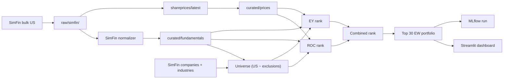

# June 30 demo slice — simplest Magic Formula

**Status:** accepted (see [ADR-0002](../adr/0002-june-demo-scope-cut.md))  
**Target date:** 2026-06-30  
**North star:** Full MVP in [`architecture/architecture.md`](architecture/architecture.md) — this document defines only what ships first.

## Objective

Deliver a working, explainable Greenblatt-style Magic Formula pipeline on real US data: ingest fundamentals, rank the market, build a model portfolio, show results in Streamlit. No historical validation or execution in this slice.

## In scope

| Step | Module / spec | Notes |
| --- | --- | --- |
| 1 | SimFin ETL | [`etl-data-lake.md`](features/etl-data-lake.md) — bulk US download, raw zone, SimFin normalizer |
| 2 | Universe | [`universe-construction.md`](features/universe-construction.md) — demo mode: SimFin US minus sector exclusions |
| 3 | Quality | [`high-quality-stocks.md`](features/high-quality-stocks.md) — ROC |
| 4 | Cheapness | [`cheap-stocks.md`](features/cheap-stocks.md) — Earnings Yield |
| 5 | Ranking | Combined rank = ROC rank + EY rank (lower is better); tie-break ascending market cap |
| 6 | Model portfolio | Top **30** names, **equal-weight** only |
| 7 | Dashboard | [`dashboard-reporting.md`](features/dashboard-reporting.md) — ranking table, portfolio, per-name explainability |
| 8 | MLflow | Log each pipeline run (params, scoring metrics, portfolio artifact) |

## Out of scope (phase 2)

- Permanent loss filter ([`permanent-loss-filter.md`](features/permanent-loss-filter.md))
- Backtesting and crisis report ([`backtesting.md`](features/backtesting.md))
- Sell-watch ([`sell-watch.md`](features/sell-watch.md))
- Paper trading / broker ([`broker-execution.md`](features/broker-execution.md))
- Watchlist (ranking table in dashboard is enough)
- Corroborative signals, unstructured data, portfolio evolution (personal CSV)
- SEC EDGAR ETL (frozen spike remains in repo — [ADR-0001](../adr/0001-simfin-fundamentals-mvp.md))
- Historical S&P 500 universe with delisted names
- Score-weighted and risk-parity weighting

## Data sources

| Data | Source | Tier |
| --- | --- | --- |
| Fundamentals | SimFin bulk (`income` TTM, `balance` quarterly, `cashflow` TTM, `companies`, `industries`) | Free |
| Prices (demo) | SimFin bulk `shareprices/latest` | Free; same ticker namespace as universe |
| Prices (phase 2) | SimFin `shareprices/daily` or vendor fallback | Backtest and personal NAV |
| Industry exclusions | `data/reference/simfin_industry_exclusions.csv` + bank/insurance dataset sanity check | Versioned CSV |

## Pipeline diagram

## Key decisions (closed for demo)

| Topic | Decision |
| --- | --- |
| Backfill | Full SimFin US bulk per dataset variant; normalizer filters to universe tickers |
| `as_of_date` | SimFin `Publish Date`; restatements → new `version_id` with `Restated Date`; missing publish → `Report Date + lag` → review queue |
| Fundamentals periodicity | Income/cashflow **TTM**; balance sheet **quarterly** (latest PIT row) |
| Raw vs curated | Raw verbatim for downloaded variants; curated minimal (provider-agnostic schema) |
| Universe | All SimFin `market=us` companies minus banks/insurers/utilities (`IndustryId` CSV + bank/insurance sanity check) |
| Share prices | SimFin `shareprices/latest`; `price_date` may lag `run_date` by ~30 days (free tier) — OK for demo |
| Portfolio | Top 30, equal-weight, market-cap tie-break on ranks |
| SEC code | Frozen, not called by demo pipeline |

## Acceptance criteria

- [ ] One command (or Prefect flow) runs the full demo pipeline for a `run_date`.
- [ ] Dashboard shows combined rank, ROC/EY inputs, and top-30 portfolio with explanations.
- [ ] Every curated fundamental row has `as_of_date <= run_date` when queried PIT.
- [ ] No bank/insurer/utility from the exclusion list appears in the ranked universe.
- [ ] MLflow run exists with portfolio parquet artifact and git commit SHA tag.
- [ ] Hermetic CI tests do not call SimFin or yfinance live.

## After the demo (phase 2 order)

1. Historical S&P 500 universe + permanent loss filter  
2. Minimal backtest (annual rebalance, 20 years) — custom pandas/DuckDB loop, not Zipline  
3. Walk-forward, Monte Carlo, benchmark gate  
4. Sell-watch + paper trading  
5. SEC EDGAR normalizer (optional PIT upgrade)  
6. Quantitative Value metrics (multi-period fundamentals from raw SimFin archives)
