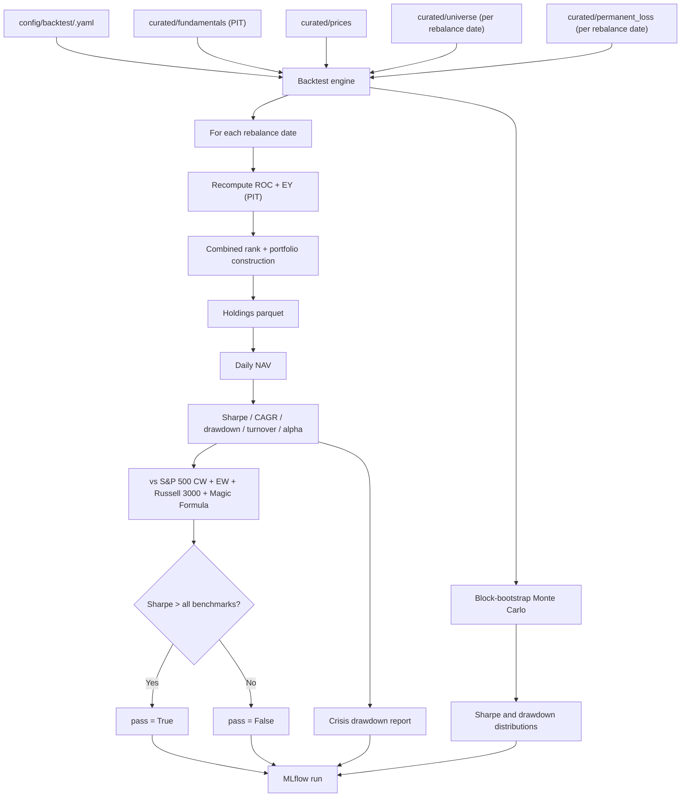

# Feature: Backtesting and Crisis Report

## Objective

Validate the strategy on at least 20 years of point-in-time data before any paper trading order is generated. Backtests must be reproducible, point-in-time correct, free of survivorship bias, and tracked end-to-end via MLflow. A backtest run that does not beat all benchmarks on Sharpe blocks order generation for that configuration.

## MVP scope

- Walk-forward backtest with 3 to 5 year train / validation windows.
- Annual rebalancing (matches production).
- Long-only, 15 to 30 names, max 10% per name (matches production).
- Weighting (equal-weight, score-weighted, risk-parity) as a hyperparameter; the winning weighting on validation Sharpe is used in production.
- Block-bootstrap Monte Carlo to generate alternate histories from the same data.
- Benchmark suite: S&P 500 cap-weighted, S&P 500 equal-weighted, Russell 3000, Greenblatt Magic Formula canonical replica.
- Crisis drawdown report (dotcom 2000-2002, GFC 2008-2009, COVID 2020, 2022 rate shock). Drawdowns reported, not gated.
- MLflow run per backtest with parameters, metrics, and artifacts.

## Out of MVP scope

- Transaction costs, slippage, bid-ask spreads.
- Capital-gains taxes.
- Currency hedging.
- Synthetic data via generative models (GAN / diffusion / VAR).
- Live optimization of the rebalance frequency (fixed annual for the MVP).
- Short positions, leverage.

## Inputs

| Input | Source |
| --- | --- |
| PIT fundamentals | `curated/fundamentals` |
| Adjusted prices | `curated/prices` |
| Historical universe per run date | `curated/universe` (rebuilt for each rebalance date) |
| Permanent loss exclusions | `curated/permanent_loss` |
| Quality and cheapness scores | `curated/scores/quality` + `curated/scores/cheap` (recomputed inside the backtest with PIT inputs) |
| Benchmarks reference | `data/reference/benchmarks/` with constituents of S&P 500 CW/EW and Russell 3000 over time; Magic Formula portfolio is rebuilt at every rebalance from the same universe and PIT data |
| Backtest config | `config/backtest/<name>.yaml` (parameters: start date, end date, rebalance, weighting, MC settings, walk-forward windows) |

## Outputs

All outputs live as MLflow run artifacts under the `backtesting` experiment.

| Output | Description |
| --- | --- |
| Equity curves parquet | Daily NAV per backtest variant, per benchmark |
| Trade ledger parquet | Every simulated trade at each rebalance |
| Holdings parquet | Holdings per name per date |
| Metrics dictionary | Sharpe, CAGR, max drawdown, turnover, hit rate, alpha vs each benchmark, in-sample vs out-of-sample Sharpe gap |
| Crisis report HTML | Drawdown per named crisis vs each benchmark |
| Monte Carlo distribution parquet | Per-trial returns, Sharpe distribution, drawdown distribution |
| Pass / fail flag | `True` only if strategy Sharpe strictly beats every benchmark |
| MLflow tags | `git_sha`, `config_hash`, `pit_data_hash` |

## Pass criterion

The backtest passes (and therefore allows production paper orders) only if all of the following hold on the out-of-sample window:

- `Sharpe(strategy) > Sharpe(S&P 500 CW)`
- `Sharpe(strategy) > Sharpe(S&P 500 EW)`
- `Sharpe(strategy) > Sharpe(Russell 3000)`
- `Sharpe(strategy) > Sharpe(Magic Formula canonical replica)`

Additionally, the **in-sample vs out-of-sample Sharpe gap** is logged. A gap larger than a configurable threshold (default: in-sample Sharpe more than 50% above out-of-sample Sharpe) flips a `overfit_risk` flag in the MLflow metrics. The flag does not block by itself, but the run is highlighted in the dashboard.

Crisis windows have drawdowns reported but do not gate the run for the MVP.

## Walk-forward design

- Start date: backtest config (default: 20 years before the run date).
- End date: most recent year with full data, leaving the last 1 to 2 years as a frozen hold-out.
- Window length: 3 to 5 years (parameter). Hyperparameters (weighting, score thresholds) are tuned on the first part of each window, validated on the second.
- Rolling step: 1 year forward.
- Hold-out: an explicit final window the strategy never sees during tuning. Reported separately.

## Monte Carlo (block bootstrap)

- Resample contiguous blocks of `block_length` months (default 12) from the historical multi-asset return panel.
- Trial count `n_trials` (default 500).
- Same strategy logic runs on each synthetic path.
- Logged outputs: Sharpe distribution, max drawdown distribution, 5th / 50th / 95th percentile equity curves.
- Block bootstrap preserves the joint distribution of prices and fundamentals because both come from the same sampled blocks.

## Mermaid diagram

## Expected flow

1. The pipeline triggers a backtest when the configuration changes, when a new release is built, or on a manual request from the dashboard.
2. The engine reads the config and resolves the start / end dates and walk-forward windows.
3. For each rebalance date (annually, starting at `start_date`):
   1. Build the universe via `universe-construction` at that date.
   2. Apply the permanent loss filter (PIT).
   3. Recompute ROC and EY on PIT fundamentals.
   4. Combine ranks, apply tie-break, select top 15 to 30 names with 10% cap.
   5. Compose the holding using the weighting variant under test.
4. Simulate daily NAV from rebalance to rebalance using adjusted prices.
5. Compute metrics overall, per walk-forward window, and per crisis window.
6. Run the same logic against the benchmark constructions to produce comparable Sharpe / drawdown.
7. Run the Monte Carlo block-bootstrap loop.
8. Decide pass / fail. Log everything to MLflow.

## Acceptance criteria

- A backtest run with the same config and the same PIT data hash produces metrics within numerical tolerance across two executions.
- Every backtest is logged as an MLflow run under the `backtesting` experiment with the `git_sha`, `config_hash`, and `pit_data_hash` tags.
- The engine never reads data more recent than the rebalance date during simulation; an automated check verifies this (e.g., max `as_of_date` per slice equals the rebalance date).
- The Magic Formula benchmark is built from the same universe and rebalanced annually like the strategy.
- The hold-out window is reported separately and is never touched by hyperparameter tuning.
- The crisis report includes at minimum dotcom 2000-2002, GFC 2008-2009, COVID 2020, 2022 rate shock.
- The pass flag is `True` only if the strategy Sharpe strictly beats every benchmark Sharpe.
- The Monte Carlo distribution has at least 500 trials by default.
- Production order generation reads the pass flag of the most recent backtest before emitting any order.

## Open questions

- Should we use the full S&P 500 CW total-return series as one benchmark and an equal-weight backtest of the same survivors as another? Recommendation: use a published total-return index (e.g., SPX TR via `^SP500TR` or a stitched series) for CW; build the EW from the historical constituents we already have.
- For Russell 3000 historical constituents we do not have a free reliable source. Recommendation: pin the Russell 3000 total-return index as a price series only (no constituent rebuild) for the MVP and revisit if it becomes the bottleneck.
- For Magic Formula benchmark, do we constrain it to the same exclusions (no banks / insurers / utilities) as the strategy, or run it on the full common-stock universe? Recommendation: same exclusions, so the comparison is fair to the strategy's universe.
- What is the right `block_length` for Monte Carlo: 6 or 12 months? Recommendation: 12 to capture annual cyclicality; expose as a parameter.
- Should we emit a pass / fail per weighting variant separately, or only for the winning variant? Recommendation: log every variant; promote only the winner.

## Risks

- Backtests on free data can have subtle PIT errors (missing restatements, late filings). The `as_of_date` check above is the main defense.
- Survivorship bias is removed by the historical universe but can creep back through benchmarks that only include current survivors. The benchmark sources matter.
- Monte Carlo block bootstrap underestimates extreme tails because it cannot generate scenarios outside historical experience. Documented as a known limitation.
- A strategy that beats all benchmarks on Sharpe can still be unstable in a single bad year. The crisis drawdown report is the user-facing warning.
- Without modeling transaction costs, the strategy looks better than it would in real life. Documented; revisit before any live trading.
