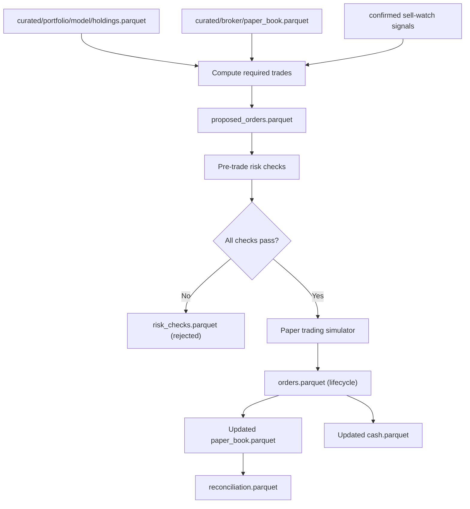

# Feature: Broker Execution

## Implementation status

**Deferred** for the June 30 demo slice ([ADR-0002](../../adr/0002-june-demo-scope-cut.md)). Spec remains the target for phase 2.

## Objective

Convert the model portfolio's target positions, plus confirmed sell-watch signals, into broker-compatible orders. For the MVP, every order is **paper-traded** in a simulator. Real broker connectivity is out of scope until the user explicitly opts in.

## MVP scope

- Translate target weights (from `portfolio-construction`) into target share counts using today's closing price.
- Compare target positions against the current paper book to compute required trades.
- Accept confirmed sell-watch signals (status `confirmed` in `curated/sell_watch/confirmations.parquet`) as forced sells.
- Run pre-trade risk checks (see "Pre-trade risk checks" below) and reject orders that violate them.
- Submit accepted orders to the internal paper trading simulator.
- Track order lifecycle (`proposed`, `accepted`, `rejected`, `submitted`, `filled`, `partially_filled`, `cancelled`).
- Reconcile the paper book against the expected target positions after fills.
- Idempotent: a given `(run_date, ticker, side, quantity, source)` tuple cannot produce two orders.
- Runs on ECS Fargate Spot once per trading day, after the daily pipeline finishes.

## Out of MVP scope

- Real broker connectivity (Alpaca, Interactive Brokers, etc.).
- Real money.
- Smart order routing.
- Limit orders, stop orders, options, futures, margin.
- Fractional-share semantics beyond what the simulator supports (the simulator accepts fractional volume to mirror the personal CSV).
- Tax-aware lot selection (FIFO at aggregate level).

## Inputs

| Input | Source |
| --- | --- |
| Target model portfolio | `curated/portfolio/model/holdings.parquet` (today's run) |
| Current paper book | `curated/broker/paper_book.parquet` |
| Confirmed sell signals | `curated/sell_watch/confirmations.parquet` (only `status = confirmed`) |
| Backtest pass flag | Latest MLflow run in `backtesting` experiment must have `pass = True` |
| Cash balance | `curated/broker/cash.parquet` |
| Today's adjusted close | `curated/prices` |
| Run date | Pipeline parameter |
| Broker config | `config/broker.yaml` (mode = `paper`, cash floor, per-order limit, daily turnover cap) |

## Outputs

| Output | Path / target |
| --- | --- |
| Proposed orders | `curated/broker/proposed_orders.parquet` |
| Risk-check log | `curated/broker/risk_checks.parquet` |
| Submitted orders + fills | `curated/broker/orders.parquet` (lifecycle) |
| Updated paper book | `curated/broker/paper_book.parquet` |
| Updated cash | `curated/broker/cash.parquet` |
| Reconciliation report | `curated/broker/reconciliation.parquet` |
| MLflow run | Parameters (config), metrics (orders proposed / submitted / rejected, turnover, cash before / after), artifacts (per-run report) |

## Pre-trade risk checks (blocks order generation when any fails)

| Check | Block? |
| --- | --- |
| Latest backtest `pass = True` | Yes |
| Permanent loss filter has flagged `pass` for every target ticker (not `exclude` or `unknown`) | Yes |
| Full scoring pipeline completed today (quality, cheapness, ranking parquets present) | Yes |
| Data freshness within threshold (every input price has a row dated today or the previous trading day) | Yes |
| No duplicate order in `curated/broker/orders.parquet` for the same `(run_date, ticker, side, quantity, source)` | Yes |
| Cash balance is above the configured floor after the trade | Yes |
| Per-order notional is below the configured per-order limit | Yes |
| Daily turnover (sum of trade notional) is below the configured cap | Yes |
| Position concentration after the trade keeps every name <= 10% of NAV | Yes |

Any failing check moves the corresponding order to `rejected` with the failure reason. The pipeline continues with the orders that passed.

## Mermaid diagram

## Expected flow

1. Load target positions and the current paper book.
2. Compute required trades (target shares - current shares) using today's closing price.
3. Add forced sells for every confirmed (and not yet submitted) sell-watch signal.
4. Run pre-trade risk checks; mark each order `accepted` or `rejected`.
5. For accepted orders, submit them to the paper trading simulator at today's close. The simulator immediately marks them `filled` with the close price as the fill price.
6. Update the paper book and cash balance.
7. Run reconciliation: assert that `paper_book` equals `target_positions` for the accepted set; log any mismatch.
8. Persist all parquet outputs and log MLflow.

## Acceptance criteria

- Live execution code paths do not exist in the MVP. The simulator is the only execution backend.
- The pipeline cannot produce two identical orders. The deduplication key is documented and tested.
- Every rejection is logged with the failing check id; rejections never silently drop.
- The reconciliation report flags discrepancies between the paper book and the target positions.
- If the latest backtest `pass = False`, no order is submitted, even for confirmed sell-watch signals. (Sell signals remain confirmed and pending until a passing backtest exists.)
- The MLflow run logs at minimum: orders proposed, orders submitted, orders rejected (per check), and turnover.
- The module runs on ECS Fargate Spot triggered by Prefect, after the daily pipeline.

## Open questions

- Should confirmed sells be allowed to execute even when the latest backtest fails? Argument for yes: protecting capital is more important than waiting for a fresh backtest. Recommendation for the MVP: no, to keep the safety boundary clean; mark as open for review once we have data.
- Do we model intraday vs end-of-day fills? Recommendation: end-of-day close only for the MVP.
- Do we charge a simulated commission per trade? Recommendation: no for the MVP (matches backtest assumptions); revisit before any real trading.
- Where does the paper book start? Recommendation: configurable initial cash in `config/broker.yaml`, default 100,000 EUR.
- Does the simulator support fractional shares like the personal CSV? Recommendation: yes; matches the real broker behavior the user already experienced.

## Risks

- Once real-broker code exists, it can be enabled by accident. The MVP module should not import any live broker SDK; a separate module behind an explicit feature flag will be added later.
- A bug in deduplication can flood the paper book with phantom positions. The unit tests must cover replays and idempotency.
- Stale prices on a market holiday could produce incorrect fills. The freshness check is the primary defense.
- The user can ignore reconciliation failures. The dashboard surfaces them prominently.
