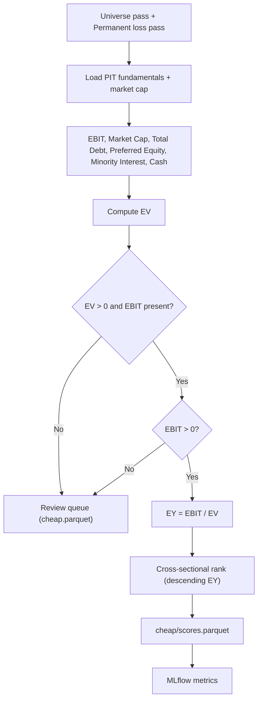

# Feature: Cheap Stocks

## Objective

Score the cheapness of every company that survives the universe filter, the permanent loss filter, and the quality scoring step. For the MVP, cheapness is a strict Greenblatt-style **Earnings Yield (EY) = EBIT / Enterprise Value**. Future iterations can plug additional valuation signals (FCF yield, EV/EBITDA, shareholder yield) through the same interface.

## MVP scope

- Compute `EY = EBIT / EV` per the canonical Greenblatt definition.
- Use the most recent point-in-time fundamentals available on the decision date and the run-date market data for EV.
- Produce a cross-sectional cheapness rank (lower rank = cheaper) for every passing company.
- Validate denominators: rows with `EV <= 0` or `EBIT` missing are flagged for review and excluded from the ranking.
- Avoid blindly ranking value traps as attractive: rows with negative EBIT are routed to the review queue rather than being inverted into "expensive".
- Log MLflow metrics (count valid, count invalid, EY quantiles).
- Expose the inputs alongside the score so the dashboard can explain "why is this company cheap?".

## Out of MVP scope

- Multi-metric cheapness score (FCF yield, EV/EBITDA, P/B, P/S, shareholder yield).
- Sector-relative valuation.
- Value-trap defense beyond the permanent loss filter (no quality threshold required to enter the cheapness rank; quality is a separate, parallel rank that combines later).
- Cyclically adjusted earnings.
- Forward-looking estimates.

## Inputs

| Input | Source | Notes |
| --- | --- | --- |
| Passing universe + permanent loss filter pass list | `curated/universe` + `curated/permanent_loss` | Only `pass` rows are scored. |
| PIT fundamentals (income statement, balance sheet) | `curated/fundamentals` | Filtered by `as_of_date <= run_date`. |
| Run-date market cap | `curated/prices` join `curated/fundamentals` | `shares_outstanding * close` on `run_date`. |
| Enterprise value components | `curated/fundamentals` | Total debt, preferred equity, minority interest, cash. |
| Run date | Pipeline parameter | |
| EY formula version | `config/cheap/ey.yaml` | Versioned. |

## EY definition (canonical Greenblatt)

```
EY = EBIT / Enterprise Value
EV = Market Cap + Total Debt + Preferred Equity + Minority Interest - Cash and Equivalents
```

with:

- `EBIT` = Operating income before interest and taxes. Trailing twelve months. Same definition as in `high-quality-stocks.md` so both scores share the same `EBIT`.
- `Market Cap` = `shares_outstanding * close` on `run_date`.
- All other components from the latest filing whose `as_of_date <= run_date`.

The formula and its variants are versioned in `config/cheap/ey.yaml`. Any change requires a new version id so backtests on prior versions remain reproducible.

## Outputs

| Output | Path / target |
| --- | --- |
| Cheapness scores parquet | `curated/scores/cheap/run_date=<YYYY-MM-DD>/scores.parquet` with `cik, ticker, ebit, market_cap, total_debt, preferred_equity, minority_interest, cash, ev, ey, ey_rank, formula_version, as_of_date` |
| Review queue rows | `curated/issues/run_date=<YYYY-MM-DD>/cheap.parquet` for invalid denominators, negative EBIT, missing inputs |
| MLflow metrics | `cheap_n_valid`, `cheap_n_invalid`, EY quantiles |

## Mermaid diagram



## Expected flow

1. Load the passing universe and join with PIT fundamentals + market cap.
2. Compute Enterprise Value from `market_cap + total_debt + preferred_equity + minority_interest - cash`.
3. Validate inputs: missing component rows are dropped; `EV <= 0` and `EBIT <= 0` rows are flagged for review.
4. Compute `EY`.
5. Produce a cross-sectional rank from highest EY (rank 1) to lowest.
6. Persist parquet and log MLflow metrics.
7. The combined Greenblatt rank (`roc_rank + ey_rank`) is built downstream by `portfolio-construction` (inside the same pipeline). Tie-break by market cap from `high-quality-stocks` carries over.

## Acceptance criteria

- Same `(universe, run_date, formula_version)` produces byte-identical output (hash-verifiable).
- The score is purely a function of curated PIT data; no network calls.
- Every row has the EY value and all components that produced it.
- Rows with invalid EV or negative EBIT are visible in the review queue and not silently flipped to "expensive".
- The formula version travels with each scored row.
- The MLflow run logs at minimum count of valid rows, count of invalid rows, EY median, and EY quantiles.

## Open questions

- For Enterprise Value, do we use `Long Term Debt + Short Term Debt + Capital Lease Obligations` for `Total Debt`, or a narrower definition? Recommendation: include capital leases under `Total Debt` and document as `formula_version = v1`.
- Cash definition: `CashAndCashEquivalents` only, or `CashAndCashEquivalents + ShortTermInvestments`? Recommendation: include short-term investments for `formula_version = v1`.
- Preferred equity: use book value or market value? Recommendation: book value (market is rarely available for free).
- Should the EY rank skip companies that fail to score on quality (i.e., invalid ROC denominator)? Recommendation: no; keep the two ranks independent so the combined score only excludes a name when both fail.

## Risks

- Negative-EBIT companies are silent value traps that easy EY models can mislabel as attractive. The MVP routes them to the review queue, which avoids the trap but may exclude legitimate turnarounds.
- One-off items in EBIT distort EY. Same caveat as in `high-quality-stocks`; accepted as a Greenblatt placeholder.
- `Total Debt` reported by EDGAR has multiple equally defensible definitions. Version locking is the only durable mitigation.
- Restated balance sheet items shift EV across versions. PIT versioning handles it; the test suite must cover restatements explicitly.
