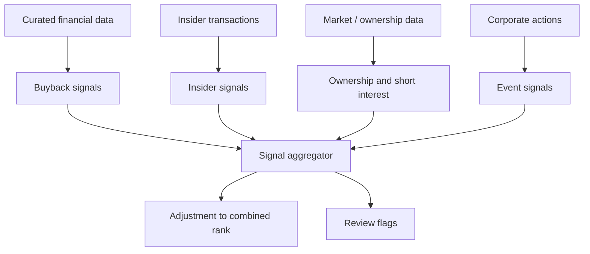

# Feature: Corroborative Signals

> **Status for the MVP: deferred.** No corroborative signal is computed or used in the first version of the pipeline. The architecture leaves a slot for this module in the ranking diagram, but the MVP combined rank is exactly `quality_rank + cheapness_rank` (Greenblatt). This spec captures the design we will revisit once the MVP is validated.

## Objective

Add signals that corroborate or challenge the core quality and cheapness ranking. These signals are auxiliary; they never overrule the permanent loss filter and they should not dominate the value framework.

## Out of MVP scope (entire module)

The whole module is parked. The first iteration of the system runs without any corroborative input. The reasons:

- The Greenblatt placeholder is intentionally minimal until the user finishes reading *Quantitative Value* and chooses the next factors.
- Insider transaction data, short interest data, and institutional ownership data all require either paid feeds or fragile scraping. The MVP's "free data only" constraint makes this hard to deliver reliably.
- A noisy corroborative score on top of a placeholder Greenblatt rank is more likely to hurt than help.

## Candidate signals (future iterations)

Listed for memory. None of them is implemented now.

### Shareholder return

- Net buyback yield.
- Share count reduction over time.
- Dividend yield.
- Dividend growth.
- Total shareholder yield.

### Insider activity

- Insider buying by executives or directors.
- Cluster buying.
- Insider selling after large price appreciation.
- Insider ownership level.

### Market and ownership context

- Short interest.
- Institutional ownership changes.
- Activist involvement.

### Corporate events

- Spin-offs.
- Tender offers.
- Debt refinancing.
- Management changes.

## Mermaid diagram (future state)

## Open questions (for the iteration when this module is reactivated)

- Which corroborative signal should be included first? Likely candidates: shareholder yield (gettable from EDGAR + prices for free) and SEC Form 4 insider transactions (also free).
- Should corroborative signals adjust the combined rank, or only appear as flags?
- How large must a buyback be to matter, and how do we strip out stock-based-compensation noise?
- How do we avoid double-counting dividends in cheapness and in shareholder yield?
- Should corroborative signals ever override a permanent loss exclusion? Recommendation locked: **no**.

## Acceptance criteria for the future module

- The module is opt-in via configuration; the MVP default keeps it off.
- It can be added without changing the ETL or the scoring modules: it consumes curated parquet and writes its own parquet.
- Its contribution to the combined rank is explicit, bounded, and documented.
- Missing signal data does not silently penalize a company.

## Risks (future)

- Insider data quality varies. Form 4 filings are reliable; aggregator interpretations are not.
- Short interest is reported with significant delay; pretending it is real-time invites bias.
- Buybacks can be value-destructive at high prices. The signal must condition on cheapness, not just on the existence of a buyback.
