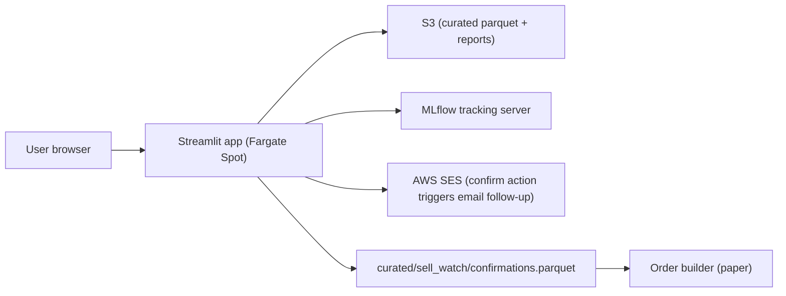

# Feature: Dashboard and Reporting

## Objective

Surface every input, score, decision, and audit trail produced by the pipeline in a single Streamlit dashboard. The dashboard is the primary product surface for the user. Visual polish is explicitly deferred; functional completeness comes first.

## MVP scope

- Streamlit app deployed on AWS (likely Fargate Spot behind an ALB, or App Runner if cheaper at MVP scale).
- One page per module: ETL health, universe, permanent loss filter, quality scores, cheapness scores, ranking, model portfolio, sell-watch, portfolio evolution, backtests.
- Every page links to the MLflow run id that produced the data displayed.
- Every score row shows the input components and the rules that fired.
- Read-only views; no editing of holdings or signals from the dashboard except confirming or dismissing sell-watch signals.
- Sell-watch confirmation writes back to `curated/sell_watch/confirmations.parquet`.
- Authentication: simple username + password from AWS Secrets Manager for the MVP (or Cognito if the cheapest path is similar).
- Reports are rendered as HTML inside Streamlit and persisted as static HTML snapshots in S3 per run date.

## Out of MVP scope

- Custom domain + TLS beyond what App Runner / ALB provides by default.
- Multi-user workspaces, roles, or permissions.
- Real-time websocket updates (page refreshes are enough for a daily cadence).
- LLM-generated narratives.
- Mobile-optimized layouts.
- Editable model parameters from the UI (those live in YAML, version-controlled).

## Inputs

| Input | Source |
| --- | --- |
| Curated parquet from every module | `s3://smartwealthai-data-lake/curated/...` |
| MLflow tracking server | `http://<mlflow-host>:5000` |
| Latest run metadata | MLflow `latest_versions` per experiment |
| Sell-watch state | `curated/sell_watch/` |
| Personal and model NAV | `curated/portfolio_evolution/` |
| User credentials | AWS Secrets Manager |

## Pages

| Page | What it shows |
| --- | --- |
| **Overview** | Headline KPIs (latest backtest Sharpe pass/fail, model NAV, personal NAV, open sell signals), latest pipeline run timestamp, links to MLflow runs. |
| **ETL & data quality** | Last successful ingestion per provider, freshness per ticker, count of rows in the review queue. |
| **Universe** | Today's universe and the most recent exclusion log. |
| **Permanent loss** | Today's exclusions with rule and value; trend line of count of exclusions over time; CI status of the Enron / Lehman / WorldCom regression. |
| **Quality** | ROC distribution + top / bottom names + per-name component breakdown. |
| **Cheapness** | EY distribution + top / bottom names + per-name component breakdown. |
| **Ranking + model portfolio** | Combined Greenblatt rank with tie-break; current 15 to 30 holdings; weight per name; cap-violation indicators. |
| **Sell-watch** | Open signals (proposed), confirmed history, dismissed history; each signal has a confirm and dismiss button. |
| **Backtests** | Equity curves, Sharpe table, crisis drawdown, Monte Carlo distribution, overfit flag, pass/fail. |
| **Portfolio evolution** | Personal NAV, model paper NAV, benchmark overlays, drawdown, rolling Sharpe, attribution. |
| **MLflow links** | Direct links to runs by date, by experiment, by tag (`git_sha`). |

## Mermaid diagram

## Expected flow

1. The user signs in.
2. The Streamlit app loads parquet directly from S3 via DuckDB for speed.
3. Each page queries the curated zone and renders the relevant tables and plots.
4. The sell-watch page lists `proposed` signals; clicking confirm or dismiss writes back to `confirmations.parquet` and the broker module picks up confirmed signals on its next run.
5. Each page footer shows the MLflow run id and a link.

## Acceptance criteria

- The dashboard is fully readable from cached parquet; no network calls to the live pipeline are made for display.
- Every numeric score on the dashboard can be traced to a row in a curated parquet file.
- Sell-watch confirmation is the only write operation triggered by the dashboard.
- The dashboard renders correctly when curated parquet for a module is missing (clear empty state, not an exception).
- The static HTML snapshot per run date is stored in `s3://smartwealthai-reports/run_date=<YYYY-MM-DD>/index.html` and is browsable.
- Authentication blocks unauthenticated access.
- The dashboard build is published from GitHub Actions to ECR and deployed to Fargate Spot.

## Open questions

- Hosting choice: Fargate Spot behind ALB, App Runner, or even a small EC2 with Caddy. Recommendation: App Runner if the price difference at the MVP scale is small; otherwise Fargate Spot.
- Custom domain in the MVP, or just the default AWS URL? Recommendation: default URL for the MVP; custom domain is a follow-up.
- Persisting the HTML snapshot per run date: do we generate it from Streamlit (which is not natively static) or from a small jinja template fed by the same parquet? Recommendation: jinja template; Streamlit is the live interactive surface, the snapshot is the immutable record.

## Risks

- Streamlit reloads on each interaction; large parquet datasets must be cached aggressively in memory.
- App Runner / Fargate Spot can be killed mid-session by AWS; the user just refreshes. Documented as acceptable for the MVP.
- Authentication via Streamlit secrets is weak; the deployment must sit behind an AWS auth layer (Cognito, ALB auth, or IAM) before any real user lands on it.
- Sell-watch confirmations from the dashboard must be idempotent; double-clicking confirm should not create two orders.
