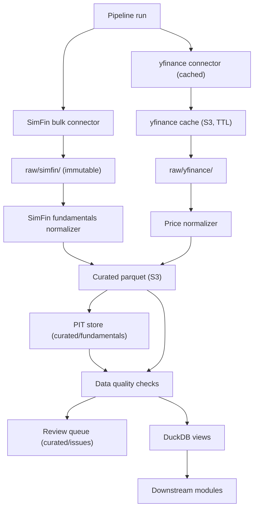
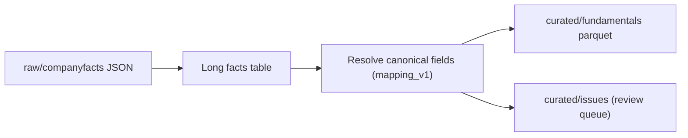

# Feature: ETL and Data Lake

## Implementation status

in_progress — **demo path:** SimFin connector + normalizer. SEC spike frozen ([ADR-0001](../../adr/0001-simfin-fundamentals-mvp.md)).

## Objective

Build the module that downloads, validates, normalizes, and stores financial data so that every downstream module (universe construction, scoring, backtesting, sell-watch, portfolio evolution) can rely on a single trustworthy source. The data lake lives on AWS S3 and is queried with DuckDB. Point-in-time correctness and incremental refresh are mandatory.

## MVP scope

### Demo slice (June 30 — primary)

- Ingest US fundamentals from **SimFin** bulk download (`simfin` Python package, free tier).
- Datasets: `companies`, `industries`, `income` (TTM), `balance` (quarterly), `cashflow` (TTM) for `market=us`.
- Store SimFin bulk responses verbatim under `raw/simfin/`.
- Normalize into provider-agnostic `curated/fundamentals` (same schema scoring modules expect).
- Point-in-time: `as_of_date` = SimFin `Publish Date`; restatements via `Restated Date` + new `version_id`.
- Ingest US prices from `yfinance` (FMP / Alpha Vantage / EODHD fallbacks optional).
- Run data quality checks; failing rows → review queue.
- Cache `yfinance` on S3 with TTL.
- Weekly bulk refresh on free tier (`refresh_days=7`); incremental normalize by publish-date watermark.
- DuckDB views on curated parquet.

### Full MVP (phase 2 additions)

- SEC EDGAR ETL (frozen spike: `sec_client`, `download-fundamentals`).
- Incremental per-CIK filing ingest when SEC normalizer ships.
- S&P 500–scoped backfill policies.

## Out of MVP scope

- Real-time streaming ingestion.
- Paid data providers (Bloomberg, FactSet, CRSP).
- Cross-currency data (only USD-denominated US issuers).
- Dividend history for the personal portfolio (tracked separately; see `portfolio-evolution.md`).
- Cross-region replication or HA setups for S3.

## Inputs

| Input | Source | Notes |
| --- | --- | --- |
| Income statement (TTM) | SimFin bulk `income` variant `ttm` | EBIT, interest, revenue, net income. |
| Balance sheet (quarterly) | SimFin bulk `balance` variant `quarterly` | NWC, PP&E, debt, cash, shares. |
| Cash flow (TTM) | SimFin bulk `cashflow` variant `ttm` | Phase 2 permanent-loss filter; ingest in demo for raw archive. |
| Publish / report / restated dates | SimFin statement rows | `Publish Date` → `as_of_date`. |
| Company metadata | SimFin `companies` | `Ticker`, `CIK`, `IndustryId`, `SimFinId`. |
| Industry labels | SimFin `industries` | Sector/industry names for exclusions CSV. |
| Daily prices, splits, dividends | `yfinance` (primary), FMP / AV / EODHD (fallback) | Cached on S3 with TTL. |
| Industry exclusions | `data/reference/simfin_industry_exclusions.csv` | Banks, insurers, utilities. |
| Reference ticker map | `data/reference/ticker_mapping.csv` | Broker symbol → yfinance symbol. |
| SEC `companyfacts` (frozen) | SEC EDGAR | Phase 2 only; spike under `raw/sec_edgar/`. |

## Outputs

All outputs live under `s3://smartwealthai-data-lake/` and are queryable from DuckDB.

| Dataset | Path (S3) | Partitioning | Notes |
| --- | --- | --- | --- |
| Raw SimFin bulk | `raw/simfin/dataset=<name>/variant=<v>/market=us/as_of_date=<YYYY-MM-DD>/` | by dataset, variant, download date | Verbatim CSV/ZIP from SimFin bulk API. |
| Raw prices | `raw/yfinance/ticker=<ticker>/endpoint=<endpoint>/as_of_date=<YYYY-MM-DD>/` | by ticker and endpoint | Verbatim yfinance response. |
| Raw SEC (frozen) | `raw/sec_edgar/cik=<cik>/endpoint=companyfacts/...` | by CIK | Phase 2; existing spike layout. |
| Curated fundamentals (PIT) | `curated/fundamentals/cik=<cik>/period=<YYYYQn>/` | by CIK and fiscal period | Provider-agnostic schema; `as_of_date`, `version_id`, `fiscal_period_end`. |
| Curated prices | `curated/prices/ticker=<ticker>/year=<YYYY>/` | by ticker and year | Adjusted and unadjusted close, volume, splits, dividends. |
| Universe history | `curated/universe/run_date=<YYYY-MM-DD>/` | by run date | Built by `universe-construction`. |
| Issue registry | `curated/issues/run_date=<YYYY-MM-DD>/` | by run date | Rows that failed quality checks. |
| yfinance cache | `cache/yfinance/<ticker>/<endpoint>/<as_of_date>.parquet` | by ticker, endpoint, date | TTL per endpoint. |

## Mermaid diagram



## Expected flow (demo)

1. Download SimFin bulk US datasets (`companies`, `industries`, `income-ttm`, `balance-quarterly`, `cashflow-ttm`) if older than `refresh_days`. Store verbatim under `raw/simfin/...`.
2. For each ticker in the demo universe (from `universe-construction`), fetch prices via yfinance cache; on miss, call live and write cache + raw.
3. Run the **SimFin normalizer** on new bulk snapshots (see *SimFin normalizer* below). Join income TTM + latest quarterly balance per ticker with PIT semantics.
4. Stamp `as_of_date` from `Publish Date` (or `Restated Date` for new versions). Fallback: `Report Date + lag` → review queue.
5. Quality checks; failures → `curated/issues/`.
6. Publish DuckDB views. Downstream reads curated only.

## Expected flow (SEC — phase 2, frozen spike)

Existing `download-fundamentals` CLI and `sec_client` remain in repo for reference. Not invoked by the demo pipeline. When resumed: per-CIK `companyfacts` download, EDGAR `acceptance-datetime` as `as_of_date`, separate SEC normalizer path documented below.

## Data quality checks (initial set)

| Check | Severity |
| --- | --- |
| Mandatory fields present (revenue, EBIT, net income, total assets, total liabilities, shares outstanding) | Block |
| `as_of_date` exists and is not in the future relative to `run_date` | Block |
| `fiscal_period_end <= as_of_date` | Block |
| Reported currency is USD | Block (non-USD goes to review queue) |
| Restated values produce a new `version_id` for the same `(cik, fiscal_period_end)` | Warn |
| Price gap larger than configurable threshold without a corresponding corporate action | Warn |
| Volume zero across multiple consecutive trading days | Warn |
| Schema migration mismatch | Block |

## Point-in-time semantics

- Every curated fundamentals row has `(cik, fiscal_period_end, as_of_date, version_id)` as the natural key.
- A query "fundamentals as of decision date D" returns, per `(cik, fiscal_period_end)`, the row with the highest `as_of_date <= D` and, on tie, the highest `version_id`.
- The same logic applies when re-running historical backtests: the backtest engine pins `D = decision_date` for each rebalance and never sees a row with `as_of_date > D`.
- Restated financials are kept as new versions; the prior version is preserved for replay of past decisions.

## yfinance cache strategy

- Cache key: `(ticker, endpoint, as_of_date)`.
- TTL per endpoint:
  - Daily prices (`history`): 1 day after market close.
  - Corporate actions (`actions`): 7 days.
  - Static company info (`info`): 30 days.
  - Income statement / balance sheet / cash flow: 90 days (yfinance fundamentals are sanity cross-check only; SimFin is canonical).
- Cache miss triggers a live call and writes the response to both the cache and the raw zone.
- Cache hits never trigger network calls.

## Incremental refresh strategy

- **SimFin (demo):** Re-download bulk US files when on-disk age exceeds `refresh_days` (default `7` on free tier). Normalizer processes only rows with `Publish Date` newer than the last successful watermark per dataset.
- **Initial backfill:** One manual bulk download of all demo datasets; normalizer filters to universe tickers.
- **yfinance:** Per-ticker watermark as before.
- Curated zones are append-only. Restatements create new versions; we never overwrite a prior version.

## Acceptance criteria

- Raw and curated zones are clearly separated; raw is never read by scoring modules.
- Every fundamentals value can be traced to a source file under `raw/simfin/` and its SimFin publish metadata.
- A query for "fundamentals available on date D" never returns rows with `as_of_date > D`.
- The same ingest run can fail for one ticker without aborting the rest.
- Schema versions and migrations are explicit; downstream views do not break silently.
- `yfinance` is not called when a valid cache entry exists.
- A full daily incremental run for the demo universe completes inside the Fargate Spot task budget (target: under 30 minutes; to validate during implementation). Phase 2 S&P 500 historical universe may need a separate budget check.
- A backtest run never triggers fresh `yfinance` calls; it only reads curated parquet.
- Schema, partitioning, and DuckDB view names are documented in the spec, not only in code.

### Progress notes

- SimFin bulk connector implemented in `src/smartwealthai/download_simfin.py`,
  `simfin_client.py`, and `lake_paths.simfin_bulk_path`. Operator guide:
  [`docs/mvp/guides/download-simfin.md`](../guides/download-simfin.md).
- Hermetic tests in `tests/test_download_simfin.py` (path layout, skip/force,
  mocked download, per-dataset failure handling).
- A hermetic fixture lake contract is implemented for CI in
  `tests/fixtures/lake/README.md` with raw SEC + raw yfinance snapshots,
  curated derived fundamentals, and a provenance manifest with checksums.
- Point-in-time selection and raw fixture loading behavior are covered by tests in
  `tests/test_ci_baseline.py` via `smartwealthai.fixture_lake`.
- Fundamentals download spike modules are implemented under `src/smartwealthai/`
  (`sec_client`, `edgartools_client`, `download_fundamentals`) — **frozen** for phase 2.
  SimFin connector + normalizer are the active demo path ([ADR-0001](../../adr/0001-simfin-fundamentals-mvp.md)).

## Decisions made (fundamentals)

| Area | Decision |
| --- | --- |
| **Demo normalizer input** | SimFin bulk parquets from `raw/simfin/` (income TTM + balance quarterly + cashflow TTM). |
| **`as_of_date` (demo)** | SimFin `Publish Date`; `Restated Date` → new `version_id`. |
| **SEC normalizer (phase 2)** | `companyfacts` JSON from `raw/sec_edgar/...`; EDGAR acceptance as `as_of_date`. |
| **Mapping** | `config/fundamentals/simfin_mapping_v1.yaml` (demo); `mapping_v1.yaml` (SEC phase 2). |
| Canonical fields | Same ~12 curated columns for ROC, EY, and QC regardless of provider. |
| Provenance | Per-field source column + `mapping_version`. |
| Downstream contract | Scoring reads `curated/fundamentals` only — provider-agnostic schema. |
| SEC spike | Frozen in repo; not deleted. |

## SimFin bulk connector (demo)

Downloads US fundamentals via the `simfin` Python package into `raw/simfin/`.
Operator guide: [`docs/mvp/guides/download-simfin.md`](../guides/download-simfin.md).

### CLI

```bash
export SIMFIN_API_KEY="<from user secrets>"
poetry run download-simfin
poetry run download-simfin --refresh-days 7 --force
```

### Module map

| Module | Role |
| --- | --- |
| `smartwealthai.simfin_client` | API key config, safe bulk download (zip-slip guarded), cache CSV path. |
| `smartwealthai.download_simfin` | CLI orchestration, skip/force by `refresh_days`, run summary. |
| `smartwealthai.lake_paths` | `simfin_bulk_path`, `simfin_errors_path`. |

### Acceptance criteria (SimFin connector)

- [x] `simfin` dependency in `pyproject.toml`; API key from `SIMFIN_API_KEY`.
- [x] CLI downloads all five demo datasets into stable `raw/simfin/` partitions.
- [x] Re-run without `--force` skips datasets fresher than `refresh_days`; `--force` overwrites.
- [x] Per-dataset failures recorded in run summary; batch continues when possible.
- [x] Hermetic tests cover path building, skip/force logic, and mocked download.
- [x] Bulk ZIP extraction validates member paths (zip-slip guard); does not use simfin `load_*` extractall path.
- [x] Operator steps in [`download-simfin.md`](../guides/download-simfin.md).

## SimFin normalizer (demo)

Transforms SimFin bulk statements into curated canonical parquet. Joins income TTM with the latest quarterly balance row per ticker subject to PIT filters.

### Configuration

| Setting | Source | Notes |
| --- | --- | --- |
| API key | `SIMFIN_API_KEY` env var | Required; AWS Secrets Manager at runtime. Never commit to repo. |
| Data root | `--data-dir` or S3 lake root | Local dev default `data/`. |
| Refresh | `refresh_days` | Default `7` for free tier. |
| Column mapping | `config/fundamentals/simfin_mapping_v1.yaml` | SimFin column → canonical field. |

### Local raw layout (demo)

| Dataset | Path |
| --- | --- |
| SimFin bulk snapshot | `raw/simfin/dataset=<income\|balance\|cashflow\|companies\|industries>/variant=<ttm\|quarterly>/market=us/as_of_date=<YYYY-MM-DD>/` |

### Acceptance criteria (SimFin normalizer)

- [ ] Reads bulk files from `raw/simfin/` only.
- [ ] Emits same curated schema as SEC path would (see canonical fields below).
- [ ] PIT natural key `(cik, fiscal_period_end, as_of_date, version_id)`.
- [ ] Hermetic tests with fixture SimFin CSV snippets.
- [ ] `simfin_mapping_v1.yaml` drives column resolution.

## SEC fundamentals normalizer (phase 2)

**GitHub issue:** [#52](https://github.com/JLaborda/SmartWealthAI/issues/52) — blocks [#44](https://github.com/JLaborda/SmartWealthAI/issues/44) (ROC/EY) and feeds [#50](https://github.com/JLaborda/SmartWealthAI/issues/50) (PIT selection).

Transforms immutable `companyfacts` JSON into curated canonical parquet. Discovery logic from `notebooks/poc_metrics.ipynb` (JNJ EBIT walk-up, debt summation, NWC components) is productized here — not in scoring code.

### Pipeline stages



1. **Ingest:** Parse `companyfacts` into a long table: `(cik, concept, fiscal_period_end, value_usd, as_of_date, form, accession)`.
2. **Resolve:** For each canonical field, apply `config/fundamentals/mapping_v1.yaml` rules:
   - **Direct:** read a single XBRL concept when populated (e.g. `OperatingIncomeLoss` for EBIT).
   - **Fallback chain:** try ordered alternative concepts (e.g. `InterestExpense`, then `InterestExpenseNonoperating`).
   - **Derived:** compute from other resolved components (e.g. EBIT walk-up from net income + taxes + interest; `total_debt` as sum of components in scoring, not necessarily stored).
   - **Review queue:** if resolution fails or QC blocks, write to `curated/issues/` — do not silently impute.
3. **Stamp:** Attach `as_of_date`, `fiscal_period_end`, `version_id`, `mapping_version`, and per-field provenance.
4. **Append:** Write append-only parquet under `curated/fundamentals/cik=<cik>/period=<YYYYQn>/`.

### Canonical output fields (mapping v1)

Fields required by `high-quality-stocks.md`, `cheap-stocks.md`, and ETL QC:

| Canonical column | Used for |
| --- | --- |
| `ebit` | ROC, EY |
| `current_assets`, `current_liabilities`, `cash`, `short_term_debt` | Net working capital |
| `ppe_net` | ROC denominator |
| `long_term_debt`, `preferred_equity`, `minority_interest` | Enterprise value |
| `shares_outstanding` | Market cap join |
| `revenue`, `net_income`, `total_assets`, `total_liabilities` | Data quality checks |

`total_debt`, `nwc`, `ev`, `roc`, and `ey` are computed in scoring modules from curated inputs plus prices — not stored in curated fundamentals unless a future spec revision says otherwise.

### Configuration

| Setting | Path | Notes |
| --- | --- | --- |
| XBRL → canonical mapping | `config/fundamentals/mapping_v1.yaml` | Versioned; new file for breaking mapping changes. |
| ROC formula | `config/quality/roc.yaml` | Scoring layer (downstream). |
| EY formula | `config/cheap/ey.yaml` | Scoring layer (downstream). |

### Acceptance criteria (normalizer)

- [ ] Reads only `companyfacts` from raw; no dependency on edgartools parquets.
- [ ] `mapping_v1.yaml` drives resolution; provenance columns on every output row.
- [ ] PIT natural key `(cik, fiscal_period_end, as_of_date, version_id)` on curated output.
- [ ] JNJ resolves EBIT via walk-up when `OperatingIncomeLoss` is blank (POC-validated).
- [ ] Hermetic tests with fixture `companyfacts` JSON; golden checks for JNJ + at least one direct-tag issuer.
- [ ] Per-field coverage summary for Dow 30 (`% direct` / `% fallback` / `% review queue`).
- [ ] CLI entry point documented in operator guide when implemented.

### Out of normalizer scope (MVP)

- Full US-GAAP taxonomy materialization.
- Per-ticker special cases (`if ticker == "JNJ"`).
- edgartools as a second normalization path.
- S3 upload (local `--data-dir` first; S3 follows CI/CD lake work).

## Fundamentals download spike (local)

First vertical slice: download and persist raw SEC `companyfacts` for a parameterized
universe. Optionally also download standardized annual statements from `edgartools` for
notebook exploration and cross-checks — **not** for the production normalizer.

No `submissions` ingest, no curated parquet normalizer in this slice (normalizer: [#52](https://github.com/JLaborda/SmartWealthAI/issues/52)), and no S3 upload.

**Operator guide:** [`docs/mvp/guides/download-fundamentals.md`](../guides/download-fundamentals.md)

### Scope

- Universe presets backed by versioned CSV files under `data/reference/universes/`.
  Initial preset: `dow30` (30 tickers with fixed CIKs). Expand later to S&P 500,
  Russell 3000, or Nasdaq as additional presets.
- SEC REST: verbatim `companyfacts` JSON per CIK (**required** for normalizer).
- `edgartools` (optional): `Company(ticker).get_facts()` → income, balance, and cash-flow
  statements via `.income_statement()`, `.balance_sheet()`, and
  `.cashflow_statement()` with `period="annual"` and configurable `periods`
  (default 16). Retained for dev/QC; may be dropped from the CLI once [#52](https://github.com/JLaborda/SmartWealthAI/issues/52) is stable.
- Local raw zone only (`--data-dir`, default `data/`). Paths mirror the production
  lake layout so the module can move to S3 later without renaming.

### Configuration

| Setting | Source | Notes |
| --- | --- | --- |
| SEC identity | `SEC_IDENTITY` env var (required) | Used for SEC REST `User-Agent` and `edgartools.set_identity()`. |
| Data root | `--data-dir` CLI flag | Default `data/`. |
| Universe | `--universe` preset or `--universe-file` | Preset `dow30` reads `data/reference/universes/dow30.csv`. |
| History depth | `--periods` | Default `16` annual columns from `edgartools`. |
| Snapshot date | `--as-of-date` | Default: UTC today. Partition key for immutable daily snapshots. |
| Re-download | `--force` | Ignore existing files for the chosen `as_of_date`. |

### Local raw layout

| Dataset | Path |
| --- | --- |
| SEC companyfacts | `raw/sec_edgar/cik=<cik>/endpoint=companyfacts/as_of_date=<YYYY-MM-DD>/response.json` |
| edgartools income | `raw/edgartools/cik=<cik>/as_of_date=<YYYY-MM-DD>/income_statement_annual.parquet` |
| edgartools balance | `raw/edgartools/cik=<cik>/as_of_date=<YYYY-MM-DD>/balance_sheet_annual.parquet` |
| edgartools cash flow | `raw/edgartools/cik=<cik>/as_of_date=<YYYY-MM-DD>/cashflow_statement_annual.parquet` |
| Run errors | `raw/download_runs/as_of_date=<YYYY-MM-DD>/errors.json` (written only when failures occur) |

### Cache and refresh

- Partition by `as_of_date`. If a target file for today already exists, skip the
  network call unless `--force` is set.
- SEC requests are throttled (max ~8 req/s) and retried up to three times with
  exponential backoff on transient errors (429, 5xx, timeouts).
- A failure for one CIK does not abort the run. Permanent errors (e.g. 404) are
  not retried. Exit code is `1` when any CIK fails, `0` otherwise.

### CLI

```bash
export SEC_IDENTITY="Your Name your@email.com"
python -m smartwealthai.download_fundamentals --universe dow30
python -m smartwealthai.download_fundamentals --universe dow30 --periods 16 --force
```

### Module map

| Module | Role |
| --- | --- |
| `smartwealthai.sec_client` | SEC REST client (throttle, retry, `companyfacts` download). |
| `smartwealthai.edgartools_client` | Optional `get_facts()` statement extraction to parquet (dev/QC). |
| `smartwealthai.download_fundamentals` | CLI orchestration, universe loading, run summary. |
| `smartwealthai.normalize_fundamentals` (planned) | `companyfacts` → curated canonical parquet ([#52](https://github.com/JLaborda/SmartWealthAI/issues/52)). |

### Acceptance criteria (spike)

- [x] `dow30` preset loads 30 `(ticker, cik)` rows from a git-versioned CSV.
- [ ] Each successful CIK produces the four raw artifacts above for the run date.
- [x] Re-running without `--force` on the same day skips existing files.
- [ ] `--force` re-downloads and overwrites today's partition.
- [ ] One failing CIK does not stop the rest; failures are listed in `errors.json`.
- [x] Hermetic unit tests cover universe loading, path building, and skip/force logic.

## Open questions

- For SEC EDGAR, do we use `sec-edgar-downloader` (filings as files), the `sec_api` (paid), or the official EDGAR REST APIs (`/submissions`, `/companyfacts`)? **Closed:** official REST APIs for fundamentals (`/companyfacts`); `sec-edgar-downloader` only when full 10-K / 10-Q text is needed by `unstructured-financial-data`.
- ~~Should `edgartools` be a normalizer input alongside `companyfacts`?~~ **Closed:** `companyfacts` only; edgartools optional dev/QC ([#52](https://github.com/JLaborda/SmartWealthAI/issues/52)).
- Do we keep daily prices only, or also intraday OHLC? Recommendation: daily-only for the MVP.
- Do we need a separate metadata table tracking ingestion provenance (URL, response code, byte size, hash), or is the S3 path enough?
- What is the policy when the same field disagrees between EDGAR and yfinance? Recommendation: EDGAR wins for fundamentals; yfinance wins for prices and corporate actions; disagreements are logged.
- Should the DuckDB views materialize parquet artifacts or always read directly from S3? Recommendation: read directly from S3 for the MVP; materialize only if query latency becomes a bottleneck.
- Do we add a hash of the raw payload to detect silent provider changes?

## Risks

- yfinance is a community wrapper around an undocumented Yahoo endpoint. It can break with little warning. Mitigations: cache aggressively, treat fallbacks as first-class, log every miss.
- SEC EDGAR rate limits requests (10 req/sec, with a required User-Agent). Mitigations: respect headers, throttle, retry with backoff.
- Free-tier providers have monthly quotas. The cache and provider abstraction must make it easy to skip a provider when its quota is exhausted.
- Restated fundamentals are easy to miss if the normalizer overwrites rows instead of creating new versions. The unit tests must explicitly cover this case.
- Mishandled timezones can shift `as_of_date` by a day and create silent look-ahead bias. All timestamps are stored in UTC.
