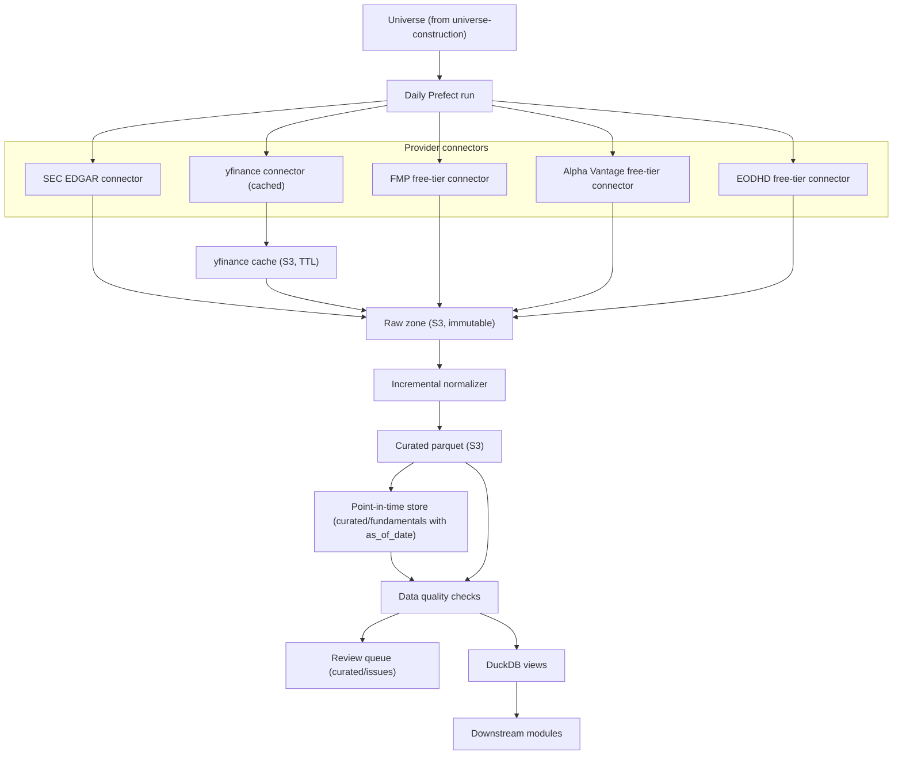

# Feature: ETL and Data Lake

## Implementation status

in_progress

## Objective

Build the module that downloads, validates, normalizes, and stores financial data so that every downstream module (universe construction, scoring, backtesting, sell-watch, portfolio evolution) can rely on a single trustworthy source. The data lake lives on AWS S3 and is queried with DuckDB. Point-in-time correctness and incremental refresh are mandatory.

## MVP scope

- Ingest US-issuer fundamentals from SEC EDGAR.
- Ingest US prices and corporate actions from `yfinance`, with the free tiers of FMP, Alpha Vantage, and EODHD as redundancy.
- Store raw provider responses verbatim in an immutable raw zone.
- Normalize raw data into a versioned curated schema (parquet, DuckDB-friendly).
- Maintain a point-in-time store keyed by EDGAR filing `acceptance-datetime`.
- Run data quality, freshness, and consistency checks; failing rows go to a review queue.
- Cache `yfinance` responses on S3 with TTL per endpoint to avoid quota issues.
- Refresh the lake incrementally: only changed or new filings / prices are reprocessed.
- Expose curated datasets (universe, fundamentals, prices, corporate actions) to downstream modules through DuckDB views on S3 parquet.

## Out of MVP scope

- Real-time streaming ingestion.
- Paid data providers (Bloomberg, FactSet, CRSP).
- Cross-currency data (only USD-denominated US issuers).
- Dividend history for the personal portfolio (tracked separately; see `portfolio-evolution.md`).
- Cross-region replication or HA setups for S3.

## Inputs

| Input | Source | Notes |
| --- | --- | --- |
| Filings index | SEC EDGAR | `submissions/CIK*.json` per filer. |
| 10-K / 10-Q | SEC EDGAR | Companyfacts JSON for normalized US-GAAP/IFRS values. |
| Filing timestamp | SEC EDGAR | `acceptance-datetime.txt` inside each filing; this is the official `as_of_date`. |
| Daily prices, splits, dividends | `yfinance` (primary), FMP / Alpha Vantage / EODHD free tiers (fallback) | Cached on S3 with TTL. |
| Sector classification (SIC) | SEC EDGAR submissions | Used by `universe-construction`. |
| Reference ticker map | `data/reference/ticker_mapping.csv` | Broker symbol -> yfinance symbol. |

## Outputs

All outputs live under `s3://smartwealthai-data-lake/` and are queryable from DuckDB.

| Dataset | Path (S3) | Partitioning | Notes |
| --- | --- | --- | --- |
| Raw filings | `raw/sec_edgar/cik=<cik>/form=<form>/accession=<accession>/` | by CIK, form, accession | Verbatim JSON/XML from EDGAR. |
| Raw prices | `raw/yfinance/ticker=<ticker>/endpoint=<endpoint>/as_of_date=<YYYY-MM-DD>/` | by ticker and endpoint | Verbatim yfinance response. |
| Curated fundamentals (PIT) | `curated/fundamentals/cik=<cik>/period=<YYYYQn>/` | by CIK and fiscal period | Parquet with `as_of_date`, `version_id`, `fiscal_period_end`. |
| Curated prices | `curated/prices/ticker=<ticker>/year=<YYYY>/` | by ticker and year | Adjusted and unadjusted close, volume, splits, dividends. |
| Universe history | `curated/universe/run_date=<YYYY-MM-DD>/` | by run date | Snapshot of the universe used by each run (built by `universe-construction`). |
| Issue registry | `curated/issues/run_date=<YYYY-MM-DD>/` | by run date | Rows that failed quality checks. |
| yfinance cache | `cache/yfinance/<ticker>/<endpoint>/<as_of_date>.parquet` | by ticker, endpoint, date | TTL per endpoint. |

## Mermaid diagram

## Expected flow

1. Receive the universe of tickers / CIKs from `universe-construction` for the run date.
2. For each CIK, pull the latest filings index from SEC EDGAR. If a new accession exists, download the filing and store it verbatim under `raw/sec_edgar/...`. Capture the `acceptance-datetime` as `as_of_date`.
3. For each ticker, request prices and corporate actions from the yfinance cache. On a cache miss (or expired TTL), call `yfinance` and write the response to `cache/yfinance/...` and `raw/yfinance/...`. Use free-tier providers as fallback if yfinance fails.
4. Run the incremental normalizer: only new accessions and only new price rows are transformed. The output is appended to the curated parquet datasets with the appropriate partitions.
5. The normalizer stamps every fundamentals row with `metric`, `as_of_date` (EDGAR acceptance timestamp), `fiscal_period_end`, and `version_id` (monotonic per CIK + fiscal period + metric to track restatements).
6. Run data quality checks (see "Data quality checks" below). Failing rows are written to `curated/issues/...` and excluded from downstream views.
7. Publish DuckDB views (`v_universe`, `v_fundamentals_pit`, `v_prices_adj`, `v_corporate_actions`) that point at the curated zone. Downstream modules consume only these views.

## Data quality checks (initial set)

| Check | Severity |
| --- | --- |
| Mandatory fields present (revenue, EBIT, net income, total assets, total liabilities, shares outstanding) | Block |
| `as_of_date` exists and is not in the future relative to `run_date` | Block |
| `fiscal_period_end <= as_of_date` | Block |
| Reported currency is USD | Block (non-USD goes to review queue) |
| Restated values produce a new `version_id` for the same `(cik, fiscal_period_end, metric)` | Warn |
| Price gap larger than configurable threshold without a corresponding corporate action | Warn |
| Volume zero across multiple consecutive trading days | Warn |
| Schema migration mismatch | Block |

## Point-in-time semantics

- Every curated fundamentals row has `(cik, fiscal_period_end, metric, as_of_date, version_id)` as the natural key.
- A query "fundamentals as of decision date D" returns, per `(cik, fiscal_period_end, metric)`, the row with the highest `as_of_date <= D` and, on tie, the highest `version_id`.
- The same logic applies when re-running historical backtests: the backtest engine pins `D = decision_date` for each rebalance and never sees a row with `as_of_date > D`.
- Restated financials are kept as new versions; the prior version is preserved for replay of past decisions.

## yfinance cache strategy

- Cache key: `(ticker, endpoint, as_of_date)`.
- TTL per endpoint:
  - Daily prices (`history`): 1 day after market close.
  - Corporate actions (`actions`): 7 days.
  - Static company info (`info`): 30 days.
  - Income statement / balance sheet / cash flow: 90 days (we still prefer EDGAR for fundamentals; yfinance fundamentals are only a sanity cross-check).
- Cache miss triggers a live call and writes the response to both the cache and the raw zone.
- Cache hits never trigger network calls.

## Incremental refresh strategy

- The ingestion scheduler tracks, per provider, the last successful `as_of_date` per ticker / CIK.
- A daily run only fetches data more recent than that watermark.
- A backfill mode exists for the initial historical load (20+ years of S&P 500 history) and is run once, manually, before the first production run.
- Curated zones are append-only. Restatements create new versions; we never overwrite a prior version.

## Acceptance criteria

- Raw and curated zones are clearly separated; raw is never read by scoring modules.
- Every fundamentals value can be traced to a source file under the raw zone and its `acceptance-datetime`.
- A query for "fundamentals available on date D" never returns rows with `as_of_date > D`.
- The same ingest run can fail for one ticker without aborting the rest.
- Schema versions and migrations are explicit; downstream views do not break silently.
- `yfinance` is not called when a valid cache entry exists.
- A full daily incremental run for the S&P 500 universe completes inside the Fargate Spot task budget (target: under 30 minutes; to validate during implementation).
- A backtest run never triggers fresh `yfinance` calls; it only reads curated parquet.
- Schema, partitioning, and DuckDB view names are documented in the spec, not only in code.

### Progress notes

- A hermetic fixture lake contract is implemented for CI in
  `tests/fixtures/lake/README.md` with raw SEC + raw yfinance snapshots,
  curated derived fundamentals, and a provenance manifest with checksums.
- Point-in-time selection and raw fixture loading behavior are covered by tests in
  `tests/test_ci_baseline.py` via `smartwealthai.fixture_lake`.
- Point-in-time fixture selection preserves one latest row per
  `(cik, fiscal_period_end, metric)` so multi-metric fundamentals are not collapsed.

## Open questions

- For SEC EDGAR, do we use `sec-edgar-downloader` (filings as files), the `sec_api` (paid), or the official EDGAR REST APIs (`/submissions`, `/companyfacts`)? Recommendation: official REST APIs for fundamentals (JSON, easy to parse) plus `sec-edgar-downloader` for full 10-K / 10-Q text when needed by `unstructured-financial-data`.
- Do we keep daily prices only, or also intraday OHLC? Recommendation: daily-only for the MVP.
- Do we need a separate metadata table tracking ingestion provenance (URL, response code, byte size, hash), or is the S3 path enough?
- What is the policy when the same field disagrees between EDGAR and yfinance? Recommendation: EDGAR wins for fundamentals; yfinance wins for prices and corporate actions; disagreements are logged.
- Should the DuckDB views materialize parquet artifacts or always read directly from S3? Recommendation: read directly from S3 for the MVP; materialize only if query latency becomes a bottleneck.
- Do we add a hash of the raw payload to detect silent provider changes?

## Risks

- yfinance is a community wrapper around an undocumented Yahoo endpoint. It can break with little warning. Mitigations: cache aggressively, treat fallbacks as first-class, log every miss.
- SEC EDGAR rate limits requests (10 req/sec, with a required User-Agent). Mitigations: respect headers, throttle, retry with backoff.
- Free-tier providers have monthly quotas. The cache and provider abstraction must make it easy to skip a provider when its quota is exhausted.
- Restated fundamentals are easy to miss if the normalizer overwrites rows instead of creating new versions. The unit tests must explicitly cover this case.
- Mishandled timezones can shift `as_of_date` by a day and create silent look-ahead bias. All timestamps are stored in UTC.
