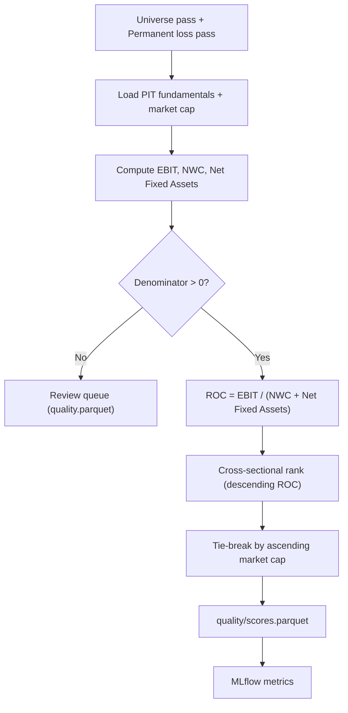

# Feature: High-Quality Stocks

## Implementation status

done (demo cross-sectional slice) — ROC scoring and ranks: `src/smartwealthai/magic_formula_ranking.py`, CLI `score-universe` ([#60](https://github.com/JLaborda/SmartWealthAI/issues/60)). Single-ticker tracer: `magic_formula_metrics.py`, `pit_fundamentals.py`, `compute-metrics` ([#44](https://github.com/JLaborda/SmartWealthAI/issues/44)).

## Objective

Score the economic quality of every company that survives the universe filter and the permanent loss filter. For the MVP, the quality factor is a strict Greenblatt-style **Return on Capital (ROC)** computed from point-in-time fundamentals. Future iterations can plug additional quality signals into the same interface.

## MVP scope

- Compute `ROC = EBIT / (Net Working Capital + Net Fixed Assets)` per the canonical Greenblatt definition.
- Use the most recent point-in-time fundamentals available on the decision date.
- Produce a cross-sectional quality rank (lower rank = higher quality) for every passing company.
- Apply a market-cap tie-break: when ROC ties, the smaller market cap wins.
- Validate denominator: rows with `Net Working Capital + Net Fixed Assets <= 0` are flagged for review and excluded from the ranking.
- Log MLflow metrics: distribution of ROC, count of valid vs invalid rows, percentile statistics.
- Expose the score, the input components, and the explanation downstream so the dashboard can show "why is this company high quality?".

## Out of MVP scope

- Multi-metric quality scores (ROIC, ROE, ROA, FCF margin, accruals, balance sheet sub-score). Captured as candidates for the next iteration.
- Sector-relative quality (sectors with unusual accounting are already excluded upstream).
- Earnings quality / accruals scoring.
- Capital allocation scoring.
- Forward-looking estimates.
- Machine learning quality prediction.

## Inputs

| Input | Source | Notes |
| --- | --- | --- |
| Passing universe + permanent loss filter pass list | `curated/universe` + `curated/permanent_loss` | Only `pass` rows are scored. |
| PIT fundamentals (income statement, balance sheet) | `curated/fundamentals` | Filtered by `as_of_date <= run_date`. |
| Market cap | `curated/prices/run_date=<YYYY-MM-DD>/prices.parquet` join `curated/fundamentals` | Tie-break uses `shares_outstanding * adj_close` on `run_date`. |
| Run date | Pipeline parameter | |
| ROC formula version | `config/quality/roc.yaml` | Versioned to allow future variants. |

## ROC definition (canonical Greenblatt)

```
ROC = EBIT / (Net Working Capital + Net Fixed Assets)
```

with:

- `EBIT` = Operating income before interest and taxes. Trailing twelve months.
- `Net Working Capital` = `max(Current Assets - Excess Cash - Current Liabilities + Short-Term Debt, 0)` (Greenblatt uses non-interest-bearing current liabilities; we use this approximation and version it).
- `Net Fixed Assets` = Total fixed assets (PP&E net of depreciation).
- All values from the latest filing whose `as_of_date <= run_date`.

The formula and its variants are versioned in `config/quality/roc.yaml`. Any change requires a new version id so backtests on prior versions remain reproducible.

## Outputs

| Output | Path / target |
| --- | --- |
| Quality scores parquet | `curated/scores/quality/run_date=<YYYY-MM-DD>/scores.parquet` with `cik, ticker, ebit, nwc, net_fixed_assets, roc, roc_rank, market_cap, tiebreak_rank, formula_version, as_of_date` |
| Review queue rows | `curated/issues/run_date=<YYYY-MM-DD>/quality.parquet` for invalid denominators and other warnings |
| MLflow metrics | `quality_n_valid`, `quality_n_invalid`, ROC quantiles |

## Mermaid diagram



## Expected flow

1. Load the passing universe and join with PIT fundamentals.
2. Compute `EBIT`, `Net Working Capital`, and `Net Fixed Assets` using the formula version configured for the run.
3. Validate inputs: drop rows with missing components; flag rows with `denominator <= 0` and route them to the review queue.
4. Compute `ROC`.
5. Produce a cross-sectional rank from highest ROC (rank 1) to lowest.
6. Resolve ties by ascending market cap.
7. Persist the parquet output and log MLflow metrics.

## Acceptance criteria

- Same `(universe, run_date, formula_version)` produces byte-identical output (hash-verifiable).
- The score is purely a function of curated PIT data; no network calls.
- Every row has both the ROC value and the components that produced it.
- Rows with invalid denominators are visible in the review queue and not silently dropped or auto-scored.
- The ranking is stable: changing only the market cap of a non-tied row never changes the rank order.
- The MLflow run logs at minimum count of valid rows, count of invalid rows, ROC median, and ROC quantiles.
- The formula version travels with each scored row, so a backtest using a past `formula_version` is reproducible.

## Open questions

- Greenblatt himself uses Pre-Tax Operating Earnings; do we use `EBIT` straight from EDGAR (`OperatingIncomeLoss + InterestAndDebtExpense`) or compute Pre-Tax Operating Earnings explicitly? Recommendation: use `OperatingIncomeLoss` from EDGAR and document the choice as `formula_version = v1`.
- ~~Excess cash definition for `Net Working Capital`~~ **Closed (v1):** curated `cash` uses SimFin `Cash, Cash Equivalents & Short Term Investments` for both NWC and EV (known approximation — NWC excess-cash adjustment is slightly aggressive vs cash-equivalents-only).
- Should very small ROC differences (e.g., < 0.1 percentage point) be treated as ties for the market-cap tie-break? Recommendation: no in the MVP; revisit if rank stability becomes a problem.
- For companies with negative EBIT but positive denominator, ROC is negative. Do we exclude them, or rank them at the bottom? Recommendation: rank them at the bottom; they will likely never enter the top 30 anyway.

## Risks

- `Net Working Capital` and `Net Fixed Assets` definitions vary across textbooks and providers. Locking the formula version is the only way to keep backtests reproducible.
- Single-metric quality leaves the strategy exposed to capital-light tech businesses whose balance sheets distort ROC. We accept this in the MVP and document the limitation.
- Restatements can move ROC sharply between versions. The PIT store keeps both versions; backtests must pick the version available at `as_of_date`.
- One-off items in EBIT can produce false positives. The MVP does not adjust for them; this is a known weakness of the Greenblatt placeholder.
