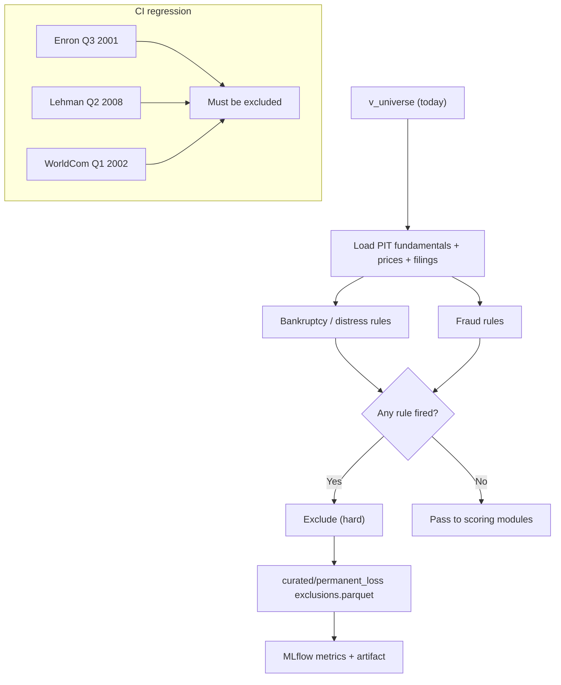

# Feature: Permanent Loss Filter

## Implementation status

**Deferred** for the June 30 demo slice ([ADR-0002](../../adr/0002-june-demo-scope-cut.md)). Spec remains the target for phase 2.

## Objective

Identify companies in the investable universe with elevated risk of permanent capital loss and remove them from the ranking before any score is computed. For the MVP, "permanent loss" is defined narrowly as **fraud or bankruptcy / financial distress**. Companies flagged by either subfilter are hard-excluded.

## MVP scope

- Hard exclusion (not a score penalty). A flagged company never enters the ranking.
- Two subfilters: fraud signals and bankruptcy / distress signals.
- Inputs come from the curated point-in-time store; no live network calls.
- Every exclusion records the triggered rule, the inputs that fired it, and the `as_of_date`.
- Regression test in CI: the bankruptcy subfilter must flag Enron, Lehman, and WorldCom on the dates each company was already in clear distress (e.g., Enron Q3 2001 10-Q, Lehman Q2 2008 10-Q, WorldCom Q1 2002 10-Q). If any of these stops being flagged, the CI build fails.

## Out of MVP scope

- Manipulation / accruals models (Beneish M-score, accruals-based scores). Deferred.
- Machine learning fraud detection.
- LLM-driven qualitative analysis of filings (handled later by `unstructured-financial-data`).
- Sector-specific distress models (banks, insurers, REITs and utilities are already excluded upstream by `universe-construction`).
- `Penalize` and `unknown` states. Only `pass` and `exclude` for the MVP.

## Inputs

| Input | Source |
| --- | --- |
| Curated PIT fundamentals (income statement, balance sheet, cash flow) | `curated/fundamentals` |
| Adjusted prices and corporate actions | `curated/prices` |
| SEC filing index (form type, accession, acceptance datetime) | `curated/sec_edgar/submissions` |
| Auditor information (when extracted) | `curated/sec_edgar/auditor` (future) |
| Regression test fixtures | `tests/fixtures/permanent_loss/` (CIK + as_of_date + expected `exclude`) |
| Run date | Pipeline parameter |

## Outputs

| Output | Path / target |
| --- | --- |
| Exclusion table | `curated/permanent_loss/run_date=<YYYY-MM-DD>/exclusions.parquet` with columns `cik, ticker, subfilter, rule_id, rule_version, triggered_value, threshold, as_of_date, explanation` |
| Filter status | `pass` or `exclude` per `(cik, as_of_date)` |
| Logged metrics (MLflow) | Number of evaluations, number of exclusions per subfilter, list of newly excluded companies |

## Bankruptcy / distress subfilter (MVP rules)

The MVP implements a small but well-known set of distress indicators. Each rule has a versioned id so historical decisions can be replayed.

| Rule id | Definition | Threshold (initial) | Source |
| --- | --- | --- | --- |
| `BK_ALTMAN_Z` | Altman Z-score for non-financials | Z < 1.81 | `curated/fundamentals` |
| `BK_INT_COVERAGE` | Interest coverage (EBIT / Interest Expense), TTM | < 1.0 | `curated/fundamentals` |
| `BK_NETDEBT_EBITDA` | Net debt to EBITDA, TTM | > 7.0 with negative FCF | `curated/fundamentals` |
| `BK_NEGATIVE_EQUITY` | Stockholders' equity | < 0 | `curated/fundamentals` |
| `BK_GOING_CONCERN` | "Going concern" language flag from latest 10-K (provided by `unstructured-financial-data` once available) | flag present | `curated/text_flags` (future) |
| `BK_DELISTED` | Listing status | `delisted` and `delisting_reason in {bankruptcy, regulatory}` | `curated/prices` |

A company is excluded if **any** of the above rules fire.

## Fraud subfilter (MVP rules)

The MVP fraud signals are intentionally narrow. They detect structural / accounting events, not subjective judgments.

| Rule id | Definition | Threshold (initial) |
| --- | --- | --- |
| `FRD_RESTATEMENT_RECENT` | Material restatement of prior reported figures in the last 12 months (e.g., 10-K/A or 10-Q/A filings) | `>= 1` filing |
| `FRD_AUDITOR_CHANGE_REPEATED` | Auditor change in 2 of the last 3 fiscal years | `>= 2` changes |
| `FRD_REGULATORY_ACTION` | Open SEC enforcement action against the issuer | `True` |
| `FRD_LATE_FILER` | Filed `NT 10-K` or `NT 10-Q` (late filing notification) in last 12 months | `>= 1` filing |

A company is excluded if **any** rule fires. Rules that depend on data not yet available in the MVP (`FRD_REGULATORY_ACTION`, derived from EDGAR enforcement feeds) are coded but tolerated as `unavailable` until the data is wired. Their absence is logged.

## Mermaid diagram

## Expected flow

1. Read the universe for the run date from `v_universe`.
2. Join with the latest PIT fundamentals (using `as_of_date <= run_date`).
3. Compute each bankruptcy and fraud rule. Rules with missing required inputs are recorded as `unavailable` and the row is sent to the review queue (not auto-excluded).
4. If any rule fires, mark the company as `exclude` with the rule id, threshold, and the values that triggered it.
5. Write the exclusion parquet and log MLflow metrics.
6. Hand the passing set of `(cik, ticker)` to the scoring modules.

## Acceptance criteria

- The module is a pure function of curated parquet + reference rules: same inputs produce byte-identical output (verifiable by hash).
- The regression CI test for Enron, Lehman, and WorldCom blocks the build if any of the three stops being flagged.
- Every excluded row carries the `rule_id`, `rule_version`, `triggered_value`, and `threshold`.
- Rule definitions live in code, but thresholds live in a YAML config under `config/permanent_loss/` so they can be tuned by backtests without code changes.
- The filter never queries network resources.
- Companies with `unavailable` rule outputs do not pass silently: they enter the review queue.
- Each MLflow run for the permanent loss filter logs the count of exclusions per rule.

## Open questions

- Should `BK_NETDEBT_EBITDA` be sector-relative even though banks / insurers / utilities are excluded? Recommendation: keep it absolute for the MVP; revisit when those sectors are reintroduced.
- Threshold for `BK_NETDEBT_EBITDA` should probably be revisited per backtest; the initial 7.0 is a placeholder.
- Where does the auditor-change history come from? Recommendation: parse `acceptedAccountingFirm` from EDGAR if available; otherwise wait for `unstructured-financial-data` to provide it.
- Do we want a "watchlist" state (`watch`) between `pass` and `exclude`? Recommendation: no for the MVP; that role is fulfilled by `sell-watch` once a company is held.

## Risks

- Excluding bankrupt companies after the fact is easy; excluding them *before* is the hard part. The Altman Z-score has known weaknesses for tech / asset-light companies. The MVP accepts this in exchange for simplicity.
- Restatements happen for innocent reasons (acquisitions, IFRS-to-GAAP changes). The MVP rule will produce some false positives; they are tracked in the FP/FN review process.
- Removing companies for "late filer" status can be aggressive. We log every `NT 10-K` and `NT 10-Q` so the FP review can tune the rule.
- `BK_DELISTED` is only useful historically; it cannot prevent a loss in real time. Its purpose is to make the historical backtest realistic (a delisted-for-bankruptcy company never enters the post-delisting universe).
