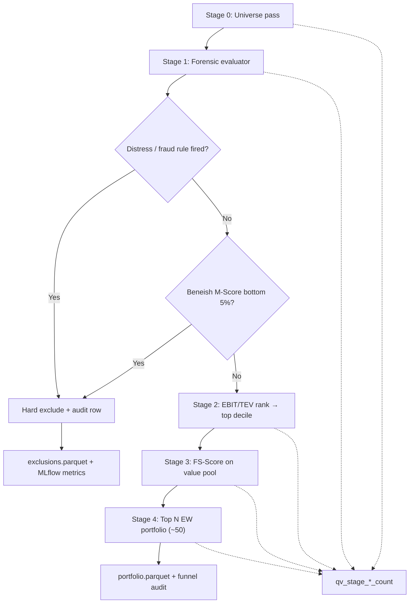

# Feature: Quantitative Value (QV funnel)

## Implementation status

**done** (spec only) — canonical QV feature spec authored in [#86](https://github.com/JLaborda/SmartWealthAI/issues/86). Scoring code deferred to [#89](https://github.com/JLaborda/SmartWealthAI/issues/89)–[#93](https://github.com/JLaborda/SmartWealthAI/issues/93).

## Objective

Define the **production scoring path** for Phase 2+: the *Quantitative Value* funnel from Wesley R. Gray and Tobias Carlisle — forensic hard exclusion, EBIT/TEV value screen, FS-Score quality screen, and a concentrated equal-weight **model portfolio**. The June 30 demo **Magic Formula** path (ROC + EY + combined rank → top 30) remains a **benchmark-only** replica for backtest comparison, not production scoring.

Parent PRD: [`docs/mvp/prds/phase2/prd.md`](../prds/phase2/prd.md).

## MVP scope

- **Sequential funnel** with monotonic shrinkage: each stage only removes names; stage input/output counts are auditable and logged to MLflow.
- **Stage 1 — Universe pass:** investable tickers from [`universe-construction.md`](universe-construction.md) (sector hard exclusions upstream).
- **Stage 2 — Forensic hard exclusion:** evaluate all rules in [`permanent-loss-filter.md`](permanent-loss-filter.md) plus **Beneish M-Score** with a QVAL-style **bottom-5% cross-sectional gate** per forensic model among survivors. Emit `exclude` or `pass` with `rule_id`, `rule_version`, `triggered_value`, `threshold`, `explanation`.
- **Stage 3 — Value screen:** rank forensic survivors by **EBIT/TEV** descending (same EV definition as [`cheap-stocks.md`](cheap-stocks.md)); keep the top **decile (~10%)**, configurable via `value_decile_fraction`.
- **Stage 4 — Quality screen:** compute **FS-Score** (Gray/Carlisle 10-component variant) on the value pool; rank by FS-Score descending; keep the top **N** names up to the portfolio cap (default **50**).
- **Stage 5 — Model portfolio:** equal-weight long-only holdings; **market-cap tie-break** on rank ties (ascending, same convention as demo MF).
- **Configuration:** versioned YAML under `config/quantitative_value/` (funnel parameters) and `config/permanent_loss/` (forensic thresholds, Beneish coefficients).
- **Outputs:** per-stage parquet tables, final `model_portfolio` rows, MLflow metrics (`qv_stage_*_count`, config hashes, `git_sha`).
- **Explainability:** dashboard shows stage membership, EBIT/TEV rank, FS-Score components, and forensic pass/exclusion reasons per ticker.

## Out of MVP scope

- Implementing forensic evaluator, FS-Score calculator, QV orchestrator, or scoring CLI wiring ([#89](https://github.com/JLaborda/SmartWealthAI/issues/89)–[#91](https://github.com/JLaborda/SmartWealthAI/issues/91)).
- Multi-period ETL and daily prices ([#87](https://github.com/JLaborda/SmartWealthAI/issues/87), [#88](https://github.com/JLaborda/SmartWealthAI/issues/88)) — prerequisite data work, not part of this spec's implementation slice.
- Cloud deploy, ECS, S3 lake root ([#94](https://github.com/JLaborda/SmartWealthAI/issues/94), [#95](https://github.com/JLaborda/SmartWealthAI/issues/95)).
- Changing demo Magic Formula scoring behavior (ROC/EY/combined rank path preserved for benchmark).
- Moat "pre-flight checklist" and full forensic model zoo beyond Beneish + spec distress rules.
- Score-weighted and risk-parity portfolio weighting (equal-weight only in Phase 2a).
- Paper trading, broker execution, auto-execution of sell signals.

## Inputs

| Input | Source | Notes |
| --- | --- | --- |
| Universe pass list | `curated/universe` | `pass` rows only; banks/insurers/utilities already excluded. |
| PIT fundamentals (multi-period) | `curated/fundamentals` | `as_of_date <= run_date`; annual/quarterly history required for FS-Score YoY deltas ([#87](https://github.com/JLaborda/SmartWealthAI/issues/87)). |
| Run-date prices | `curated/prices` | Market cap and EV components at `run_date`. |
| Forensic rules + Beneish config | `config/permanent_loss/` | Thresholds and coefficient sets are versioned. |
| QV funnel config | `config/quantitative_value/` | `value_decile_fraction`, `portfolio_size`, `formula_version`, tie-break policy. |
| Run date | Pipeline parameter | Decision date for PIT queries and cross-sectional ranks. |
| Permanent loss exclusions (reference) | [`permanent-loss-filter.md`](permanent-loss-filter.md) | Bankruptcy/distress + fraud rules; extended here with Beneish. |

## Outputs

| Output | Path / target |
| --- | --- |
| Stage counts (MLflow) | `qv_stage_universe_count`, `qv_stage_forensic_pass_count`, `qv_stage_value_pool_count`, `qv_stage_quality_pool_count`, `qv_stage_portfolio_count` |
| Forensic exclusions | `curated/permanent_loss/run_date=<YYYY-MM-DD>/exclusions.parquet` — columns `cik, ticker, subfilter, rule_id, rule_version, triggered_value, threshold, percentile, as_of_date, explanation` |
| Value pool scores | `curated/scores/qv_value/run_date=<YYYY-MM-DD>/scores.parquet` — `cik, ticker, ebit, ev, ebit_tev, value_rank, formula_version, as_of_date` |
| Quality scores | `curated/scores/qv_quality/run_date=<YYYY-MM-DD>/scores.parquet` — `cik, ticker, fs_score, fs_*` component columns, `formula_version`, `as_of_date` |
| Funnel audit | `curated/scores/qv_funnel/run_date=<YYYY-MM-DD>/funnel.parquet` — per-ticker stage reached, exclusion reason if any |
| Model portfolio (QV) | `curated/portfolio/qv/run_date=<YYYY-MM-DD>/portfolio.parquet` — `cik, ticker, qv_funnel_rank, fs_score, ebit_tev, weight, formula_version` |
| Review queue | `curated/issues/run_date=<YYYY-MM-DD>/qv.parquet` — missing FS-Score or forensic inputs |

## Funnel stages

| Stage | Name | Action | Typical shrinkage |
| --- | --- | --- | --- |
| 0 | Universe | Sector-filtered investable set | Baseline count |
| 1 | Forensic | Hard `exclude` on any distress/fraud rule **or** Beneish bottom 5% | Largest drop |
| 2 | Value | Top decile by EBIT/TEV among survivors | ~90% removed |
| 3 | Quality | FS-Score rank within value pool; select top N by score | To ~50 names |
| 4 | Portfolio | Equal-weight; market-cap tie-break on rank ties | Final holdings |

**Monotonicity contract:** a name excluded at stage *k* never appears in stages *k+1* … portfolio. Stage counts must satisfy `count[k] >= count[k+1]` for all adjacent stages.

## Forensic stage (extends permanent loss filter)

Forensic evaluation runs **before** any value or quality score. It **references and extends** [`permanent-loss-filter.md`](permanent-loss-filter.md):

| Source | Rules | MVP behavior |
| --- | --- | --- |
| Bankruptcy / distress | `BK_ALTMAN_Z`, `BK_INT_COVERAGE`, `BK_NETDEBT_EBITDA`, `BK_NEGATIVE_EQUITY`, `BK_DELISTED` | Hard `exclude` if any rule fires |
| Fraud | `FRD_RESTATEMENT_RECENT`, `FRD_AUDITOR_CHANGE_REPEATED`, `FRD_LATE_FILER` | Hard `exclude` if any rule fires; EDGAR-dependent rules may be `unavailable` until wired |
| Manipulation (QV) | `FRD_BENEISH_M` | Compute Beneish M-Score; **exclude names in the bottom 5%** of the cross-sectional M-Score distribution among forensic-stage candidates |

### Beneish M-Score bottom-5% gate

- **Rule id:** `FRD_BENEISH_M`
- **Config:** `config/permanent_loss/beneish.yaml` (`rule_version`, coefficient set, minimum input coverage)
- **Gate:** among companies with a computable M-Score at `run_date`, exclude those at or below the **5th percentile** (QVAL-style safety screen per forensic model).
- **Audit columns:** `rule_id`, `rule_version`, `triggered_value` (M-Score), `threshold` (5th percentile cutoff), `percentile`, `explanation`
- **Missing inputs:** route to review queue; do not silently pass (same policy as permanent-loss spec).

Distress and fraud rules from the permanent-loss spec retain their existing thresholds in `config/permanent_loss/`; Beneish coefficients and percentile gate live in the same namespace with separate version ids.

## Value screen (EBIT/TEV)

Production **cheapness** is membership in the **EBIT/TEV value pool**, not MF **EY rank** alone.

```
EBIT/TEV = EBIT / Enterprise Value
EV = Market Cap + Total Debt + Preferred Equity + Minority Interest - Cash
```

- Same `EBIT` and EV component definitions as [`cheap-stocks.md`](cheap-stocks.md) (`formula_version` shared where components overlap).
- Cross-sectional rank **within forensic survivors** by descending EBIT/TEV.
- Keep top `value_decile_fraction` (default **0.10** ≈ decile).
- `EBIT <= 0` or invalid EV → review queue, not value pool.
- Output metric is **EBIT/TEV** and `value_rank`; this path is separate from MF `ey_rank`.

## FS-Score (Gray/Carlisle variant)

Production **quality** is the **FS-Score** composite on the value pool, not ROC rank alone. Ten binary components (1 = good, 0 = bad); sum to integer **0–10**. Reference: Gray & Carlisle, *Quantitative Value* (2013), Ch. 6; [Alpha Architect FS-Score article](https://alphaarchitect.com/2015/05/value-investing-research-simple-methods-to-improve-the-piotroski-f-score/).

`formula_version` (initial: `fs_v1`) is recorded on every scored row.

### Current profitability

| Component id | Definition | Score = 1 when |
| --- | --- | --- |
| `FS_ROA` | ROA = net income before extraordinary items / total assets (most recent fiscal year) | ROA > 0 |
| `FS_FCFTA` | FCFTA = free cash flow / total assets | FCFTA > 0 |
| `FS_ACCRUAL` | Accrual quality signal | FCFTA > ROA |

### Stability

| Component id | Definition | Score = 1 when |
| --- | --- | --- |
| `FS_ΔLEVER` | Change in long-term debt / total assets | Leverage ratio **decreased** YoY |
| `FS_ΔLIQUID` | Change in current ratio (current assets / current liabilities) | Liquidity ratio **increased** YoY |
| `FS_NEQISS` | Net equity issuance = repurchases − issuances | Repurchases **exceed** issuances |

### Recent operational improvements

| Component id | Definition | Score = 1 when |
| --- | --- | --- |
| `FS_ΔROA` | Current ROA − prior ROA | ΔROA > 0 |
| `FS_ΔFCFTA` | Current FCFTA − prior FCFTA | ΔFCFTA > 0 |
| `FS_ΔMARGIN` | Current gross margin − prior gross margin | ΔMARGIN > 0 |
| `FS_ΔTURN` | Current asset turnover − prior asset turnover | ΔTURN > 0 |

**FS-Score** = sum of all ten components. **QV funnel rank** within the value pool orders by FS-Score descending; ties break by ascending market cap (configurable in `config/quantitative_value/tie_break.yaml`).

Missing prior-year inputs for a component → component scores 0 and row is flagged in review queue if coverage falls below configured minimum.

## Model portfolio (QV)

| Topic | Decision (closed) |
| --- | --- |
| Default size | **50** names |
| Configurable cap | `portfolio_size` in `config/quantitative_value/funnel.yaml` |
| Weighting | Equal-weight only (Phase 2a) |
| Selection | Top N by FS-Score within value pool |
| Tie-break | Ascending market cap on rank ties |
| Long/short | Long-only |

This supersedes the demo slice top-30 MF portfolio for **production** scoring only; the MF replica may use a different N for benchmark comparison.

## Key interfaces (spec contracts)

These are **documentation contracts** for downstream implementation issues; no code in this issue.

### QV funnel orchestrator

- **Input:** `run_date`, lake root, QV + forensic config hashes.
- **Behavior:** run stages 0→4 sequentially; delegate to forensic evaluator, value ranker, FS-Score ranker, portfolio constructor; emit stage-count metrics.
- **Output:** `ScoringResult`-like object with per-stage tables, final portfolio, MLflow-ready metrics.

### Forensic evaluator

- **Input:** universe pass list + PIT fundamentals (+ optional filing flags).
- **Output:** `exclude` or `pass` per `(cik, run_date)` with full audit columns.

### FS-Score calculator

- **Input:** multi-period PIT income/balance/cashflow for one ticker at `decision_date`.
- **Output:** component dict, total 0–10, `formula_version`.

### Value metrics

- Reuse EV/EBIT building blocks from cheap-stocks module; separate production path from MF `EY rank`.

### Magic Formula benchmark path

- Preserve ROC + EY + **combined rank** unchanged; invoke only from backtest benchmark builder and dedicated CI tests.

## Configuration namespace

| Path | Contents |
| --- | --- |
| `config/quantitative_value/funnel.yaml` | `portfolio_size` (default 50), `value_decile_fraction` (default 0.10), stage ordering |
| `config/quantitative_value/fs_score.yaml` | `formula_version`, minimum input coverage, fiscal-year alignment rules |
| `config/quantitative_value/tie_break.yaml` | Market-cap tie-break policy |
| `config/permanent_loss/*.yaml` | Distress/fraud thresholds (existing) + `beneish.yaml` (coefficients, bottom-percentile gate) |

Every MLflow run logs config file hashes and `formula_version` values.

## Mermaid diagram



## Expected flow

1. Load universe pass list for `run_date`; log `qv_stage_universe_count`.
2. Run forensic evaluator (permanent-loss rules + Beneish bottom-5% gate); write exclusions; log `qv_stage_forensic_pass_count`.
3. Rank forensic survivors by EBIT/TEV; keep top decile; log `qv_stage_value_pool_count`.
4. Compute FS-Score for value-pool names; rank by total score; select top `portfolio_size`; log `qv_stage_quality_pool_count`.
5. Build equal-weight portfolio with market-cap tie-break; log `qv_stage_portfolio_count`.
6. Persist parquet artifacts and MLflow run (params, stage metrics, portfolio artifact, `git_sha`).

## Acceptance criteria

- [x] Spec exists with objective, MVP scope, inputs/outputs, funnel stages, Mermaid diagram, acceptance criteria, and risks ([#86](https://github.com/JLaborda/SmartWealthAI/issues/86)).
- [x] FS-Score documents all **10 binary components** with Gray/Carlisle definitions and `formula_version`.
- [x] Forensic stage references [`permanent-loss-filter.md`](permanent-loss-filter.md) and documents Beneish **bottom-5%** gate with audit columns.
- [x] Portfolio size default **~50** recorded as a closed decision with configurable cap.
- [ ] Funnel monotonic shrinkage: each stage only removes names; stage counts auditable in MLflow (implementation [#91](https://github.com/JLaborda/SmartWealthAI/issues/91)).
- [ ] Forensic hard exclusion runs before any value/quality score (implementation [#89](https://github.com/JLaborda/SmartWealthAI/issues/89)).
- [ ] Value screen keeps top decile by EBIT/TEV among survivors (implementation [#90](https://github.com/JLaborda/SmartWealthAI/issues/90)).
- [ ] Quality screen ranks FS-Score within value pool; portfolio cap applied last (implementation [#91](https://github.com/JLaborda/SmartWealthAI/issues/91)).
- [ ] MF **combined rank** remains benchmark-only; demo ROC/EY path unchanged on fixtures (regression in CI).
- [ ] Same `(universe, run_date, config hashes)` produces byte-identical funnel outputs when implementation lands.

## Open questions

- Beneish M-Score: use classic 8-variable model or include optional 9th/10th variables when data exists? **Recommendation:** start with 8-variable `M-Score` per Beneish (1999); document coefficient set in `beneish.yaml`; extend in a new `rule_version` if coverage improves.
- FS-Score fiscal alignment: match on fiscal year-end or trailing four quarters? **Recommendation:** fiscal year pairs for YoY deltas; flag mismatched fiscal calendars in review queue.
- Value decile: fixed 10% fraction vs fixed count? **Recommendation:** fraction (`value_decile_fraction = 0.10`) so pool scales with universe size.

## Risks

- **Missing multi-period data** shrinks FS-Score coverage; depends on [#87](https://github.com/JLaborda/SmartWealthAI/issues/87) landing first.
- **Beneish false positives** on growth firms with high DSRI; bottom-5% gate mitigates but does not eliminate FP review burden.
- **Survivorship bias** in Phase 2a light backtest (current SimFin US universe) — must be labeled in reports per PRD.
- **Compute cost:** full funnel × rebalance dates in backtests; plan DuckDB pushdown or materialized stage tables early.
- **Vocabulary drift:** production terms (FS-Score, EBIT/TEV value pool, QV funnel rank) must stay distinct from MF benchmark terms in code and `CONTEXT.md`.
