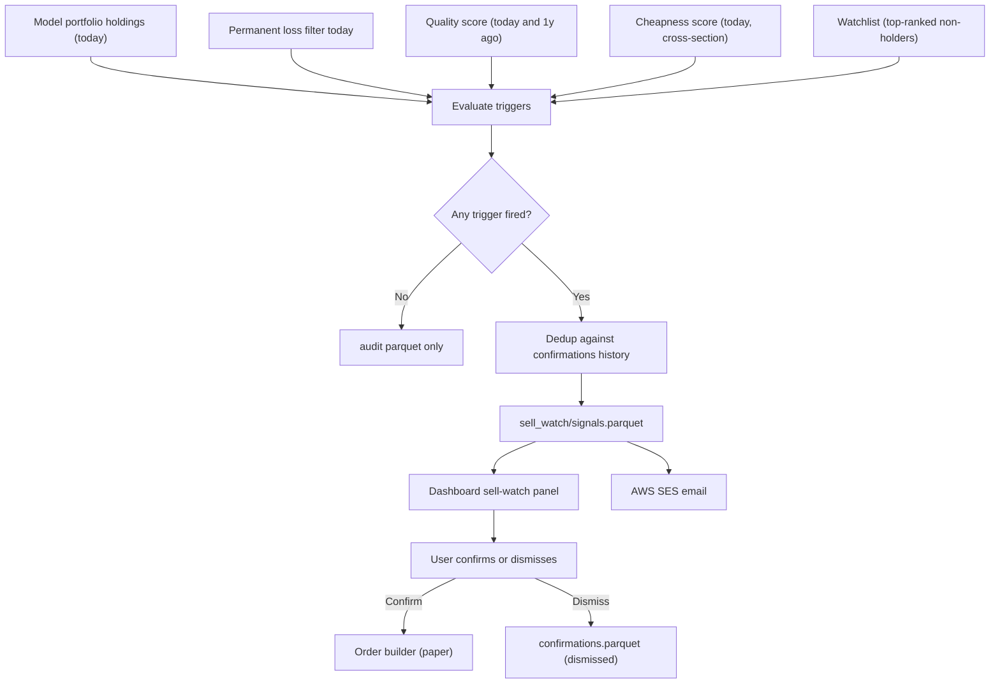

# Feature: Sell-Watch / Vigilance

## Objective

Monitor every name held in the **model portfolio** every day and emit a hard `sell` signal when the thesis breaks. Signals never auto-execute: they appear in the dashboard and trigger an AWS SES email so the user can review and confirm. Sell-watch does not monitor the user's personal portfolio (those are personal decisions).

## MVP scope

- Daily run against the live model portfolio holdings.
- Four trigger families: quality deterioration, fraud / bankruptcy flag turning on after entry, overvaluation, opportunity cost.
- Hard `sell` only. No `trim` or `hold-with-warning` states.
- Manual confirmation required: a sell signal must be confirmed in the dashboard before the broker module builds an order.
- Alerts: dashboard badge + AWS SES email per signal.
- Logs every evaluation (signal or no signal) for audit and FP/FN review.
- MLflow run per daily evaluation with parameters, metrics, and artifacts.

## Out of MVP scope

- Monitoring of the user's personal portfolio.
- Price-based stops (trailing stop, drawdown stop).
- Time-based stops.
- Automatic execution.
- Multi-state output (`trim`, `hold-with-warning`).
- LLM-driven narrative explanation (deferred).

## Inputs

| Input | Source |
| --- | --- |
| Current model portfolio holdings | `curated/portfolio/model/holdings.parquet` (produced by portfolio-construction) |
| Latest PIT fundamentals | `curated/fundamentals` |
| Latest prices | `curated/prices` |
| Latest quality scores | `curated/scores/quality` |
| Latest cheapness scores | `curated/scores/cheap` |
| Latest watchlist (top-ranked names not yet held) | `curated/portfolio/watchlist.parquet` |
| Permanent loss filter output | `curated/permanent_loss` |
| Confirmed signals history | `curated/sell_watch/confirmations.parquet` (so we do not re-alert on the same signal day after day) |
| Sell-watch config | `config/sell_watch.yaml` (thresholds, opportunity-cost margin, lookback for ROC YoY) |

## Trigger definitions (MVP)

All thresholds are starting points and live in `config/sell_watch.yaml`. Each is hyperparameter-able by the backtest engine.

| Trigger id | Rule | Default threshold |
| --- | --- | --- |
| `SW_PERMANENT_LOSS` | The permanent loss filter, evaluated on the holding today, flags `exclude` | n/a |
| `SW_QUALITY_DROP_YOY` | ROC YoY drop greater than `quality_yoy_drop` | 30% |
| `SW_QUALITY_DECILE_DROP` | The holding is no longer in the top decile of cross-sectional ROC | top 10% |
| `SW_OVERVALUATION_PCT` | EY below the cross-sectional `overvaluation_percentile` of the current universe | 10th percentile |
| `SW_OVERVALUATION_ABS` | EY below the absolute `overvaluation_floor` | 5.0% |
| `SW_OPPORTUNITY_COST` | A watchlist candidate outranks the holding by more than `opportunity_cost_margin` positions on the combined Greenblatt rank | 5 positions |

A holding is flagged `sell` if `SW_PERMANENT_LOSS` fires, **or** any quality trigger fires (`SW_QUALITY_DROP_YOY` or `SW_QUALITY_DECILE_DROP`), **or** any overvaluation trigger fires (`SW_OVERVALUATION_PCT` or `SW_OVERVALUATION_ABS`), **or** `SW_OPPORTUNITY_COST` fires.

## Outputs

| Output | Path / target |
| --- | --- |
| Signals parquet | `curated/sell_watch/run_date=<YYYY-MM-DD>/signals.parquet` with `ticker, triggers, fired_thresholds, values, message_id, status` |
| Audit parquet | `curated/sell_watch/run_date=<YYYY-MM-DD>/evaluations.parquet` (every holding evaluated, signal or no signal) |
| Email payload (per signal) | Subject + body + dashboard deep link |
| MLflow metrics | Count of signals per trigger, daily count of evaluations, count of confirmed vs ignored signals |

The `status` field starts as `proposed` and moves to `confirmed` or `dismissed` when the user acts on it from the dashboard.

## Mermaid diagram

## Expected flow

1. Pull today's holdings from the model portfolio table.
2. For each holding:
   1. Look up its current permanent loss status. If `exclude`, fire `SW_PERMANENT_LOSS`.
   2. Compute ROC today and ROC 1 year ago from PIT data. Fire `SW_QUALITY_DROP_YOY` if drop > threshold.
   3. Locate the holding's ROC rank among the current universe. Fire `SW_QUALITY_DECILE_DROP` if it left the top decile.
   4. Locate the holding's EY in today's universe percentile. Fire `SW_OVERVALUATION_PCT` if below the configured percentile.
   5. Read the holding's absolute EY. Fire `SW_OVERVALUATION_ABS` if below the absolute floor.
   6. Compare the holding's combined Greenblatt rank against the best non-held watchlist candidate. Fire `SW_OPPORTUNITY_COST` if margin exceeds threshold.
3. If any trigger fired, check the confirmations history to avoid re-alerting on an already-active signal. If it is new, write a signal row and send an SES email.
4. Write the audit parquet covering every evaluation.
5. The dashboard exposes the open signals. The user clicks confirm or dismiss, which writes `confirmations.parquet`.
6. Confirmed signals flow into the broker module as sell orders. Dismissed signals are remembered so we do not re-fire the same signal until the underlying input changes materially.
7. Log MLflow metrics for the daily run.

## Acceptance criteria

- The module never fires an order autonomously. The broker module requires a confirmed signal.
- A signal is deduplicated against the confirmations history so the same trigger does not email the user every day.
- Every signal row contains the trigger ids, the input values, the thresholds in effect, and the `as_of_date`.
- The audit parquet contains a row for every holding evaluated, signal or no signal.
- Thresholds live in YAML and travel with the run; backtests can sweep them.
- Emails sent through AWS SES include a dashboard deep link to the signal.
- The pipeline is idempotent for a given run date: re-running produces the same signal set without duplicate emails (idempotent by `message_id`).
- The MLflow run logs at minimum: number of evaluations, number of signals, number per trigger.

## Open questions

- For the "no longer in top decile" rule, do we use the decile of the same universe used to enter the position, or today's universe? Recommendation: today's universe; matches the spirit of opportunity cost.
- For `SW_QUALITY_DROP_YOY`, how do we handle restatements that change ROC retroactively? Recommendation: compare today's PIT ROC against the ROC value used at entry (snapshot at purchase), not against today's "1 year ago" PIT slice.
- The opportunity-cost trigger requires the watchlist to be sorted by the same combined rank used to enter. Should the watchlist be recomputed daily, or only at rebalance? Recommendation: daily, cheap.
- Should we dampen the email frequency with a rate limit (e.g., max 5 signals per day)? Recommendation: yes, with an MLflow metric reporting the suppression count.
- For the dismissed-signal memory: how long do we wait before re-firing a dismissed signal? Recommendation: until either the trigger value changes by more than 10% from the dismissal value, or 90 days have passed, whichever comes first.

## Risks

- Daily signals can desensitize the user. The dedup + dismissal memory exists to prevent this.
- The opportunity-cost trigger is the most rank-sensitive: small ranking noise can produce churn. The 5-position margin is the dampener; the backtest must validate that it is not too aggressive.
- Restated fundamentals can produce false sells if we rely on today's PIT slice for "ROC 1 year ago". The snapshot-at-entry approach above mitigates this.
- AWS SES may rate-limit or land in spam if the sender domain is not verified. The infrastructure spec must include verifying the SES sender identity.
- The user can dismiss legitimate signals out of bias. The FP/FN review of dismissed signals is a follow-up improvement.
