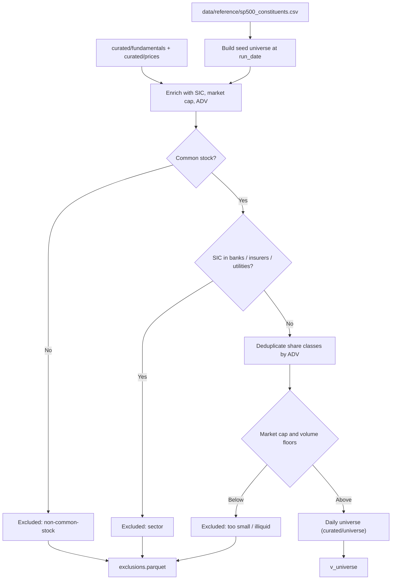

# Feature: Universe Construction

## Objective

Produce the investable universe of US common stocks for each decision date. This module is the single entry point for "which tickers does the strategy consider today?" and is the upstream dependency of every downstream module. It must be point-in-time correct and survivorship-bias-free.

## MVP scope

- Use the S&P 500 historical constituents as the seed universe, covering at least the last 20 years.
- Include companies that were once in the S&P 500 even if they are now delisted or bankrupt; they are direct evidence used by the permanent loss filter.
- Keep common stocks only. Exclude ADRs, REITs, BDCs, ETFs, and preferred shares for the MVP.
- Exclude banks, insurers, and utilities using SEC SIC codes.
- Deduplicate share classes: keep the share class with the highest average trading liquidity per issuer.
- Apply optional market cap and trading volume floors as parameters.
- Produce a daily, immutable universe snapshot stored under `curated/universe/run_date=<YYYY-MM-DD>/`.

## Out of MVP scope

- Non-US universes.
- Index families other than S&P 500 (Russell 3000, MSCI USA, etc.) as the seed.
- Liquidity rules beyond a static daily-volume threshold.
- Sector exposure limits (out of MVP scope per architecture decision).
- Automatic re-classification of issuers as they change SIC code.

## Inputs

| Input | Source | Notes |
| --- | --- | --- |
| Historical S&P 500 constituents | `data/reference/sp500_constituents.csv` | Pinned snapshot from a community dataset (proposed: `github.com/fja05680/sp500`). Format: `date, ticker, action` where `action in {added, removed}`. Must cover 20+ years. |
| SIC codes | SEC EDGAR submissions JSON | Field `sicCode`. Cached in curated zone. |
| Daily prices and volume | `curated/prices` | Already produced by `etl-data-lake`. |
| Market cap | `curated/fundamentals` join `curated/prices` | `shares_outstanding * close`. |
| Ticker mapping (broker -> yfinance) | `data/reference/ticker_mapping.csv` | Same file used by `portfolio-evolution`. |
| Run date | Pipeline parameter | Determines the point-in-time universe slice. |

## Outputs

| Dataset | Path | Schema |
| --- | --- | --- |
| Daily universe | `s3://smartwealthai-data-lake/curated/universe/run_date=<YYYY-MM-DD>/universe.parquet` | `run_date, ticker, cik, sic_code, sector_bucket, in_sp500, market_cap_eur, market_cap_usd, avg_daily_volume_usd, share_class_kept, exclusion_reasons` |
| Exclusion log | `s3://smartwealthai-data-lake/curated/universe/run_date=<YYYY-MM-DD>/exclusions.parquet` | One row per excluded ticker with the triggered rule(s). |
| DuckDB view | `v_universe` | Latest universe view, partitioned on `run_date`. |

## Mermaid diagram

## Expected flow

1. Read the pinned `data/reference/sp500_constituents.csv` and compute, for the given `run_date`, the set of tickers that have been in the index at any point between the backtest start date and `run_date`.
2. Map each ticker to its CIK and `sic_code` via the curated EDGAR submissions table.
3. Filter to common stocks. The MVP keeps only issuers whose SEC form types include `10-K` and `10-Q` filed on a standard schedule, and excludes:
   - ETFs and ETN issuers (form `N-CSR`, `N-Q`, fund-specific filings).
   - REITs (`SIC 6798`).
   - BDCs (`SIC 6770` and explicit BDC registrants).
   - Preferred-only listings.
   - Foreign private issuers filing `20-F` instead of `10-K` (ADRs).
4. Exclude sectors by SIC code range:
   - Banks: `6020-6199`.
   - Insurers: `6311-6411`.
   - Utilities: `4900-4999`.
   The full SIC-to-bucket mapping table is materialized in the spec for review.
5. For each issuer with multiple share classes, compute the trailing-90-day average daily volume per class and keep the class with the highest figure. All other classes go to `exclusions.parquet` with reason `share_class_lower_liquidity`.
6. Apply optional floors:
   - `market_cap_usd >= market_cap_floor` (parameter, default off in the MVP).
   - `avg_daily_volume_usd_90d >= adv_floor` (parameter, default `1_000_000` USD).
7. Persist the universe and exclusion log for `run_date`, alongside the parameter values used.

## Acceptance criteria

- Calling the module with the same `run_date` twice produces byte-identical output (same hash).
- Bankrupt companies that were once in the index appear in past universe snapshots up to their delisting date and are excluded only after that date with reason `delisted`.
- No company whose SIC code is in the excluded sector ranges appears in any universe snapshot.
- Each excluded ticker has at least one reason logged in `exclusions.parquet`.
- Share class deduplication is reversible from the exclusion log (we can answer "which class did we keep on 2015-06-30?").
- The module never queries network resources; it consumes only curated parquet and reference CSVs.
- The schema of `universe.parquet` is versioned and documented.

## Open questions

- Source of the historical constituents file. Proposed: `github.com/fja05680/sp500` snapshot pinned in `data/reference/sp500_constituents.csv`. Need user confirmation.
- How do we handle additions / removals on the same day a ticker is also evaluated for inclusion? Recommendation: include the ticker if it was in the index at the close of the prior trading day.
- Do we want a manual override list (`data/reference/universe_overrides.csv`) so the user can pin or blacklist tickers for testing? Recommendation: yes, but only honored when an explicit flag is set on the run.
- For dual-class issuers, do we collapse activity from both classes for the personal portfolio module, or do we keep them separate? Recommendation: keep separate in `portfolio-evolution`, deduplicate only in the investment universe.
- Do we want to record, in the universe snapshot, the SIC code reclassifications that happen mid-history? Recommendation: yes, store both the current and the as-of-date SIC code.

## Risks

- The community S&P 500 constituents dataset can have errors (missing additions, wrong dates). Mitigation: pin a snapshot and add a smoke test that asserts a known set of historical events (e.g., Lehman removal 2008, Tesla addition 2020).
- SIC codes are not a perfect sector classifier. Some banks file under non-bank SIC codes and vice versa. Mitigation: keep an explicit override list per CIK and review it during exclusions analysis.
- Survivorship bias still creeps in if the constituents file is built from "currently listed" companies. Mitigation: verify a sample of known-bankrupt companies (Lehman, Enron, WorldCom) are present in the historical file.
- Share class deduplication based on liquidity can flip the kept class across days for low-liquidity issuers. Mitigation: smooth the volume metric over 90 days and require a margin before flipping.
- Excluding banks, insurers, and utilities removes a sizable chunk of the index. Documented as an MVP trade-off.
