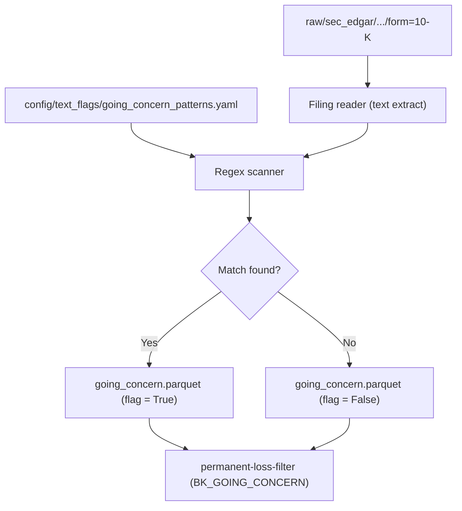

# Feature: Unstructured Financial Data

> **Status for the MVP: minimal.** The MVP does not run LLM analyses, summaries, or embeddings on filings. It only stores raw filing references and exposes one targeted text-flag pipeline that the permanent loss filter can consume: a **"going concern" detector** on the latest 10-K. Everything else (transcripts, news, sentiment, RAG) is parked until after the MVP is validated.

## Objective

Provide a thin text-processing layer that complements the structured pipeline. For the MVP, the only consumer is the permanent loss filter, which benefits from a high-precision "going concern" flag pulled from the latest 10-K.

## MVP scope

- Persist the raw 10-K text (or filing reference) in the data lake under `raw/sec_edgar/...` (already produced by `etl-data-lake`).
- Run a rule-based scanner that looks for "going concern" language patterns in the latest 10-K per company.
- Emit a boolean flag plus the matched passage(s) and the filing url.
- Expose results in a curated parquet (`curated/text_flags/going_concern.parquet`) consumed by `permanent-loss-filter`.
- Run weekly (filings do not change daily); incremental.
- No LLM, no embeddings, no summarization in the MVP.

## Out of MVP scope

- Summarization or LLM-driven narratives.
- Sentiment analysis.
- Year-over-year risk-factor diffs.
- Earnings call transcripts.
- News scraping.
- Multilingual filings.
- RAG / vector search infrastructure.
- Auditor-change extraction (handled by a different rule once the data is available).

## Inputs

| Input | Source |
| --- | --- |
| Latest 10-K filing per CIK | `raw/sec_edgar/.../form=10-K/...` |
| List of patterns to match | `config/text_flags/going_concern_patterns.yaml` (versioned) |

## Outputs

| Output | Path |
| --- | --- |
| Going concern flag | `curated/text_flags/going_concern.parquet` with `cik, accession, as_of_date, flag_bool, matched_phrases, source_url, pattern_version` |
| MLflow metrics | Count of CIKs scanned, count of flags raised |

## Patterns (initial set)

Stored in YAML, versioned. Match is case-insensitive, regex-based, restricted to the "Notes to Consolidated Financial Statements" and "Management's Discussion" sections when section markers can be found; otherwise applied to the full text.

```yaml
patterns:
  - "substantial doubt about (its|the company.s) ability to continue as a going concern"
  - "substantial doubt regarding the company.s ability to continue as a going concern"
  - "raise substantial doubt about (our|the company.s) ability to continue as a going concern"
```

A single match is enough to flag.

## Mermaid diagram



## Expected flow

1. Locate the latest 10-K per CIK whose `acceptance-datetime <= run_date`.
2. Extract plain text from the filing (HTML to text, no OCR; 10-Ks are HTML on EDGAR).
3. Run the regex scanner.
4. Persist a row per CIK with the flag, the matched phrase(s), the filing URL, the accession, and the pattern version.
5. The permanent loss filter joins this table on its `BK_GOING_CONCERN` rule.

## Acceptance criteria

- The going concern flag is reproducible for the same accession and the same pattern version (deterministic).
- A CIK without a recent 10-K is not silently flagged as `False`; it is marked `unknown` and routed to the review queue.
- The matched passage is stored alongside the flag for human review.
- Adding a new pattern requires a new `pattern_version`; old runs do not re-flag retroactively unless the user triggers a backfill.

## Open questions

- Do we want to also scan 10-Qs, or 10-Ks only? Recommendation: 10-Ks only for the MVP; going concern is mostly disclosed in the annual report.
- Section extraction: do we attempt to limit the search to specific 10-K items (Item 7, Item 8 notes), or scan the full filing? Recommendation: full filing for the MVP; precision is high enough.
- Should the flag have a TTL (e.g., expires 13 months after the filing date)? Recommendation: yes, default 400 days.

## Risks

- Some 10-Ks contain "going concern" language in a hypothetical or risk-factor context. The MVP rule will produce some false positives. Logged for FP/FN review.
- HTML parsing of EDGAR documents can fail on edge cases. The pipeline must capture and log parse errors instead of crashing.
- A pattern list in YAML is easy to break if patterns conflict. The `pattern_version` discipline is the only mitigation.

## Future iterations (parked)

- Auditor-change extraction (`FRD_AUDITOR_CHANGE_REPEATED` in permanent-loss-filter).
- Risk-factor year-over-year diff.
- Earnings call transcript ingestion + topic flags.
- LLM-driven summary with citation enforcement.
- Embeddings + RAG search inside the dashboard.
