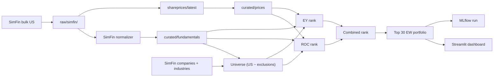

# Roadmap

## June 30 demo slice — simplest Magic Formula

**Status:** accepted (see [ADR-0002](../adr/0002-june-demo-scope-cut.md))  
**Target date:** 2026-06-30  
**North star:** Full MVP in [`mission.md`](mission.md) — this document defines only what ships first.

## Objective

Deliver a working, explainable Greenblatt-style Magic Formula pipeline on real US data: ingest fundamentals, rank the market, build a model portfolio, show results in Streamlit. No historical validation or execution in this slice.

## In scope

| Step | Module / spec | Notes |
| --- | --- | --- |
| 1 | SimFin ETL | [`etl-data-lake.md`](features/006-etl-data-lake/spec.md) — bulk US download, raw zone, SimFin normalizer |
| 2 | Universe | [`universe-construction.md`](features/011-universe-construction/spec.md) — demo mode: SimFin US minus sector exclusions |
| 3 | Quality | [`high-quality-stocks.md`](features/007-high-quality-stocks/spec.md) — ROC |
| 4 | Cheapness | [`cheap-stocks.md`](features/003-cheap-stocks/spec.md) — Earnings Yield |
| 5 | Ranking | Combined rank = ROC rank + EY rank (lower is better); tie-break ascending market cap |
| 6 | Model portfolio | Top **30** names, **equal-weight** only |
| 7 | Dashboard | [`dashboard-reporting.md`](features/005-dashboard-reporting/spec.md) — ranking table, portfolio, per-name explainability |
| 8 | MLflow | Log each pipeline run (params, scoring metrics, portfolio artifact) — `src/smartwealthai/mlflow_run_logging.py`, wired in `score-universe` ([#61](https://github.com/JLaborda/SmartWealthAI/issues/61)) |

## Out of scope (phase 2)

- Permanent loss filter ([`permanent-loss-filter.md`](features/008-permanent-loss-filter/spec.md))
- Backtesting and crisis report ([`backtesting.md`](features/001-backtesting/spec.md))
- Sell-watch ([`sell-watch.md`](features/010-sell-watch/spec.md))
- Paper trading / broker ([`broker-execution.md`](features/002-broker-execution/spec.md))
- Watchlist (ranking table in dashboard is enough)
- Corroborative signals, unstructured data, portfolio evolution (personal CSV)
- SEC EDGAR ETL (frozen spike remains in repo — [ADR-0001](../adr/0001-simfin-fundamentals-mvp.md))
- Historical S&P 500 universe with delisted names
- Score-weighted and risk-parity weighting

## Data sources

| Data | Source | Tier |
| --- | --- | --- |
| Fundamentals | SimFin bulk (`income` TTM, `balance` quarterly, `cashflow` TTM, `companies`, `industries`) | Free |
| Prices (demo) | SimFin bulk `shareprices/latest` | Free; same ticker namespace as universe |
| Prices (phase 2) | SimFin `shareprices/daily` or vendor fallback | Backtest and personal NAV |
| Industry exclusions | `data/reference/simfin_industry_exclusions.csv` + bank/insurance dataset sanity check | Versioned CSV |

## Pipeline diagram

## Key decisions (closed for demo)

| Topic | Decision |
| --- | --- |
| Backfill | Full SimFin US bulk per dataset variant; normalizer filters to universe tickers |
| `as_of_date` | SimFin `Publish Date`; restatements → new `version_id` with `Restated Date`; missing publish → `Report Date + lag` → review queue |
| Fundamentals periodicity | Income/cashflow **TTM**; balance sheet **quarterly** (latest PIT row) |
| Raw vs curated | Raw verbatim for downloaded variants; curated minimal (provider-agnostic schema) |
| Universe | All SimFin `market=us` companies minus banks/insurers/utilities (`IndustryId` CSV + bank/insurance sanity check) |
| Share prices | SimFin `shareprices/latest`; `price_date` may lag `run_date` by ~30 days (free tier) — OK for demo |
| Portfolio | Top 30, equal-weight, market-cap tie-break on ranks |
| SEC code | Frozen, not called by demo pipeline |

## Acceptance criteria

- [x] One command (or Prefect flow) runs the full demo pipeline for a `run_date`.
- [x] Dashboard shows combined rank, ROC/EY inputs, and top-30 portfolio with explanations.
- [ ] Every curated fundamental row has `as_of_date <= run_date` when queried PIT.
- [ ] No bank/insurer/utility from the exclusion list appears in the ranked universe.
- [x] MLflow run exists with portfolio parquet artifact and git commit SHA tag.
- [x] Hermetic CI tests do not call SimFin or yfinance live.

## After the demo (phase 2 order)

1. Quantitative Value feature spec + glossary ([#86](https://github.com/JLaborda/SmartWealthAI/issues/86))  
2. Multi-period fundamentals ETL + PIT history ([#87](https://github.com/JLaborda/SmartWealthAI/issues/87))  
3. Daily price history for backtest window ([#88](https://github.com/JLaborda/SmartWealthAI/issues/88))  
4. Forensic evaluator + permanent loss filter ([#89](https://github.com/JLaborda/SmartWealthAI/issues/89))  
5. FS-Score calculator ([#90](https://github.com/JLaborda/SmartWealthAI/issues/90))  
6. QV funnel orchestrator (production scoring) ([#91](https://github.com/JLaborda/SmartWealthAI/issues/91))  
7. Magic Formula benchmark path isolation ([#92](https://github.com/JLaborda/SmartWealthAI/issues/92))  
8. Light backtest (5–10y QV) ([#96](https://github.com/JLaborda/SmartWealthAI/issues/96))  
9. CI/CD M2 Terraform + S3 lake ([#105](https://github.com/JLaborda/SmartWealthAI/issues/105)–[#112](https://github.com/JLaborda/SmartWealthAI/issues/112))  
10. Sell-watch + dashboard QV views ([#97](https://github.com/JLaborda/SmartWealthAI/issues/97), [#93](https://github.com/JLaborda/SmartWealthAI/issues/93))  
11. Historical S&P 500 universe + full backtest (2b) ([#99](https://github.com/JLaborda/SmartWealthAI/issues/99), [#100](https://github.com/JLaborda/SmartWealthAI/issues/100))  
12. SEC EDGAR normalizer (optional PIT upgrade)  
13. Paper trading (deferred)

## Feature registry (stable IDs)

Chronological spec IDs (creation order). **Priority** is defined by this roadmap and [`../backlog/backlog.md`](../backlog/backlog.md), not by the number.

| ID | Feature | Spec |
| --- | --- | --- |
| 001 | Backtesting | [`spec/features/001-backtesting/spec.md`](../features/001-backtesting/spec.md) |
| 002 | Broker Execution | [`spec/features/002-broker-execution/spec.md`](../features/002-broker-execution/spec.md) |
| 003 | Cheap Stocks | [`spec/features/003-cheap-stocks/spec.md`](../features/003-cheap-stocks/spec.md) |
| 004 | Corroborative Signals | [`spec/features/004-corroborative-signals/spec.md`](../features/004-corroborative-signals/spec.md) |
| 005 | Dashboard Reporting | [`spec/features/005-dashboard-reporting/spec.md`](../features/005-dashboard-reporting/spec.md) |
| 006 | Etl Data Lake | [`spec/features/006-etl-data-lake/spec.md`](../features/006-etl-data-lake/spec.md) |
| 007 | High Quality Stocks | [`spec/features/007-high-quality-stocks/spec.md`](../features/007-high-quality-stocks/spec.md) |
| 008 | Permanent Loss Filter | [`spec/features/008-permanent-loss-filter/spec.md`](../features/008-permanent-loss-filter/spec.md) |
| 009 | Portfolio Evolution | [`spec/features/009-portfolio-evolution/spec.md`](../features/009-portfolio-evolution/spec.md) |
| 010 | Sell Watch | [`spec/features/010-sell-watch/spec.md`](../features/010-sell-watch/spec.md) |
| 011 | Universe Construction | [`spec/features/011-universe-construction/spec.md`](../features/011-universe-construction/spec.md) |
| 012 | Unstructured Financial Data | [`spec/features/012-unstructured-financial-data/spec.md`](../features/012-unstructured-financial-data/spec.md) |
| 013 | Quantitative Value | [`spec/features/013-quantitative-value/spec.md`](../features/013-quantitative-value/spec.md) |
| 014 | CI/CD Infrastructure | [`spec/features/014-cicd-infrastructure/spec.md`](../features/014-cicd-infrastructure/spec.md) |

## Informal backlog

See [`../backlog/backlog.md`](../backlog/backlog.md).
