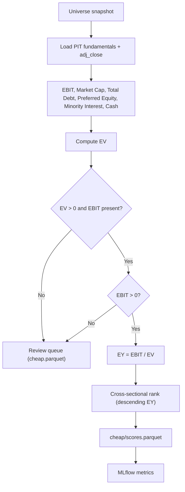

# Feature: Cheap Stocks

## Implementation status

done (demo cross-sectional slice) — EY scoring and ranks: `src/smartwealthai/magic_formula_ranking.py`, CLI `score-universe` ([#60](https://github.com/JLaborda/SmartWealthAI/issues/60)). Single-ticker tracer: `magic_formula_metrics.py`, `pit_fundamentals.py`, `compute-metrics` ([#44](https://github.com/JLaborda/SmartWealthAI/issues/44)).

## Objective

Score the cheapness of every company in the investable universe. For the demo slice, cheapness is Greenblatt-style **Earnings Yield (EY) = EBIT / Enterprise Value**. The EY rank does not require a valid ROC. The permanent-loss filter is phase 2 and is not applied by `score-universe`.

## MVP scope

- Compute `EY = EBIT / EV` per the canonical Greenblatt definition.
- Use the most recent point-in-time fundamentals available on the decision date and the run-date market data for EV.
- Produce a cross-sectional cheapness rank (lower rank = cheaper) for every passing company.
- Validate denominators: rows with `EV <= 0` or `EBIT` missing are flagged for review and excluded from the ranking.
- Avoid blindly ranking value traps as attractive: rows with negative EBIT are routed to the review queue rather than being inverted into "expensive".
- Log MLflow metrics (count valid, count invalid, EY quantiles).
- Expose the inputs alongside the score so the dashboard can explain "why is this company cheap?".

## Out of MVP scope

- Multi-metric cheapness score (FCF yield, EV/EBITDA, P/B, P/S, shareholder yield).
- Sector-relative valuation.
- Value-trap defense beyond the permanent loss filter (no quality threshold required to enter the cheapness rank; quality is a separate, parallel rank that combines later).
- Cyclically adjusted earnings.
- Forward-looking estimates.

## Inputs

| Input | Source | Notes |
| --- | --- | --- |
| Universe | `curated/universe/run_date=<YYYY-MM-DD>/universe.parquet` | Every row is scored. `curated/permanent_loss` is not read. |
| PIT fundamentals (income statement, balance sheet) | `curated/fundamentals` | Filtered by `as_of_date <= run_date`. |
| Run-date market cap | `curated/prices/run_date=<YYYY-MM-DD>/prices.parquet` join `curated/fundamentals` | `shares_outstanding * adj_close`; `price_date` is the latest trading day ≤ `run_date`. |
| Enterprise value components | `curated/fundamentals` | Total debt, preferred equity, minority interest, cash. |
| Run date | Pipeline parameter | |
| EY formula version | `src/smartwealthai/magic_formula_metrics.py` | Constant `FORMULA_VERSION = "v1"`. There is no `config/cheap/ey.yaml`. |

## EY definition (shipped v1)

Implemented in `src/smartwealthai/magic_formula_metrics.py`. Same EBIT and PIT row as [`007-high-quality-stocks`](../007-high-quality-stocks/spec.md).

```
total_debt = long_term_debt + short_term_debt
market_cap = shares_outstanding * adj_close
EV = market_cap + total_debt + preferred_equity + minority_interest - cash
EY = EBIT / EV    # only when EBIT > 0 and EV > 0
```

| Input | Curated field | Notes |
| --- | --- | --- |
| EBIT | `ebit` | SimFin `Operating Income (Loss)`, TTM |
| Shares | `shares_outstanding` | SimFin `Shares (Basic)` |
| Price | `adj_close` | Run-date snapshot, not raw `close` |
| Long-term / short-term debt | `long_term_debt`, `short_term_debt` | Summed in scoring. Capital leases are not in `simfin_mapping_v1.yaml` and are not added. |
| Preferred equity, minority interest | `preferred_equity`, `minority_interest` | Null counts as `0`. Missing values do not raise `missing_inputs`. |
| Cash | `cash` | Subtracted in EV. Same field as NWC excess cash. |

Demo `score-universe` scores the curated universe. It does not apply the permanent-loss filter. A universe ticker with no fundamentals row or no price row is omitted from both the cheapness score file and `cheap.parquet`.

**Validation flags:**

| Flag | When | EY rank |
| --- | --- | --- |
| `missing_inputs` | A required ROC/EY input is null (preferred equity and minority interest are not required) | No |
| `negative_ebit` | `ebit < 0` | No. ROC may still be ranked. |
| `invalid_ev` | `EV <= 0` | No |

`is_cheap_rankable` does not look at ROC. A name can sit in the quality score file and the cheapness review queue at the same time. The combined rank (`roc_rank + ey_rank`) includes a name only when both factors are rankable.

**Rank.** Higher EY is better (rank 1). Equal EY breaks toward smaller market cap with distinct ranks `1..N`.

Bump `FORMULA_VERSION` in `magic_formula_metrics.py` when the formula changes.

## Outputs

| Output | Path / target |
| --- | --- |
| Cheapness scores parquet | `curated/scores/cheap/run_date=<YYYY-MM-DD>/scores.parquet` with `run_date, cik, ticker, ebit, market_cap, total_debt, preferred_equity, minority_interest, cash, ev, ey, ey_rank, formula_version, as_of_date` |
| Review queue rows | `curated/issues/run_date=<YYYY-MM-DD>/cheap.parquet` with `run_date, cik, ticker, flags, ebit, roc, ey` |
| MLflow metrics | `cheap_n_valid`, `cheap_n_invalid`, EY quantiles |

## Mermaid diagram



## Expected flow

1. Load the universe snapshot for `run_date` and join PIT fundamentals plus `adj_close`.
2. Compute total debt, market cap, and EV in `build_metrics`.
3. Leave `ey` null and append `negative_ebit` or `invalid_ev` when EBIT is not positive or EV is not positive. Write those rows to `cheap.parquet`.
4. Rank valid EY descending, then market cap ascending.
5. Persist parquet. `as_of_date` on the score row is the decision `run_date`.
6. `score_universe` builds the combined rank in the same run (`magic_formula_ranking.build_combined_ranking`) and the top-30 equal-weight portfolio. There is no separate portfolio-construction CLI.

## Acceptance criteria

- Same `(universe, run_date, formula_version)` produces byte-identical output (hash-verifiable).
- The score is purely a function of curated PIT data; no network calls.
- Every row has the EY value and all components that produced it.
- Rows with invalid EV or negative EBIT are visible in the review queue and not silently flipped to "expensive".
- The formula version travels with each scored row.
- The MLflow run logs at minimum count of valid rows, count of invalid rows, EY median, and EY quantiles.

## Decisions (v1)

| Question | Shipped behavior |
| --- | --- |
| Total debt | `long_term_debt + short_term_debt`. Capital leases are not mapped and not added. |
| Cash | SimFin `Cash, Cash Equivalents & Short Term Investments` → curated `cash`. |
| Preferred equity | Book value from SimFin `Preferred Equity`. Null becomes `0` (minority interest too). |
| Independence from ROC | EY rank does not require a valid ROC. Combined rank drops a name when either factor fails. |

## Risks

- Negative-EBIT companies are silent value traps that easy EY models can mislabel as attractive. The MVP routes them to the review queue, which avoids the trap but may exclude legitimate turnarounds.
- One-off items in EBIT distort EY. Same caveat as in `high-quality-stocks`; accepted as a Greenblatt placeholder.
- `Total Debt` reported by EDGAR has multiple equally defensible definitions. Version locking is the only durable mitigation.
- Restated balance sheet items shift EV across versions. PIT versioning handles it; the test suite must cover restatements explicitly.
