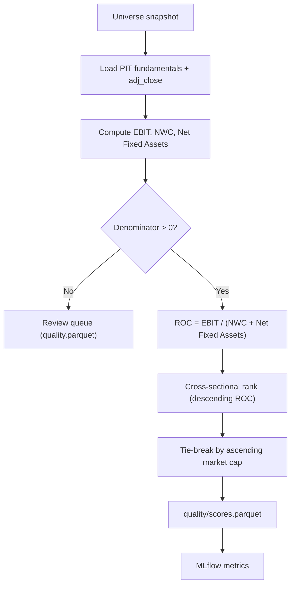

# Feature: High-Quality Stocks

## Implementation status

done (demo cross-sectional slice) — ROC scoring and ranks: `src/smartwealthai/magic_formula_ranking.py`, CLI `score-universe` ([#60](https://github.com/JLaborda/SmartWealthAI/issues/60)). Single-ticker tracer: `magic_formula_metrics.py`, `pit_fundamentals.py`, `compute-metrics` ([#44](https://github.com/JLaborda/SmartWealthAI/issues/44)).

## Objective

Score the economic quality of every company in the investable universe. For the demo slice, the quality factor is Greenblatt-style **Return on Capital (ROC)** from point-in-time fundamentals. The permanent-loss filter is phase 2 and is not applied by `score-universe`.

## MVP scope

- Compute `ROC = EBIT / (Net Working Capital + Net Fixed Assets)` per the canonical Greenblatt definition.
- Use the most recent point-in-time fundamentals available on the decision date.
- Produce a cross-sectional quality rank (lower rank = higher quality) for every passing company.
- Apply a market-cap tie-break: when ROC ties, the smaller market cap wins.
- Validate denominator: rows with `Net Working Capital + Net Fixed Assets <= 0` are flagged for review and excluded from the ranking.
- Log MLflow metrics: distribution of ROC, count of valid vs invalid rows, percentile statistics.
- Expose the score, the input components, and the explanation downstream so the dashboard can show "why is this company high quality?".

## Out of MVP scope

- Multi-metric quality scores (ROIC, ROE, ROA, FCF margin, accruals, balance sheet sub-score). Captured as candidates for the next iteration.
- Sector-relative quality (sectors with unusual accounting are already excluded upstream).
- Earnings quality / accruals scoring.
- Capital allocation scoring.
- Forward-looking estimates.
- Machine learning quality prediction.

## Inputs

| Input | Source | Notes |
| --- | --- | --- |
| Universe | `curated/universe/run_date=<YYYY-MM-DD>/universe.parquet` | Every row is scored. `curated/permanent_loss` is not read. |
| PIT fundamentals (income statement, balance sheet) | `curated/fundamentals` | Filtered by `as_of_date <= run_date`. |
| Market cap | `curated/prices/run_date=<YYYY-MM-DD>/prices.parquet` join `curated/fundamentals` | `shares_outstanding * adj_close`. |
| Run date | Pipeline parameter | |
| ROC formula version | `src/smartwealthai/magic_formula_metrics.py` | Constant `FORMULA_VERSION = "v1"`. There is no `config/quality/roc.yaml`. |

## ROC definition (shipped v1)

Implemented in `src/smartwealthai/magic_formula_metrics.py`. Column names come from `config/fundamentals/simfin_mapping_v1.yaml`.

```
NWC = max(current_assets - cash - current_liabilities + short_term_debt, 0)
ROC = EBIT / (NWC + ppe_net)    # only when the denominator is > 0
```

| Input | Curated field | SimFin column |
| --- | --- | --- |
| EBIT | `ebit` | `Operating Income (Loss)` (TTM income) |
| Current assets / liabilities | `current_assets`, `current_liabilities` | `Total Current Assets`, `Total Current Liabilities` |
| Excess cash | `cash` | `Cash, Cash Equivalents & Short Term Investments` |
| Short-term debt | `short_term_debt` | `Short Term Debt` |
| Net fixed assets | `ppe_net` | `Property, Plant & Equipment, Net` |

Demo `score-universe` ranks every ticker in `curated/universe/run_date=<date>/universe.parquet`. It does not read a permanent-loss pass list (that filter is phase 2).

**Row selection.** `load_pit_fundamentals_bulk` keeps one fundamentals row per CIK. Inside a `period=*` partition it keeps `statement_variant == ttm` when any TTM row is present; a partition with no TTM row contributes its last row. Across those candidates it keeps the greatest `as_of_date <= run_date`, then the greatest `version_id`. Price is `adj_close` from `curated/prices/run_date=<date>/prices.parquet`. A universe ticker with no fundamentals row or no price row is omitted from the score file and the review queue. That case is not flagged `missing_inputs`.

**Validation flags** (`MetricsResult.flags`):

| Flag | When | Quality rank |
| --- | --- | --- |
| `missing_inputs` | Any of `ebit`, `current_assets`, `current_liabilities`, `cash`, `short_term_debt`, `ppe_net`, `shares_outstanding`, `adj_close`, `long_term_debt` is null | No |
| `invalid_roc_denominator` | `NWC + ppe_net <= 0` | No |
| `negative_ebit` | `ebit < 0` | Yes, when ROC was computed |

Negative EBIT still gets a ROC and a quality rank when the denominator is positive. Those names are excluded from the EY rank (see [`003-cheap-stocks`](../003-cheap-stocks/spec.md)).

**Rank.** `assign_metric_ranks` sorts by descending ROC, then ascending market cap, and assigns ranks `1..N`. Equal ROC values do not share a rank; the smaller market cap gets the better rank. There is no `tiebreak_rank` column.

Bump `FORMULA_VERSION` in `magic_formula_metrics.py` when the formula changes. Score rows carry that string so a later backtest can tell which definition produced them.

## Outputs

| Output | Path / target |
| --- | --- |
| Quality scores parquet | `curated/scores/quality/run_date=<YYYY-MM-DD>/scores.parquet` with `run_date, cik, ticker, ebit, nwc, net_fixed_assets, roc, roc_rank, market_cap, formula_version, as_of_date` |
| Review queue rows | `curated/issues/run_date=<YYYY-MM-DD>/quality.parquet` with `run_date, cik, ticker, flags, ebit, roc, ey` |
| MLflow metrics | `quality_n_valid`, `quality_n_invalid`, ROC quantiles |

## Mermaid diagram



## Expected flow

1. Load the universe snapshot for `run_date` and join PIT fundamentals plus the run-date price row.
2. Compute NWC, the ROC denominator, and ROC (`build_metrics`).
3. Route `missing_inputs` and `invalid_roc_denominator` to `quality.parquet`. Keep negative-EBIT names in the quality rank when ROC exists.
4. Assign unique ranks: higher ROC first, smaller market cap on a tie (`assign_metric_ranks`).
5. Persist parquet. `as_of_date` on the score row is the decision `run_date`, not the filing publish date (that date stays on the fundamentals row).
6. Log MLflow metrics from `score-universe` (the standalone CLI always logs; `run-demo-pipeline --skip-mlflow` is the skip switch).

## Acceptance criteria

- Same `(universe, run_date, formula_version)` produces byte-identical output (hash-verifiable).
- The score is purely a function of curated PIT data; no network calls.
- Every row has both the ROC value and the components that produced it.
- Rows with invalid denominators are visible in the review queue and not silently dropped or auto-scored.
- The ranking is stable: changing only the market cap of a non-tied row never changes the rank order.
- The MLflow run logs at minimum count of valid rows, count of invalid rows, ROC median, and ROC quantiles.
- The formula version travels with each scored row, so a backtest using a past `formula_version` is reproducible.

## Decisions (v1)

| Question | Shipped behavior |
| --- | --- |
| EBIT source | SimFin `Operating Income (Loss)` → curated `ebit`. Demo scoring does not read EDGAR `OperatingIncomeLoss`. |
| Excess cash | Curated `cash` (cash + equivalents + short-term investments) for both NWC and EV. Slightly aggressive vs cash-equivalents-only. |
| Near-ties | No epsilon. Equal ROC values are ordered only by ascending market cap, then given distinct ranks. |
| Negative EBIT | ROC is computed and quality-ranked when the denominator is positive. EY is not (cheapness review flag `negative_ebit`). |

## Risks

- `Net Working Capital` and `Net Fixed Assets` definitions vary across textbooks and providers. Locking the formula version is the only way to keep backtests reproducible.
- Single-metric quality leaves the strategy exposed to capital-light tech businesses whose balance sheets distort ROC. We accept this in the MVP and document the limitation.
- Restatements can move ROC sharply between versions. The PIT store keeps both versions; backtests must pick the version available at `as_of_date`.
- One-off items in EBIT can produce false positives. The MVP does not adjust for them; this is a known weakness of the Greenblatt placeholder.
