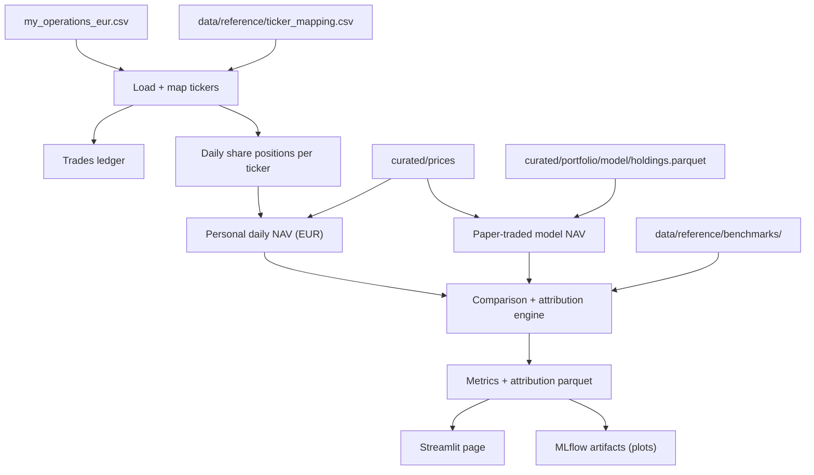

# Feature: Portfolio Evolution

## Objective

Reconstruct the daily evolution of two portfolios over time and compare both against configurable benchmarks:

1. The user's **personal portfolio** built from cleaned broker operations.
2. The **model portfolio** simulated as if it had been actually traded daily.

The user must be able to answer the questions "have my own decisions been worth it?" and "would I have done better following the model?".

## MVP scope

- Consume the consolidated personal-operations CSV (already in EUR) as the single source of truth for the personal portfolio.
- Use the closed schema documented in `spec/constitution/mission.md` (Date, Symbol, Type, Volume, Price, Value, Commission, Currency).
- Reconstruct daily NAV in EUR using adjusted prices from the curated price store.
- Apply the broker-to-yfinance ticker mapping (`data/reference/ticker_mapping.csv`).
- Treat bankrupt or delisted holdings systematically: write a closing price of zero on the delisting date instead of dropping the position.
- Paper-trade the model portfolio daily, starting from the date the model first emits a portfolio, so we can compare both portfolios on the same time axis.
- Compute and display: cumulative return, drawdown, rolling Sharpe, holdings over time, return attribution, comparison vs S&P 500 (and other benchmarks), comparison vs the model portfolio.
- Daily refresh.
- Persist outputs in S3 parquet + MLflow artifacts; render in the Streamlit dashboard.

## Out of MVP scope

- Dividend tracking inside the personal portfolio CSV (the file does not include dividend events today; tracked as follow-up).
- Tax modeling.
- Multi-currency portfolios (the consolidated file is already EUR).
- Diversification / clustering analysis (deferred per architecture decision).
- Lot-level cost basis tracking; the MVP uses FIFO at the aggregate level.
- Editable holdings inside the dashboard (read-only views).

## Inputs

| Input | Source |
| --- | --- |
| Personal operations CSV | `data/clean/personal_finance/operations/my_operations_eur.csv` (canonical schema) |
| Ticker mapping | `data/reference/ticker_mapping.csv` |
| Adjusted prices | `curated/prices` (yfinance-cached) |
| Model portfolio holdings history | `curated/portfolio/model/holdings.parquet` (one row per name per date once the model has emitted a portfolio) |
| Benchmark price series | `data/reference/benchmarks/` (S&P 500 TR, MSCI World, Russell 3000 TR, etc.) |
| User preference | `config/portfolio_evolution.yaml` (which benchmarks to display, base currency, starting NAV alignment) |

## Outputs

| Output | Path / target |
| --- | --- |
| Personal daily NAV | `curated/portfolio_evolution/personal/nav.parquet` with `date, nav_eur, position_count` |
| Personal holdings over time | `curated/portfolio_evolution/personal/holdings.parquet` with `date, ticker, shares, market_value_eur, weight` |
| Personal trades ledger | `curated/portfolio_evolution/personal/trades.parquet` (mirrors the input CSV with derived fields) |
| Model paper NAV | `curated/portfolio_evolution/model/nav.parquet` |
| Model holdings over time | `curated/portfolio_evolution/model/holdings.parquet` (already produced upstream) |
| Comparison metrics | `curated/portfolio_evolution/comparison/metrics.parquet` (cumulative return, drawdown, rolling Sharpe, alpha vs each benchmark) |
| Attribution | `curated/portfolio_evolution/attribution/contribution.parquet` (per-ticker contribution to total return) |
| Streamlit page | `apps/dashboard/pages/portfolio_evolution.py` |
| MLflow artifacts | NAV plots, drawdown plot, rolling Sharpe plot |

## Mermaid diagram

## Expected flow

1. Read `my_operations_eur.csv`. Apply the ticker mapping to translate broker symbols to yfinance symbols. Sort by date.
2. Build a daily share-position table per ticker: cumulative `BUY - SELL` of `Volume` per ticker. Bankrupt / delisted tickers retain their shares but have price set to zero from the delisting date onward.
3. Multiply share positions by adjusted close to produce daily market value per ticker.
4. Sum across tickers to produce the personal daily NAV in EUR. Add cash flows from `Commission` to the NAV (commissions reduce NAV at trade time).
5. For the model paper portfolio, replay `curated/portfolio/model/holdings.parquet` day by day. Use the rebalance dates known to the strategy and assume execution at the close of the rebalance date. NAV is `sum(shares * close)`.
6. Align both NAV series to a common base date (the earlier of the personal portfolio inception and the model emission date) and rebase to 100 for display purposes. Keep the raw EUR values too.
7. Compute metrics: cumulative return, max drawdown, rolling Sharpe (configurable window, default 252 trading days), alpha vs each enabled benchmark, beta vs each enabled benchmark, hit rate per ticker for the attribution panel.
8. Persist parquet outputs, log MLflow artifacts, expose the Streamlit page.

## Acceptance criteria

- Personal NAV reconstruction is deterministic for the same CSV and the same curated price snapshot.
- A `BUY` followed by a `SELL` of the same `Volume` on the same day produces no change in NAV that day except for the commissions.
- A bankrupt or delisted ticker produces a one-day drop to zero on the delisting date instead of being silently dropped.
- The Streamlit page renders, for any selected benchmark: NAV vs benchmark, drawdown vs benchmark, rolling Sharpe, holdings stacked area, attribution table.
- The MLflow run logs at minimum: personal CAGR, personal max drawdown, model CAGR, model max drawdown, alpha vs each enabled benchmark.
- The pipeline runs daily after the model portfolio module finishes.
- The personal trades ledger and the operations CSV are reconciled: every input row appears once in the ledger, with no silent drops.
- If a ticker is missing from the curated price store, the pipeline raises a clear error rather than silently producing wrong NAV.

## Open questions

- How do we align the two portfolios when the personal portfolio starts in 2019 but the model first emits in 2026? Recommendation: render both on the same time axis, with the model paper book starting at the model emission date and using its own base 100; do not back-cast the model.
- Do we want to compare the personal portfolio against a "model would have done X starting from 2019" counterfactual? Recommendation: yes, as a stretch goal once the backtest engine is in place; mark out of MVP.
- For dividends not in the CSV: do we enrich the personal NAV using yfinance dividend events per ticker held on the ex-dividend date? Recommendation: out of MVP; tracked as follow-up.
- Should attribution be computed daily or only at month-end? Recommendation: monthly for the MVP to keep the parquet small.
- For benchmarks, MSCI World requires a price source. Do we accept a free ETF proxy (e.g., `URTH` total return on yfinance)? Recommendation: yes for the MVP; document.

## Risks

- The CSV schema is the contract; any silent change in the cleaning pipeline (`src/preprocessing/cleaning_operations.py`) can break the portfolio evolution module. The CI should include a schema test.
- Ticker remapping in code paths can drift from the CSV file in `data/reference/`. The mapping must be loaded from the file only.
- Bankrupt-ticker handling can mask data errors as real losses. The pipeline must log a clear warning when a ticker disappears, and require an explicit "delisted_on" entry in `data/reference/delistings.csv` before zeroing the price.
- Free yfinance prices can be wrong or missing for older tickers (especially European listings). The fallback chain in [`../006-etl-data-lake/spec.md`](../006-etl-data-lake/spec.md) must cover this.
- Paper-trading the model assumes execution at the close of the rebalance date. This is optimistic; future iterations should model open-next-day execution and a basic spread cost.
