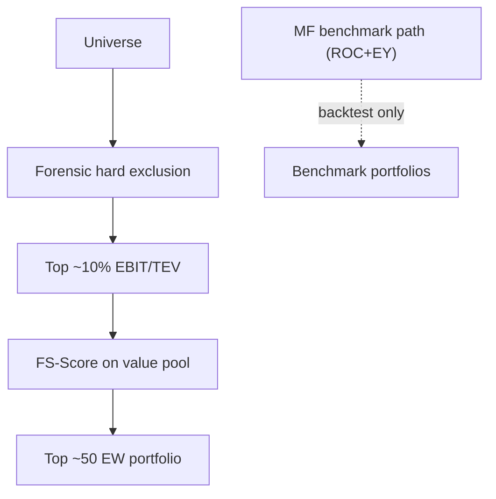

# Feature: Quantitative Value

## Implementation status

**in_progress** — governance slice ([#86](https://github.com/JLaborda/SmartWealthAI/issues/86)); scoring code in downstream issues ([#87](https://github.com/JLaborda/SmartWealthAI/issues/87)–[#91](https://github.com/JLaborda/SmartWealthAI/issues/91)).

## Delivery

**Phase:** phase 2 (production scoring replaces Greenblatt demo path)

## Objective

Implement the *Quantitative Value* funnel (Gray/Carlisle): forensic hard exclusion → top ~10% by EBIT/TEV among survivors → FS-Score on the value pool → ~50 equal-weight model portfolio. Magic Formula (ROC + EY) remains a **benchmark-only** path for backtest comparison, not production scoring.

## In scope

- QV funnel orchestrator invoked by `score-universe` (or successor CLI) for a `run_date`.
- Value screen: EBIT/TEV cross-sectional rank; keep top decile (~10%).
- Quality screen: 10-point FS-Score (binary components per Gray/Carlisle) on the value pool.
- Model portfolio: ~50 equal-weight names (configurable cap); default **50**.
- Stage-count metrics logged to MLflow; scored artifacts per funnel stage in curated lake.
- Forensic bottom-5% cross-sectional exclusion gate (QVAL-style) integrated with [`008-permanent-loss-filter`](../008-permanent-loss-filter/spec.md).
- Distinct `qv_*` vs `mf_*` code paths; production never calls MF combined rank.

## Out of scope

- Paper trading and broker execution.
- Full 20-year walk-forward backtest (see [`001-backtesting`](../001-backtesting/spec.md)).
- SEC EDGAR fraud rules that require EDGAR ETL (log `unavailable` until wired).
- Score-weighted or risk-parity portfolio construction.

## Inputs

| Input | Source | Notes |
| --- | --- | --- |
| Universe | `curated/universe/` | Sector exclusions upstream ([`011-universe-construction`](../011-universe-construction/spec.md)) |
| PIT fundamentals (multi-period) | `curated/fundamentals/` | Annual/quarterly for FS-Score and Beneish |
| Prices | `curated/prices/` | EV / market cap on `run_date` |
| Forensic exclusions | `curated/permanent_loss/` | Hard exclude before value screen |
| Run date | Pipeline parameter | Strict PIT: `as_of_date <= run_date` |

## Outputs

| Output | Path / target |
| --- | --- |
| Funnel stage counts | MLflow metrics |
| Value pool ranks | `curated/scores/value/` |
| FS-Score breakdown | `curated/scores/quality/` |
| Model portfolio | `curated/portfolio/run_date=<YYYY-MM-DD>/portfolio.parquet` |
| Review queue rows | `curated/issues/` for missing FS-Score / forensic inputs |

## Mermaid diagram

## Expected flow

1. Load universe for `run_date`; apply sector exclusions (already done upstream).
2. Run forensic evaluator; drop hard exclusions and bottom-5% forensic percentile gate.
3. Rank survivors by EBIT/TEV; keep top decile (value pool).
4. Compute FS-Score (0–10) for each value-pool name; rank by score.
5. Select top ~50 names; equal-weight; write portfolio parquet + MLflow artifact.
6. Log stage counts: universe → forensic → value → quality → portfolio.

## Forensic stage (stage 1)

Extends [`008-permanent-loss-filter`](../008-permanent-loss-filter/spec.md) with Phase 2a scope:

| Mechanism | Behavior | `formula_version` |
| --- | --- | --- |
| Hard rule exclusions | Bankruptcy/distress and fraud rules fire `exclude` before any score | Per `rule_version` in permanent-loss config |
| Beneish M-Score | Computed cross-sectionally on forensic survivors; names in the **bottom 5%** (worst manipulation risk) are hard-excluded | `beneish_v1` (coefficients versioned under `config/permanent_loss/`) |
| QVAL-style percentile gate | Applied **per forensic model** that emits a continuous score (Beneish first; others may follow in 2b) | Same as parent model version |

Each exclusion records `rule_id`, `rule_version`, `triggered_value`, `threshold`, `as_of_date`, and `explanation`. Missing inputs route to the **review queue**, not silent pass.

## FS-Score (stage 3 quality screen)

Gray/Carlisle 10-point **Financial Strength Score** (`fs_score_v1`). Each component is binary (0 or 1); total score is the sum (0–10). Requires multi-period PIT fundamentals ([#87](https://github.com/JLaborda/SmartWealthAI/issues/87)).

| Component | Category | Signal (1 if true) |
| --- | --- | --- |
| `FS_ROA` | Current profitability | Return on assets > 0 |
| `FS_FCFTA` | Current profitability | Free cash flow / total assets > 0 |
| `FS_ACCRUAL` | Current profitability | Free cash flow > net income (accrual quality) |
| `FS_ΔLEVER` | Stability | Long-term debt ratio decreased YoY |
| `FS_ΔLIQUID` | Stability | Current ratio improved YoY |
| `FS_NEQISS` | Stability | Net equity issuance negative (net repurchaser) |
| `FS_ΔROA` | Recent operational improvements | ROA improved YoY |
| `FS_ΔFCFTA` | Recent operational improvements | FCFTA improved YoY |
| `FS_ΔMARGIN` | Recent operational improvements | Gross margin improved YoY |
| `FS_ΔTURN` | Recent operational improvements | Asset turnover improved YoY |

Within the **value pool**, rank by total FS-Score descending; ties break by ascending market cap (configurable). Names below the portfolio cap are dropped.

## Value screen (stage 2)

| Metric | Definition | Notes |
| --- | --- | --- |
| EBIT/TEV | `EBIT / Enterprise Value` | Same EV definition as [`003-cheap-stocks`](../003-cheap-stocks/spec.md) (`formula_version = v1`) |
| Value pool | Top decile (~10%) by EBIT/TEV among forensic survivors | Configurable fraction under `config/quantitative_value/` |

Negative EBIT rows route to the **review queue** (not the value pool).

## Portfolio constructor (stage 4)

| Decision | Value |
| --- | --- |
| Default size | **50** names |
| Weighting | Equal-weight long-only |
| Tie-break | Ascending market cap on FS-Score rank ties |
| Config | `config/quantitative_value/portfolio_v1.yaml` (cap configurable) |

## Acceptance criteria

### Governance ([#86](https://github.com/JLaborda/SmartWealthAI/issues/86))

- [x] `spec/features/013-quantitative-value/spec.md` exists with objective, scope, funnel stages, and acceptance criteria (this document).
- [x] FS-Score components and forensic bottom-5% gate documented with formula versions.
- [x] Portfolio size default (~50) and configurable cap recorded as a closed decision.
- [x] `CONTEXT.md` updated with production QV terms (quality = FS-Score, cheap = value pool, QV funnel rank); MF terms marked benchmark-only.
- [x] `spec/constitution/roadmap.md` "After the demo" section reflects QV-first production order.

### Implementation (downstream)
- [ ] `score-universe` runs full QV funnel for a `run_date` when implementation completes ([#91](https://github.com/JLaborda/SmartWealthAI/issues/91)).
- [ ] Excluded names never appear in final portfolio; stage shrinkage monotonic on fixtures.

## Open questions

- **Closed:** Portfolio default size = **50** names, configurable via versioned QV config.

## Risks

- Multi-period fundamentals not available until ETL extension ([#87](https://github.com/JLaborda/SmartWealthAI/issues/87)) — funnel blocked until PIT history exists.
- FS-Score and Beneish need aligned fiscal-period joins; missing inputs must route to review queue, not silent drop.

## Related specs

- [`spec/prds/phase2/prd.md`](../../prds/phase2/prd.md) — parent PRD ([#85](https://github.com/JLaborda/SmartWealthAI/issues/85))
- [`../008-permanent-loss-filter/spec.md`](../008-permanent-loss-filter/spec.md) — forensic evaluator ([#89](https://github.com/JLaborda/SmartWealthAI/issues/89))
- [`../006-etl-data-lake/spec.md`](../006-etl-data-lake/spec.md) — multi-period ETL ([#87](https://github.com/JLaborda/SmartWealthAI/issues/87))
- [`../007-high-quality-stocks/spec.md`](../007-high-quality-stocks/spec.md) — MF ROC benchmark ([#92](https://github.com/JLaborda/SmartWealthAI/issues/92))
- [`../003-cheap-stocks/spec.md`](../003-cheap-stocks/spec.md) — MF EY benchmark ([#92](https://github.com/JLaborda/SmartWealthAI/issues/92))
- [`../005-dashboard-reporting/spec.md`](../005-dashboard-reporting/spec.md) — QV explainability ([#93](https://github.com/JLaborda/SmartWealthAI/issues/93))
