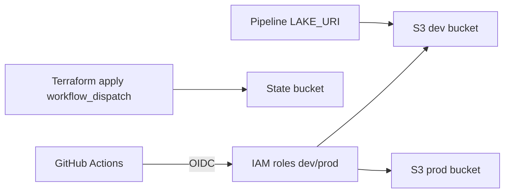

# Feature: CI/CD Infrastructure

## Implementation status

**planned** (M2 Terraform v1)

## Delivery

**Phase:** phase 0–2 infrastructure (M0 PR CI done; M2 Terraform in progress per [#105](https://github.com/JLaborda/SmartWealthAI/issues/105))

## Objective

Versioned AWS infrastructure and CI/CD workflows so the investment pipeline can run against S3, authenticate via GitHub OIDC, and read runtime secrets from Secrets Manager — without long-lived AWS keys in the repository.

## In scope (M2 v1)

| Component | Description |
| --- | --- |
| Bootstrap | S3 remote state + DynamoDB lock (`infra/terraform/bootstrap/`) |
| Storage | `smartwealthai-data-lake-dev` and `smartwealthai-data-lake-prod` buckets |
| IAM | GitHub OIDC provider; `smartwealthai-github-actions-dev` and `-prod` roles |
| Secrets | `smartwealthai/simfin-api-key` placeholder in Secrets Manager |
| Terraform CI | PR workflow: `fmt -check`, `validate`, `plan` on `infra/terraform/` changes |
| Ingest-smoke | Manual/weekly workflow: OIDC → dev S3 write (post-apply) |
| Lake I/O | `LAKE_URI` env selects file or `s3://` backend ([#112](https://github.com/JLaborda/SmartWealthAI/issues/112)) |

Lake layout follows [`spec/constitution/mission.md`](../../constitution/mission.md): `raw/`, `curated/`, `pit/`, `curated/issues/`.

## Out of scope (M2 v1)

- ECR, ECS Fargate, EventBridge daily schedule (M3–M4; [#95](https://github.com/JLaborda/SmartWealthAI/issues/95))
- MLflow tracking server on EC2
- Streamlit dashboard image and CD
- Prefect orchestration
- Auto-`apply` on merge to `develop` or `main`
- Multi-account AWS, OpenTofu, Terraform Cloud

## Inputs

| Input | Source | Notes |
| --- | --- | --- |
| Terraform modules | `infra/terraform/` | HCL under version control |
| GitHub repo/ref | OIDC trust policy | `JLaborda/SmartWealthAI` |
| `SIMFIN_API_KEY` | Secrets Manager (manual post-apply) | Never in Terraform variables or git |

## Outputs

| Output | Path / target |
| --- | --- |
| Dev/prod bucket ARNs | Terraform module outputs → GitHub Environment variables |
| OIDC role ARNs | GitHub Actions `aws-role-to-assume` |
| Ingest-smoke objects | `s3://smartwealthai-data-lake-dev/raw/...` |

## Mermaid diagram

## Expected flow

1. Operator runs bootstrap apply once (local credentials).
2. Configure dev/prod backends; `terraform plan` via PR CI.
3. Manual `workflow_dispatch` apply per environment; prod requires approval.
4. Set Secrets Manager secret value via Console/CLI.
5. Ingest-smoke workflow validates OIDC → dev S3 write.
6. Application reads/writes Parquet via `LAKE_URI` (local `data/` or `s3://`).

## Acceptance criteria

- [ ] Bootstrap module creates state bucket + lock table; README documents apply order ([#106](https://github.com/JLaborda/SmartWealthAI/issues/106)).
- [ ] Dev and prod storage modules with distinct bucket names ([#107](https://github.com/JLaborda/SmartWealthAI/issues/107)).
- [ ] OIDC roles with least-privilege S3 policies scoped to correct bucket ([#108](https://github.com/JLaborda/SmartWealthAI/issues/108)).
- [ ] Secrets Manager resource exists; no plaintext API key in Terraform state ([#109](https://github.com/JLaborda/SmartWealthAI/issues/109)).
- [ ] PR CI fails on Terraform fmt/validate errors ([#110](https://github.com/JLaborda/SmartWealthAI/issues/110)).
- [ ] Ingest-smoke writes to dev bucket via OIDC; does not block unrelated PRs ([#111](https://github.com/JLaborda/SmartWealthAI/issues/111)).
- [ ] `LAKE_URI` selects storage backend; local demo path still works ([#112](https://github.com/JLaborda/SmartWealthAI/issues/112)).
- [ ] PR CI remains hermetic (no live AWS calls in unit tests).

## Open questions

- None for M2 v1 (closed in [ADR-0003](../../adr/0003-terraform-for-aws-iac.md)).

## Risks

- First bootstrap apply requires human AWS credentials (HITL).
- Overlap between [#94](https://github.com/JLaborda/SmartWealthAI/issues/94) (Phase 2a tracer: Dockerfile + ingest-smoke) and [#112](https://github.com/JLaborda/SmartWealthAI/issues/112) — coordinate `LAKE_URI` implementation once.

## Related specs

- [`spec/prds/ci-cd/ci-cd-prd.md`](../../prds/ci-cd/ci-cd-prd.md) — full CI/CD milestones M0–M6
- [`spec/prds/terraform/terraform-prd.md`](../../prds/terraform/terraform-prd.md) — M2 vertical slices
- [`spec/adr/0003-terraform-for-aws-iac.md`](../../adr/0003-terraform-for-aws-iac.md)
