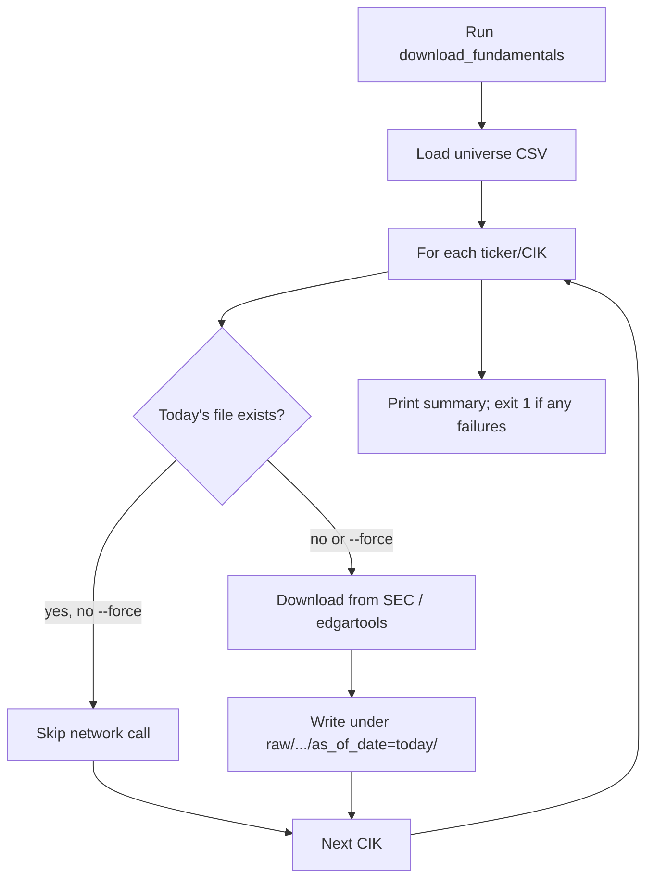

# Guide: Download fundamentals (local spike — frozen)

> **Status:** This guide documents the **frozen SEC ETL spike** ([ADR-0001](../../adr/0001-simfin-fundamentals-mvp.md)). The June 30 demo pipeline uses **SimFin** instead — see [`roadmap.md`](../roadmap.md) and [`etl-data-lake.md`](../../006-etl-data-lake/spec.md). Do not delete this spike; it resumes in phase 2.

Operator guide for the first ETL vertical slice: download raw SEC `companyfacts` and
standardized annual statements from `edgartools` for a parameterized universe.

**Canonical spec:** [`../../006-etl-data-lake/spec.md`](../../006-etl-data-lake/spec.md) (section
*Fundamentals download spike*).

## Prerequisites

1. Python 3.11+ and Poetry installed.
2. Project dependencies installed:

   ```bash
   poetry install
   ```

3. **SEC identity** (required by SEC EDGAR and `edgartools`):

   ```bash
   export SEC_IDENTITY="Your Name your@email.com"
   ```

   Use a real contact address. SEC may block requests with generic or invalid identities.

4. Network access to `data.sec.gov` and SEC endpoints used by `edgartools`.

## Quick start (Dow 30)

```bash
export SEC_IDENTITY="Your Name your@email.com"
poetry run download-fundamentals --universe dow30
```

Equivalent module invocation:

```bash
poetry run python -m smartwealthai.download_fundamentals --universe dow30
```

A full Dow 30 run downloads **120 artifacts** (4 per CIK: 1 JSON + 3 parquet files) and
typically takes several minutes because of SEC rate limits and `edgartools` parsing.

## CLI reference

Built with [Click](https://click.palletsprojects.com/). Run `download-fundamentals --help` for
auto-generated option docs.

| Flag | Default | Description |
| --- | --- | --- |
| `--universe` | — | Preset name. Currently: `dow30`. |
| `--universe-file` | — | Path to a custom CSV (`ticker,cik`). Overrides preset when both are set. |
| `--data-dir` | `data` | Local data lake root. |
| `--periods` | `16` | Annual fiscal columns requested from `edgartools`. |
| `--as-of-date` | UTC today | Partition date (`YYYY-MM-DD`) for immutable daily snapshots. |
| `--force` | off | Re-download even when today's partition already exists. |

### Examples

```bash
# Custom universe CSV
poetry run download-fundamentals --universe-file data/reference/universes/dow30.csv

# Pin snapshot date (reproducible backfill slice)
poetry run download-fundamentals --universe dow30 --as-of-date 2026-06-07

# Force refresh after a failed partial run
poetry run download-fundamentals --universe dow30 --force

# Write to a temp lake (CI / experiments)
poetry run download-fundamentals --universe dow30 --data-dir /tmp/swai-lake
```

## Universe files

Presets map to versioned CSV files under `data/reference/universes/`. See
[`../../../data/reference/universes/README.md`](../../../data/reference/universes/README.md).

Format:

```csv
ticker,cik
AAPL,0000320193
MSFT,0000789019
```

- `ticker` — trading symbol passed to `edgartools.Company(ticker)`.
- `cik` — 10-digit zero-padded SEC CIK used for `companyfacts` URLs.

Fixed CIKs avoid ambiguity across share classes and ticker renames.

## Output layout

Under `{data-dir}/raw/`:

```text
sec_edgar/cik=<cik>/endpoint=companyfacts/as_of_date=<YYYY-MM-DD>/response.json
edgartools/cik=<cik>/as_of_date=<YYYY-MM-DD>/income_statement_annual.parquet
edgartools/cik=<cik>/as_of_date=<YYYY-MM-DD>/balance_sheet_annual.parquet
edgartools/cik=<cik>/as_of_date=<YYYY-MM-DD>/cashflow_statement_annual.parquet
download_runs/as_of_date=<YYYY-MM-DD>/errors.json   # only when failures occur
```

### Artifact summary

| Artifact | Source | Contents |
| --- | --- | --- |
| `response.json` | SEC REST `/api/xbrl/companyfacts/CIK*.json` | Verbatim XBRL facts (raw zone). |
| `*_annual.parquet` | `edgartools` `get_facts()` | Parsed annual statements with `concept`, `label`, `section`, `FY 20xx` columns. |

Raw downloads are **never** consumed directly by scoring modules in the MVP; a future
normalizer will produce curated parquet with point-in-time semantics.

## Cache and re-runs



- Re-running on the **same day** without `--force` skips existing files.
- `--force` overwrites today's partition only.
- Prior dates remain immutable (append-only by `as_of_date`).

## Error handling

- One failing CIK does **not** abort the run.
- Transient SEC errors (429, 5xx, timeouts) retry up to 3 times with exponential backoff.
- Permanent errors (404, invalid CIK) fail immediately for that issuer.
- Failures are written to `raw/download_runs/as_of_date=<date>/errors.json`.
- Exit code: `0` if all issuers succeed, `1` if any fail.

## Module map

| Module | Responsibility |
| --- | --- |
| `smartwealthai.download_fundamentals` | CLI orchestration and run summary. |
| `smartwealthai.universe` | Preset resolution and CSV loading. |
| `smartwealthai.lake_paths` | Path builders for the local raw zone. |
| `smartwealthai.sec_client` | SEC REST client (throttle, retry, `companyfacts`). |
| `smartwealthai.edgartools_client` | `get_facts()` statement extraction to parquet. |

## Tests

Hermetic unit tests (no network):

```bash
poetry run pytest tests/test_download_fundamentals.py -q
```

Integration smoke test (requires `SEC_IDENTITY` and network) is intentionally **not** part
of PR CI. Run locally on a small CSV when validating credentials.

## Expanding universes

1. Add `data/reference/universes/<name>.csv` with `ticker,cik` rows.
2. Register the preset in `UNIVERSE_PRESETS` inside `src/smartwealthai/universe.py`.
3. Run: `poetry run download-fundamentals --universe <name>`.

Planned expansions: S&P 500, Russell 3000, Nasdaq — same CSV + preset pattern.

## Out of scope (this spike)

- `submissions` ingest (SIC, filing index).
- Curated parquet / point-in-time normalizer.
- S3 upload and DuckDB views.
- Quarterly statements (`period="quarterly"`).
