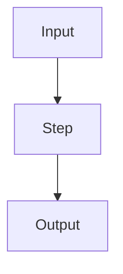

# Feature spec template

Copy this file when creating a new feature. Do **not** edit this template in place.

## Folder layout

```text
spec/features/00N-slug/
  spec.md       ← required (this template)
  plan.md       ← add when implementation starts (in_progress)
  tasks.md      ← add when implementation starts (checklist)
```

### Stable ID (`00N`)

- Assign the **next unused three-digit prefix** when the spec file is first created (chronological ID, not priority).
- Check [`../constitution/roadmap.md`](../constitution/roadmap.md) for existing IDs.
- **Never renumber** an existing folder. Priority changes go only in `roadmap.md`.
- Use a lowercase **slug** (`kebab-case`) describing the module.

### Workflow

1. Copy sections below into `spec/features/00N-slug/spec.md`.
2. Align with [`../constitution/mission.md`](../constitution/mission.md) and related feature specs.
3. Add the feature to [`../constitution/roadmap.md`](../constitution/roadmap.md) (priority / phase).
4. Update [`../../CONTEXT.md`](../../CONTEXT.md) if new domain terms are introduced (`/grill-with-docs`).
5. Open **one GitHub issue** per feature when moving to implementation — see [`github-issues.md`](github-issues.md).

---

# Feature: <!-- Human-readable name -->

## Implementation status

<!-- Delete this section until coding starts, then set one of: -->
<!-- **planned** | **in_progress** | **done** -->

## Delivery

<!-- Which roadmap phase this feature targets. Link to spec/constitution/roadmap.md — e.g. "June 30 demo slice" or "Phase 2". -->
<!-- Scope bullets below describe *this delivery*; later phases can extend the same spec or add a new one. -->

**Phase:** <!-- demo | phase 2 | future -->

## Objective

<!-- One paragraph: what this module does and why it exists in the pipeline. -->

## In scope

<!-- Bullet list of what ships for the phase above. -->

## Out of scope

<!-- Explicit exclusions for this phase (and deferred work called out clearly). -->

## Inputs

| Input | Source | Notes |
| --- | --- | --- |
| <!-- e.g. PIT fundamentals --> | <!-- curated path --> | <!-- filters, joins --> |

## Outputs

| Output | Path / target |
| --- | --- |
| <!-- primary artifact --> | <!-- S3 / parquet / MLflow --> |

## Mermaid diagram

<!-- Required when the flow is non-trivial or changes. -->



## Expected flow

<!-- Numbered steps an implementer can follow. -->

1. …
2. …

## Acceptance criteria

<!-- Testable, checkable conditions. Use `- [ ]` if tracking in the spec. -->

- …

## Open questions

<!-- Unresolved decisions. Mark closed items with ~~strikethrough~~ and **Closed:** -->

- …

## Risks

<!-- What can go wrong; mitigations where known. -->

- …

## Related specs

<!-- Cross-links to dependent or sibling modules. -->

- [`../NNN-other-feature/spec.md`](../NNN-other-feature/spec.md) — …
